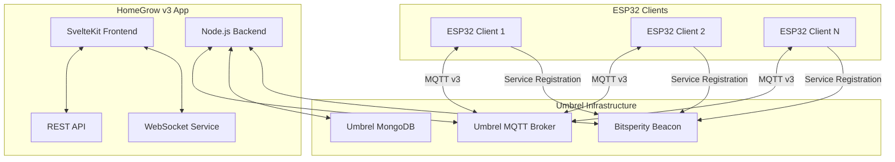

# HomeGrow v3 - Professional Hydroponic System Management

[](https://github.com/bitsperity/homegrow)
[](LICENSE)
[](https://umbrel.com)
[](https://docker.com)

HomeGrow v3 ist eine professionelle Umbrel-App für die Verwaltung hydroponischer Systeme mit Arduino/ESP32-basierten Clients. Die App bietet eine moderne, mobile-first Benutzeroberfläche für Device-Management, Sensor-Monitoring, automatisierte Wachstumsprogramme und manuelle Steuerung.

## 🌟 Features

### 🔍 Automatische Service Discovery
- **Bitsperity Beacon Integration** - ESP32 Clients werden automatisch über mDNS/Bonjour erkannt
- **Zero-Configuration Networking** - Keine manuelle IP-Konfiguration erforderlich
- **Real-time Device Updates** - Sofortige Benachrichtigung bei neuen/entfernten Devices

### 📱 Mobile-First PWA
- **Progressive Web App** - App-like Experience auf allen Geräten
- **Offline-Funktionalität** - Kritische Funktionen auch ohne Internet
- **Push-Benachrichtigungen** - Alerts und Status-Updates in Echtzeit
- **Responsive Design** - Optimiert für Smartphone, Tablet und Desktop

### 📊 Real-time Monitoring
- **Live Sensordaten** - pH und TDS-Werte in Echtzeit
- **Historische Charts** - Trends und Analysen über verschiedene Zeiträume
- **Multi-Device Support** - Überwachung mehrerer ESP32-Clients gleichzeitig
- **Data Quality Indicators** - Sensor-Status und Kalibrierungs-Gültigkeit

### 🤖 Intelligente Automation
- **Wachstumsprogramme** - Mehrstufige Programme mit phasenspezifischen Parametern
- **Adaptive pH-Korrektur** - Basierend auf historischen Daten
- **Nutrient Balancing** - Multi-Pump-Koordination für optimale Nährstoffverteilung
- **Safety Systems** - Emergency-Stop bei kritischen Werten

### 🎛️ Manuelle Steuerung
- **7 Pumpen pro Client** - Wasser, Luft, pH+/-, Nährstoffe A/B, Cal-Mag
- **Präzise Dosierung** - Volumen- und zeitbasierte Steuerung
- **Pump Protection** - Überlastungsschutz und Cooldown-Management
- **Scheduling System** - Automatisierte Pump-Schedules

## 🏗️ Architektur



## 🚀 Installation

### Über Umbrel App Store

1. Öffnen Sie den Umbrel App Store
2. Suchen Sie nach "HomeGrow v3"
3. Klicken Sie auf "Install"
4. Warten Sie auf die Installation der Dependencies:
   - `bitsperity-mongodb`
   - `bitsperity-beacon`

### Manuelle Installation

```bash
# Repository klonen
git clone https://github.com/bitsperity/homegrow.git
cd homegrow

# Dependencies installieren
npm install

# Umgebungsvariablen konfigurieren
cp .env.example .env

# App starten
npm run dev
```

## ⚙️ Konfiguration

### Umgebungsvariablen

```bash
# .env
NODE_ENV=production
MONGODB_URL=mongodb://bitsperity-mongodb:27017/homegrow
MQTT_URL=mqtt://umbrel-mqtt:1883
BEACON_URL=http://bitsperity-beacon:8080
JWT_SECRET=your-secret-key
HOMEGROW_HOST=homegrow-app
HOMEGROW_PORT=3000
```

### ESP32 Client Setup

1. **Hardware-Anforderungen:**
   - ESP32 Development Board
   - pH-Sensor (analog)
   - TDS-Sensor (analog)
   - 7x Peristaltic Pumps
   - Relay Board (8-Kanal)

2. **Software-Installation:**
   ```cpp
   // Arduino IDE Libraries
   #include <WiFi.h>
   #include <PubSubClient.h>
   #include <ArduinoJson.h>
   #include <HTTPClient.h>
   ```

3. **Beacon Registration:**
   ```cpp
   // Automatische Registrierung bei Bitsperity Beacon
   BeaconClient beacon;
   beacon.registerWithBeacon();
   ```

## 📖 API Dokumentation

### Device Management

```http
# Alle Geräte abrufen
GET /api/v1/devices

# Gerät erstellen
POST /api/v1/devices
Content-Type: application/json

{
  "device_id": "esp32-001",
  "name": "Hydroponic System 1",
  "location": "Greenhouse A"
}

# Geräte automatisch erkennen
POST /api/v1/devices/discover
```

### Sensor Data

```http
# Aktuelle Sensordaten
GET /api/v1/sensors/{device_id}/latest

# Historische Daten
GET /api/v1/sensors/{device_id}/{sensor_type}/history?start=2024-01-01&end=2024-01-31

# Aggregierte Daten
GET /api/v1/sensors/{device_id}/{sensor_type}/aggregate?interval=hour&start=2024-01-01&end=2024-01-02
```

### Commands

```http
# Pump-Befehl senden
POST /api/v1/commands/{device_id}
Content-Type: application/json

{
  "command": "activate_pump",
  "params": {
    "pump": "water",
    "duration_sec": 30
  }
}

# Emergency Stop
POST /api/v1/commands/emergency-stop
```

### WebSocket Events

```javascript
// WebSocket Verbindung
const ws = new WebSocket('ws://localhost:3000/ws');

// Sensor-Daten abonnieren
ws.send(JSON.stringify({
  type: 'subscribe_device',
  device_id: 'esp32-001'
}));

// Events empfangen
ws.onmessage = (event) => {
  const data = JSON.parse(event.data);
  
  switch (data.type) {
    case 'sensor_data':
      console.log('New sensor reading:', data);
      break;
    case 'device_status':
      console.log('Device status changed:', data);
      break;
    case 'command_response':
      console.log('Command executed:', data);
      break;
  }
};
```

## 🧪 Development

### Projekt-Setup

```bash
# Dependencies installieren
npm install

# Development Server starten
npm run dev

# Tests ausführen
npm test

# E2E Tests
npm run test:e2e

# Build für Production
npm run build
```

### Projektstruktur

```
bitsperity-homegrow/
├── src/                           # Frontend (SvelteKit)
│   ├── lib/
│   │   ├── components/            # Svelte Components
│   │   ├── stores/                # State Management
│   │   ├── utils/                 # Utility Functions
│   │   └── types/                 # TypeScript Types
│   ├── routes/                    # SvelteKit Routes
│   └── app.html                   # HTML Template
├── server/                        # Backend Services
│   ├── services/                  # Core Services
│   ├── models/                    # Database Models
│   ├── routes/                    # API Routes
│   └── index.js                   # Main Server
├── static/                        # Static Assets
├── tests/                         # Test Suite
└── migration/                     # v2 to v3 Migration
```

### Code Style

```bash
# Linting
npm run lint

# Code Formatting
npm run format

# Type Checking
npm run check
```

## 🔧 Troubleshooting

### Häufige Probleme

**1. ESP32 Client wird nicht erkannt**
```bash
# Beacon Service Status prüfen
curl http://bitsperity-beacon:8080/api/v1/services

# MQTT Verbindung testen
mosquitto_pub -h umbrel-mqtt -t test -m "hello"
```

**2. Sensordaten kommen nicht an**
```bash
# MQTT Topics überwachen
mosquitto_sub -h umbrel-mqtt -t "homegrow/devices/+/sensors/+"

# Device Logs prüfen
docker logs homegrow_v3
```

**3. Database Connection Fehler**
```bash
# MongoDB Status prüfen
docker exec bitsperity-mongodb mongosh --eval "db.adminCommand('ismaster')"

# Collections anzeigen
docker exec bitsperity-mongodb mongosh homegrow --eval "show collections"
```

### Debug Mode

```bash
# Debug Logs aktivieren
export DEBUG=homegrow:*
npm run dev

# Verbose Logging
export LOG_LEVEL=debug
npm start
```

## 📊 Monitoring & Analytics

### System Metrics

- **Device Uptime** - Verfügbarkeit der ESP32-Clients
- **Sensor Quality** - Datenqualität und Kalibrierungsstatus
- **Command Success Rate** - Erfolgsrate der Pump-Befehle
- **Data Throughput** - Sensor-Daten pro Minute
- **Error Rates** - System- und Kommunikationsfehler

### Performance Targets

- **Dashboard Load Time**: < 2 Sekunden
- **Real-time Updates**: < 500ms Latency
- **API Response Time**: < 1 Sekunde
- **Mobile Performance**: 60fps Animationen
- **Memory Usage**: < 512MB RAM

## 🔄 Migration von v2

### Automatische Migration

```bash
# Migration Script ausführen
npm run migrate

# Backup erstellen
node migration/backup.js

# Daten validieren
node migration/validate.js
```

### Manuelle Migration

1. **Daten exportieren:**
   ```bash
   mongoexport --db homegrow_v2 --collection devices --out devices_v2.json
   ```

2. **Konfiguration konvertieren:**
   ```bash
   node migration/config-migration.js
   ```

3. **Daten importieren:**
   ```bash
   mongoimport --db homegrow --collection devices --file devices_v3.json
   ```

## 🤝 Contributing

### Development Workflow

1. Fork das Repository
2. Erstellen Sie einen Feature Branch: `git checkout -b feature/amazing-feature`
3. Committen Sie Ihre Änderungen: `git commit -m 'Add amazing feature'`
4. Pushen Sie den Branch: `git push origin feature/amazing-feature`
5. Öffnen Sie einen Pull Request

### Code Guidelines

- **TypeScript** für Type Safety
- **ESLint** für Code Quality
- **Prettier** für Code Formatting
- **Vitest** für Unit Tests
- **Playwright** für E2E Tests

## 📄 License

Dieses Projekt ist unter der MIT License lizenziert - siehe [LICENSE](LICENSE) für Details.

## 🙏 Acknowledgments

- **Umbrel Team** - Für die großartige Self-Hosting Platform
- **SvelteKit** - Für das moderne Frontend Framework
- **Tailwind CSS** - Für das Utility-First CSS Framework
- **MongoDB** - Für die skalierbare Datenbank
- **MQTT** - Für das zuverlässige Messaging Protocol

## 📞 Support

- **GitHub Issues**: [https://github.com/bitsperity/homegrow/issues](https://github.com/bitsperity/homegrow/issues)
- **Documentation**: [https://docs.bitsperity.com/homegrow](https://docs.bitsperity.com/homegrow)
- **Community**: [https://community.bitsperity.com](https://community.bitsperity.com)

---

**HomeGrow v3** - Professionelle hydroponische Systemverwaltung für das moderne Smart Home.

*Entwickelt mit ❤️ von [Bitsperity](https://bitsperity.com)*
