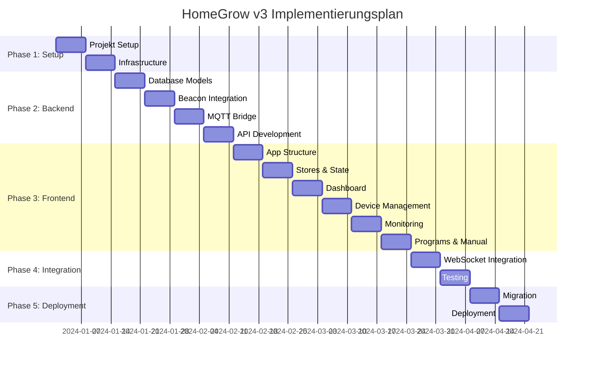

# HomeGrow v3 - Implementierungsplan

## Übersicht

Dieses Dokument definiert den detaillierten Implementierungsplan für HomeGrow v3 - eine professionelle Umbrel-App für hydroponische Systeme mit Arduino/ESP32-basierten Clients und Bitsperity Beacon Service Discovery.

## Projektstruktur

```
bitsperity-homegrow/
├── umbrel-app.yml                 # Umbrel App Konfiguration
├── docker-compose.yml             # Docker Services
├── Dockerfile                     # App Container
├── README.md                      # Projekt Dokumentation
├── REQUIREMENTS.md                # Funktionale Anforderungen
├── IMPLEMENTATION.md              # Dieser Implementierungsplan
├── CHANGELOG.md                   # Versionshistorie
├── .env.example                   # Umgebungsvariablen Template
├── .gitignore                     # Git Ignore Regeln
├── package.json                   # Node.js Dependencies
├── package-lock.json              # Dependency Lock
├── svelte.config.js               # SvelteKit Konfiguration
├── tailwind.config.js             # Tailwind CSS Konfiguration
├── vite.config.js                 # Vite Build Konfiguration
├── src/                           # Hauptquellcode
│   ├── app.html                   # HTML Template
│   ├── app.css                    # Globale Styles
│   ├── hooks.client.js            # Client-side Hooks
│   ├── hooks.server.js            # Server-side Hooks
│   ├── lib/                       # Shared Libraries
│   │   ├── components/            # Svelte Components
│   │   │   ├── ui/                # UI Base Components
│   │   │   ├── charts/            # Chart Components
│   │   │   ├── device/            # Device Components
│   │   │   ├── monitoring/        # Monitoring Components
│   │   │   ├── program/           # Program Components
│   │   │   └── manual/            # Manual Control Components
│   │   ├── stores/                # Svelte Stores
│   │   ├── utils/                 # Utility Functions
│   │   ├── types/                 # TypeScript Types
│   │   ├── api/                   # API Client
│   │   ├── mqtt/                  # MQTT Client
│   │   ├── beacon/                # Beacon Service Discovery
│   │   └── database/              # Database Models
│   ├── routes/                    # SvelteKit Routes
│   │   ├── +layout.svelte         # Root Layout
│   │   ├── +page.svelte           # Dashboard
│   │   ├── devices/               # Device Management
│   │   ├── monitoring/            # Live Monitoring
│   │   ├── programs/              # Program Management
│   │   ├── manual/                # Manual Control
│   │   ├── settings/              # Settings
│   │   └── api/                   # API Routes
│   │       ├── v1/                # API v1
│   │       │   ├── devices/       # Device API
│   │       │   ├── sensors/       # Sensor Data API
│   │       │   ├── commands/      # Command API
│   │       │   ├── programs/      # Program API
│   │       │   └── system/        # System API
│   │       └── ws/                # WebSocket Handler
│   └── service-worker.js          # PWA Service Worker
├── server/                        # Backend Services
│   ├── index.js                   # Main Server Entry
│   ├── config/                    # Configuration
│   │   ├── database.js            # MongoDB Config
│   │   ├── mqtt.js                # MQTT Config
│   │   ├── beacon.js              # Beacon Config
│   │   └── app.js                 # App Config
│   ├── services/                  # Backend Services
│   │   ├── beacon-client.js       # Beacon Service Discovery
│   │   ├── mqtt-bridge.js         # MQTT-DB Bridge
│   │   ├── automation-engine.js   # Automation Engine
│   │   ├── program-engine.js      # Program Engine
│   │   ├── notification.js        # Notification Service
│   │   └── websocket.js           # WebSocket Service
│   ├── models/                    # Database Models
│   │   ├── device.js              # Device Model
│   │   ├── sensor-data.js         # Sensor Data Model
│   │   ├── command.js             # Command Model
│   │   ├── program.js             # Program Model
│   │   └── user.js                # User Model
│   ├── routes/                    # API Routes
│   │   ├── devices.js             # Device Routes
│   │   ├── sensors.js             # Sensor Routes
│   │   ├── commands.js            # Command Routes
│   │   ├── programs.js            # Program Routes
│   │   └── system.js              # System Routes
│   ├── middleware/                # Express Middleware
│   │   ├── auth.js                # Authentication
│   │   ├── validation.js          # Request Validation
│   │   ├── error-handler.js       # Error Handling
│   │   └── rate-limit.js          # Rate Limiting
│   └── utils/                     # Server Utilities
│       ├── logger.js              # Logging Utility
│       ├── crypto.js              # Encryption Utility
│       └── helpers.js             # Helper Functions
├── static/                        # Static Assets
│   ├── favicon.ico                # App Icon
│   ├── manifest.json              # PWA Manifest
│   ├── icons/                     # App Icons
│   └── images/                    # Static Images
├── tests/                         # Test Suite
│   ├── unit/                      # Unit Tests
│   ├── integration/               # Integration Tests
│   ├── e2e/                       # End-to-End Tests
│   └── fixtures/                  # Test Data
├── docs/                          # Documentation
│   ├── api/                       # API Documentation
│   ├── deployment/                # Deployment Guides
│   └── user/                      # User Documentation
├── scripts/                       # Build & Deployment Scripts
│   ├── build.sh                   # Build Script
│   ├── deploy.sh                  # Deployment Script
│   ├── migrate.js                 # Migration Script
│   └── seed.js                    # Database Seeding
└── migration/                     # v2 to v3 Migration
    ├── data-migration.js          # Data Migration Tool
    ├── config-migration.js        # Config Migration
    └── validation.js              # Migration Validation
```

## Phase 1: Projekt-Setup & Infrastructure (Woche 1-2)

### 1.1 Projekt-Initialisierung

**Aufgaben:**
- [ ] Repository Setup mit Projektstruktur
- [ ] Package.json mit Dependencies konfigurieren
- [ ] Docker-Umgebung einrichten
- [ ] Umbrel App Konfiguration erstellen
- [ ] Entwicklungsumgebung dokumentieren

**Deliverables:**
```bash
# Package.json Dependencies
{
  "dependencies": {
    "@sveltejs/kit": "^2.0.0",
    "svelte": "^4.2.0",
    "tailwindcss": "^3.3.0",
    "fastify": "^4.24.0",
    "socket.io": "^4.7.0",
    "mongodb": "^6.3.0",
    "mqtt": "^5.3.0",
    "ws": "^8.14.0",
    "jsonwebtoken": "^9.0.0",
    "bcryptjs": "^2.4.3",
    "joi": "^17.11.0",
    "winston": "^3.11.0",
    "node-cron": "^3.0.0"
  },
  "devDependencies": {
    "@types/node": "^20.10.0",
    "typescript": "^5.3.0",
    "vitest": "^1.0.0",
    "playwright": "^1.40.0",
    "eslint": "^8.55.0",
    "prettier": "^3.1.0"
  }
}
```

**Docker-Compose Setup:**
```yaml
version: '3.8'
services:
  homegrow-app:
    build: .
    ports:
      - "3000:3000"
    environment:
      - NODE_ENV=production
      - MONGODB_URL=mongodb://bitsperity-mongodb:27017/homegrow
      - MQTT_URL=mqtt://umbrel-mqtt:1883
      - BEACON_URL=http://bitsperity-beacon:8080
    depends_on:
      - bitsperity-mongodb
      - bitsperity-beacon
    volumes:
      - ./data:/app/data
    restart: unless-stopped
```

**Umbrel App Konfiguration:**
```yaml
# umbrel-app.yml
manifestVersion: 1
id: bitsperity-homegrow
name: HomeGrow v3
tagline: Professional Hydroponic System Management
icon: https://raw.githubusercontent.com/bitsperity/homegrow/main/static/icon.svg
category: automation
version: "3.0.0"
port: 3000
description: >-
  HomeGrow v3 ist eine professionelle Umbrel-App für die Verwaltung 
  hydroponischer Systeme mit Arduino/ESP32-basierten Clients.
dependencies:
  - bitsperity-mongodb
  - bitsperity-beacon
path: ""
defaultUsername: ""
defaultPassword: ""
submitter: Bitsperity
submission: https://github.com/bitsperity/homegrow
repo: https://github.com/bitsperity/homegrow
support: https://github.com/bitsperity/homegrow/issues
gallery:
  - https://raw.githubusercontent.com/bitsperity/homegrow/main/docs/screenshots/dashboard.png
  - https://raw.githubusercontent.com/bitsperity/homegrow/main/docs/screenshots/monitoring.png
releaseNotes: >-
  HomeGrow v3 bringt eine komplett überarbeitete Benutzeroberfläche,
  automatische Service Discovery über Bitsperity Beacon und erweiterte
  Automation-Features.
```

### 1.2 Entwicklungsumgebung

**Aufgaben:**
- [ ] ESLint & Prettier Konfiguration
- [ ] TypeScript Setup für Type Safety
- [ ] Vitest für Unit Testing
- [ ] Playwright für E2E Testing
- [ ] GitHub Actions für CI/CD

**Konfigurationsdateien:**
```javascript
// svelte.config.js
import adapter from '@sveltejs/adapter-node';
import { vitePreprocess } from '@sveltejs/kit/vite';

export default {
  preprocess: vitePreprocess(),
  kit: {
    adapter: adapter(),
    alias: {
      $lib: 'src/lib',
      $components: 'src/lib/components',
      $stores: 'src/lib/stores',
      $utils: 'src/lib/utils',
      $types: 'src/lib/types'
    }
  }
};
```

```javascript
// tailwind.config.js
export default {
  content: ['./src/**/*.{html,js,svelte,ts}'],
  theme: {
    extend: {
      colors: {
        primary: {
          50: '#f0f9ff',
          500: '#3b82f6',
          900: '#1e3a8a'
        },
        success: {
          50: '#f0fdf4',
          500: '#22c55e',
          900: '#14532d'
        },
        warning: {
          50: '#fffbeb',
          500: '#f59e0b',
          900: '#78350f'
        },
        danger: {
          50: '#fef2f2',
          500: '#ef4444',
          900: '#7f1d1d'
        }
      }
    }
  },
  plugins: []
};
```

## Phase 2: Backend Services Development (Woche 3-6)

### 2.1 Database Models & Schema

**Aufgaben:**
- [ ] MongoDB Connection Setup
- [ ] Device Model Implementation
- [ ] Sensor Data Model mit Time-Series Optimierung
- [ ] Command Model mit Status Tracking
- [ ] Program Model mit Phase Management
- [ ] User Model mit Role-Based Access

**Device Model:**
```javascript
// server/models/device.js
const { ObjectId } = require('mongodb');

class DeviceModel {
  constructor(db) {
    this.collection = db.collection('devices');
    this.createIndexes();
  }

  async createIndexes() {
    await this.collection.createIndex({ device_id: 1 }, { unique: true });
    await this.collection.createIndex({ status: 1 });
    await this.collection.createIndex({ last_seen: 1 });
    await this.collection.createIndex({ 'beacon.service_id': 1 });
  }

  async create(deviceData) {
    const device = {
      device_id: deviceData.device_id,
      name: deviceData.name || `Device ${deviceData.device_id}`,
      type: deviceData.type || 'homegrow-client',
      location: deviceData.location || '',
      description: deviceData.description || '',
      status: 'offline',
      created_at: new Date(),
      updated_at: new Date(),
      last_seen: null,
      config: {
        wifi: {
          ssid: '',
          signal_strength: 0
        },
        mqtt: {
          broker: process.env.MQTT_URL,
          topics: {
            sensors: `homegrow/devices/${deviceData.device_id}/sensors`,
            commands: `homegrow/devices/${deviceData.device_id}/commands`,
            heartbeat: `homegrow/devices/${deviceData.device_id}/heartbeat`
          }
        },
        sensors: {
          ph: {
            enabled: true,
            calibration: {
              point_4: 1854,
              point_7: 1654,
              point_10: 1454,
              last_calibrated: null
            },
            filter: {
              type: 'moving_average',
              window_size: 10
            }
          },
          tds: {
            enabled: true,
            calibration: {
              reference_value: 1413,
              last_calibrated: null
            },
            filter: {
              type: 'moving_average',
              window_size: 10
            }
          }
        },
        actuators: {
          pumps: {
            water: { enabled: true, flow_rate_ml_per_sec: 10, max_runtime_sec: 300 },
            air: { enabled: true, flow_rate_ml_per_sec: 0, max_runtime_sec: 3600 },
            ph_down: { enabled: true, flow_rate_ml_per_sec: 1, max_runtime_sec: 60 },
            ph_up: { enabled: true, flow_rate_ml_per_sec: 1, max_runtime_sec: 60 },
            nutrient_a: { enabled: true, flow_rate_ml_per_sec: 2, max_runtime_sec: 120 },
            nutrient_b: { enabled: true, flow_rate_ml_per_sec: 2, max_runtime_sec: 120 },
            cal_mag: { enabled: true, flow_rate_ml_per_sec: 1, max_runtime_sec: 60 }
          }
        },
        safety: {
          ph_min: 4.0,
          ph_max: 8.5,
          tds_max: 2000,
          emergency_stop_enabled: true
        }
      },
      stats: {
        uptime_hours: 0,
        memory_usage_percent: 0,
        wifi_signal_strength: 0,
        total_commands_processed: 0,
        total_sensor_readings: 0,
        total_pump_activations: 0
      },
      beacon: {
        service_id: null,
        registered: false,
        last_heartbeat: null
      }
    };

    const result = await this.collection.insertOne(device);
    return { ...device, _id: result.insertedId };
  }

  async findByDeviceId(deviceId) {
    return await this.collection.findOne({ device_id: deviceId });
  }

  async updateStatus(deviceId, status, lastSeen = new Date()) {
    return await this.collection.updateOne(
      { device_id: deviceId },
      { 
        $set: { 
          status, 
          last_seen: lastSeen,
          updated_at: new Date()
        } 
      }
    );
  }

  async updateBeaconInfo(deviceId, beaconData) {
    return await this.collection.updateOne(
      { device_id: deviceId },
      { 
        $set: { 
          'beacon.service_id': beaconData.service_id,
          'beacon.registered': true,
          'beacon.last_heartbeat': new Date(),
          updated_at: new Date()
        } 
      }
    );
  }

  async findAll(filter = {}) {
    return await this.collection.find(filter).toArray();
  }

  async updateConfig(deviceId, configUpdate) {
    return await this.collection.updateOne(
      { device_id: deviceId },
      { 
        $set: { 
          config: configUpdate,
          updated_at: new Date()
        } 
      }
    );
  }
}

module.exports = DeviceModel;
```

**Sensor Data Model:**
```javascript
// server/models/sensor-data.js
class SensorDataModel {
  constructor(db) {
    this.collection = db.collection('sensor_data');
    this.createIndexes();
  }

  async createIndexes() {
    // Compound index for efficient queries
    await this.collection.createIndex({ 
      device_id: 1, 
      sensor_type: 1, 
      timestamp: -1 
    });
    
    // TTL index for automatic data cleanup (30 days)
    await this.collection.createIndex(
      { timestamp: 1 }, 
      { expireAfterSeconds: 30 * 24 * 60 * 60 }
    );
  }

  async insert(sensorData) {
    const document = {
      device_id: sensorData.device_id,
      sensor_type: sensorData.sensor_type,
      timestamp: new Date(sensorData.timestamp),
      device_timestamp: sensorData.device_timestamp,
      values: {
        raw: sensorData.values.raw,
        calibrated: sensorData.values.calibrated,
        filtered: sensorData.values.filtered
      },
      unit: sensorData.unit,
      quality: sensorData.quality || 'good',
      calibration_status: sensorData.calibration_status || 'valid',
      filter_config: sensorData.filter_config
    };

    return await this.collection.insertOne(document);
  }

  async getLatest(deviceId, sensorType) {
    return await this.collection.findOne(
      { device_id: deviceId, sensor_type: sensorType },
      { sort: { timestamp: -1 } }
    );
  }

  async getRange(deviceId, sensorType, startTime, endTime, limit = 1000) {
    return await this.collection.find({
      device_id: deviceId,
      sensor_type: sensorType,
      timestamp: { $gte: startTime, $lte: endTime }
    })
    .sort({ timestamp: -1 })
    .limit(limit)
    .toArray();
  }

  async getAggregated(deviceId, sensorType, interval, startTime, endTime) {
    const pipeline = [
      {
        $match: {
          device_id: deviceId,
          sensor_type: sensorType,
          timestamp: { $gte: startTime, $lte: endTime }
        }
      },
      {
        $group: {
          _id: {
            $dateTrunc: {
              date: "$timestamp",
              unit: interval // "hour", "day", etc.
            }
          },
          avg_value: { $avg: "$values.calibrated" },
          min_value: { $min: "$values.calibrated" },
          max_value: { $max: "$values.calibrated" },
          count: { $sum: 1 }
        }
      },
      { $sort: { "_id": 1 } }
    ];

    return await this.collection.aggregate(pipeline).toArray();
  }
}

module.exports = SensorDataModel;
```

### 2.2 Bitsperity Beacon Service Discovery

**Aufgaben:**
- [ ] Beacon Client Implementation
- [ ] Service Registration für HomeGrow Server
- [ ] Device Discovery für ESP32 Clients
- [ ] WebSocket Integration für Real-time Updates
- [ ] Heartbeat Management

**Beacon Client Service:**
```javascript
// server/services/beacon-client.js
const EventEmitter = require('events');
const WebSocket = require('ws');

class BeaconServiceDiscovery extends EventEmitter {
  constructor(beaconUrl = 'http://bitsperity-beacon:8080') {
    super();
    this.beaconUrl = beaconUrl;
    this.serviceId = null;
    this.discoveredDevices = new Map();
    this.wsConnection = null;
    this.heartbeatInterval = null;
    this.reconnectAttempts = 0;
    this.maxReconnectAttempts = 5;
  }

  async initialize() {
    try {
      await this.registerHomeGrowServer();
      await this.discoverExistingDevices();
      this.connectWebSocket();
      this.startHeartbeat();
      
      console.log('Beacon Service Discovery initialized successfully');
      return true;
    } catch (error) {
      console.warn('Beacon Service Discovery initialization failed:', error.message);
      console.warn('Continuing without service discovery...');
      return false;
    }
  }

  async registerHomeGrowServer() {
    const serviceData = {
      name: "homegrow-server",
      type: "web",
      host: process.env.HOMEGROW_HOST || "homegrow-app",
      port: parseInt(process.env.HOMEGROW_PORT) || 3000,
      protocol: "http",
      tags: ["homegrow", "hydroponics", "web-interface", "management"],
      metadata: {
        version: "3.0.0",
        description: "HomeGrow Hydroponic Management Server",
        capabilities: ["device_management", "monitoring", "automation"],
        endpoints: {
          api: "/api/v1",
          websocket: "/ws",
          dashboard: "/"
        },
        supported_clients: ["homegrow-client-v3"]
      },
      ttl: 300
    };

    const response = await fetch(`${this.beaconUrl}/api/v1/services/register`, {
      method: 'POST',
      headers: { 'Content-Type': 'application/json' },
      body: JSON.stringify(serviceData)
    });

    if (!response.ok) {
      throw new Error(`Registration failed: ${response.status}`);
    }

    const result = await response.json();
    this.serviceId = result.service_id;
    
    console.log(`HomeGrow Server registered with Beacon: ${this.serviceId}`);
    return result;
  }

  async discoverExistingDevices() {
    const response = await fetch(
      `${this.beaconUrl}/api/v1/services/discover?type=iot&tags=homegrow`
    );

    if (!response.ok) {
      throw new Error(`Discovery failed: ${response.status}`);
    }

    const services = await response.json();
    
    for (const service of services) {
      if (service.tags.includes('homegrow') && service.name.startsWith('homegrow-client')) {
        this.handleDeviceDiscovered(service);
      }
    }

    console.log(`Discovered ${this.discoveredDevices.size} existing HomeGrow devices`);
  }

  connectWebSocket() {
    try {
      const wsUrl = this.beaconUrl.replace('http', 'ws') + '/api/v1/ws';
      this.wsConnection = new WebSocket(wsUrl);

      this.wsConnection.on('open', () => {
        console.log('WebSocket connection to Beacon established');
        this.reconnectAttempts = 0;
      });

      this.wsConnection.on('message', (data) => {
        try {
          const update = JSON.parse(data.toString());
          this.handleWebSocketMessage(update);
        } catch (error) {
          console.error('Error parsing WebSocket message:', error);
        }
      });

      this.wsConnection.on('close', () => {
        console.log('WebSocket connection to Beacon closed');
        this.scheduleReconnect();
      });

      this.wsConnection.on('error', (error) => {
        console.error('WebSocket error:', error);
      });

    } catch (error) {
      console.warn('Failed to establish WebSocket connection:', error);
      this.scheduleReconnect();
    }
  }

  handleWebSocketMessage(update) {
    switch (update.type) {
      case 'service_registered':
        if (this.isHomeGrowClient(update.service)) {
          this.handleDeviceDiscovered(update.service);
        }
        break;
        
      case 'service_deregistered':
        this.handleDeviceRemoved(update.service_id);
        break;
        
      case 'service_updated':
        if (this.isHomeGrowClient(update.service)) {
          this.handleDeviceUpdated(update.service);
        }
        break;
    }
  }

  isHomeGrowClient(service) {
    return service.tags.includes('homegrow') && 
           service.name.startsWith('homegrow-client') &&
           service.type === 'iot';
  }

  handleDeviceDiscovered(service) {
    const deviceInfo = {
      service_id: service.service_id,
      device_id: this.extractDeviceId(service.name),
      name: service.name,
      host: service.host,
      port: service.port,
      metadata: service.metadata,
      last_seen: new Date(service.updated_at),
      status: 'online'
    };

    this.discoveredDevices.set(service.service_id, deviceInfo);
    
    console.log(`New HomeGrow device discovered: ${deviceInfo.device_id}`);
    this.emit('device_discovered', deviceInfo);
  }

  handleDeviceUpdated(service) {
    if (this.discoveredDevices.has(service.service_id)) {
      const deviceInfo = this.discoveredDevices.get(service.service_id);
      deviceInfo.last_seen = new Date(service.updated_at);
      deviceInfo.metadata = service.metadata;
      
      this.emit('device_updated', deviceInfo);
    }
  }

  handleDeviceRemoved(serviceId) {
    const deviceInfo = this.discoveredDevices.get(serviceId);
    if (deviceInfo) {
      this.discoveredDevices.delete(serviceId);
      console.log(`HomeGrow device removed: ${deviceInfo.device_id}`);
      this.emit('device_removed', deviceInfo);
    }
  }

  extractDeviceId(serviceName) {
    // Extract device ID from service name like "homegrow-client-001"
    const match = serviceName.match(/homegrow-client-(.+)$/);
    return match ? match[1] : serviceName;
  }

  startHeartbeat() {
    if (this.serviceId) {
      this.heartbeatInterval = setInterval(async () => {
        try {
          const response = await fetch(
            `${this.beaconUrl}/api/v1/services/${this.serviceId}/heartbeat`,
            { method: 'PUT' }
          );
          
          if (!response.ok) {
            console.warn(`Heartbeat failed: ${response.status}`);
          }
        } catch (error) {
          console.warn('Heartbeat error:', error.message);
        }
      }, 60000); // Every 60 seconds
    }
  }

  scheduleReconnect() {
    if (this.reconnectAttempts < this.maxReconnectAttempts) {
      const delay = Math.pow(2, this.reconnectAttempts) * 1000; // Exponential backoff
      this.reconnectAttempts++;
      
      setTimeout(() => {
        console.log(`Attempting to reconnect to Beacon (attempt ${this.reconnectAttempts})`);
        this.connectWebSocket();
      }, delay);
    } else {
      console.error('Max reconnection attempts reached. Service discovery disabled.');
    }
  }

  getDiscoveredDevices() {
    return Array.from(this.discoveredDevices.values());
  }

  async shutdown() {
    if (this.heartbeatInterval) {
      clearInterval(this.heartbeatInterval);
    }
    
    if (this.wsConnection) {
      this.wsConnection.close();
    }
    
    if (this.serviceId) {
      try {
        await fetch(`${this.beaconUrl}/api/v1/services/${this.serviceId}`, {
          method: 'DELETE'
        });
        console.log('HomeGrow Server deregistered from Beacon');
      } catch (error) {
        console.warn('Failed to deregister from Beacon:', error);
      }
    }
  }
}

module.exports = BeaconServiceDiscovery;
```

### 2.3 MQTT Bridge Service

**Aufgaben:**
- [ ] MQTT Client Setup mit Reconnection Logic
- [ ] Topic Subscription Management
- [ ] Message Parsing & Validation
- [ ] Database Integration für Sensor Data
- [ ] Command Publishing & Response Handling

**MQTT Bridge Implementation:**
```javascript
// server/services/mqtt-bridge.js
const mqtt = require('mqtt');
const EventEmitter = require('events');

class MQTTBridge extends EventEmitter {
  constructor(mqttUrl, deviceModel, sensorDataModel, commandModel) {
    super();
    this.mqttUrl = mqttUrl;
    this.client = null;
    this.deviceModel = deviceModel;
    this.sensorDataModel = sensorDataModel;
    this.commandModel = commandModel;
    this.subscribedTopics = new Set();
    this.reconnectAttempts = 0;
    this.maxReconnectAttempts = 10;
  }

  async connect() {
    return new Promise((resolve, reject) => {
      this.client = mqtt.connect(this.mqttUrl, {
        clientId: `homegrow-server-${Date.now()}`,
        clean: true,
        connectTimeout: 30000,
        reconnectPeriod: 5000,
        keepalive: 60
      });

      this.client.on('connect', () => {
        console.log('Connected to MQTT broker');
        this.reconnectAttempts = 0;
        this.subscribeToTopics();
        resolve();
      });

      this.client.on('error', (error) => {
        console.error('MQTT connection error:', error);
        reject(error);
      });

      this.client.on('message', (topic, message) => {
        this.handleMessage(topic, message);
      });

      this.client.on('reconnect', () => {
        this.reconnectAttempts++;
        console.log(`MQTT reconnecting (attempt ${this.reconnectAttempts})`);
      });

      this.client.on('offline', () => {
        console.log('MQTT client offline');
      });
    });
  }

  subscribeToTopics() {
    const topics = [
      'homegrow/devices/+/sensors/+',
      'homegrow/devices/+/heartbeat',
      'homegrow/devices/+/status',
      'homegrow/devices/+/commands/response',
      'homegrow/devices/+/logs'
    ];

    topics.forEach(topic => {
      this.client.subscribe(topic, (err) => {
        if (err) {
          console.error(`Failed to subscribe to ${topic}:`, err);
        } else {
          console.log(`Subscribed to ${topic}`);
          this.subscribedTopics.add(topic);
        }
      });
    });
  }

  async handleMessage(topic, message) {
    try {
      const topicParts = topic.split('/');
      const deviceId = topicParts[2];
      const messageType = topicParts[3];
      
      let payload;
      try {
        payload = JSON.parse(message.toString());
      } catch (error) {
        console.error(`Invalid JSON in message from ${topic}:`, error);
        return;
      }

      switch (messageType) {
        case 'sensors':
          await this.handleSensorData(deviceId, topicParts[4], payload);
          break;
        case 'heartbeat':
          await this.handleHeartbeat(deviceId, payload);
          break;
        case 'status':
          await this.handleStatusUpdate(deviceId, payload);
          break;
        case 'commands':
          if (topicParts[4] === 'response') {
            await this.handleCommandResponse(deviceId, payload);
          }
          break;
        case 'logs':
          await this.handleLogMessage(deviceId, payload);
          break;
        default:
          console.log(`Unknown message type: ${messageType}`);
      }
    } catch (error) {
      console.error('Error handling MQTT message:', error);
    }
  }

  async handleSensorData(deviceId, sensorType, payload) {
    // Validate sensor data
    if (!this.validateSensorData(payload)) {
      console.error(`Invalid sensor data from ${deviceId}:`, payload);
      return;
    }

    // Store in database
    const sensorData = {
      device_id: deviceId,
      sensor_type: sensorType,
      timestamp: payload.timestamp || new Date().toISOString(),
      device_timestamp: payload.device_timestamp,
      values: payload.values,
      unit: payload.unit,
      quality: payload.quality,
      calibration_status: payload.calibration_status,
      filter_config: payload.filter_config
    };

    await this.sensorDataModel.insert(sensorData);

    // Update device last seen
    await this.deviceModel.updateStatus(deviceId, 'online');

    // Emit event for real-time updates
    this.emit('sensor_data', {
      device_id: deviceId,
      sensor_type: sensorType,
      data: sensorData
    });

    console.log(`Sensor data received: ${deviceId}/${sensorType} = ${payload.values.calibrated}`);
  }

  async handleHeartbeat(deviceId, payload) {
    await this.deviceModel.updateStatus(deviceId, 'online');
    
    // Update device stats if provided
    if (payload.stats) {
      await this.deviceModel.collection.updateOne(
        { device_id: deviceId },
        { $set: { stats: payload.stats, updated_at: new Date() } }
      );
    }

    this.emit('device_heartbeat', { device_id: deviceId, payload });
  }

  async handleStatusUpdate(deviceId, payload) {
    await this.deviceModel.collection.updateOne(
      { device_id: deviceId },
      { 
        $set: { 
          status: payload.status,
          'config.wifi.signal_strength': payload.wifi_signal || 0,
          updated_at: new Date()
        } 
      }
    );

    this.emit('device_status', { device_id: deviceId, status: payload.status });
  }

  async handleCommandResponse(deviceId, payload) {
    // Update command status in database
    await this.commandModel.updateResponse(payload.command_id, payload);

    this.emit('command_response', {
      device_id: deviceId,
      command_id: payload.command_id,
      response: payload
    });

    console.log(`Command response: ${deviceId}/${payload.command_id} = ${payload.status}`);
  }

  async handleLogMessage(deviceId, payload) {
    // Store log message
    console.log(`Device log [${deviceId}]: ${payload.level} - ${payload.message}`);
    
    this.emit('device_log', {
      device_id: deviceId,
      log: payload
    });
  }

  validateSensorData(payload) {
    return payload &&
           payload.values &&
           typeof payload.values.raw === 'number' &&
           typeof payload.values.calibrated === 'number' &&
           typeof payload.values.filtered === 'number' &&
           payload.unit &&
           payload.timestamp;
  }

  async publishCommand(deviceId, command) {
    const topic = `homegrow/devices/${deviceId}/commands`;
    const payload = JSON.stringify(command);

    return new Promise((resolve, reject) => {
      this.client.publish(topic, payload, { qos: 1 }, (error) => {
        if (error) {
          console.error(`Failed to publish command to ${deviceId}:`, error);
          reject(error);
        } else {
          console.log(`Command published to ${deviceId}: ${command.command}`);
          resolve();
        }
      });
    });
  }

  async subscribeToDevice(deviceId) {
    const topics = [
      `homegrow/devices/${deviceId}/sensors/+`,
      `homegrow/devices/${deviceId}/heartbeat`,
      `homegrow/devices/${deviceId}/status`,
      `homegrow/devices/${deviceId}/commands/response`,
      `homegrow/devices/${deviceId}/logs`
    ];

    for (const topic of topics) {
      if (!this.subscribedTopics.has(topic)) {
        await new Promise((resolve, reject) => {
          this.client.subscribe(topic, (err) => {
            if (err) {
              reject(err);
            } else {
              this.subscribedTopics.add(topic);
              resolve();
            }
          });
        });
      }
    }
  }

  disconnect() {
    if (this.client) {
      this.client.end();
    }
  }
}

module.exports = MQTTBridge;
```

### 2.4 API Routes Implementation

**Aufgaben:**
- [ ] Device Management API
- [ ] Sensor Data API mit Aggregation
- [ ] Command API mit Status Tracking
- [ ] Program Management API
- [ ] System Status API

**Device API Routes:**
```javascript
// server/routes/devices.js
const express = require('express');
const router = express.Router();

class DeviceRoutes {
  constructor(deviceModel, mqttBridge, beaconClient) {
    this.deviceModel = deviceModel;
    this.mqttBridge = mqttBridge;
    this.beaconClient = beaconClient;
    this.setupRoutes();
  }

  setupRoutes() {
    // Get all devices
    router.get('/', async (req, res) => {
      try {
        const devices = await this.deviceModel.findAll();
        
        // Enrich with beacon discovery data
        const discoveredDevices = this.beaconClient.getDiscoveredDevices();
        const enrichedDevices = devices.map(device => {
          const discovered = discoveredDevices.find(d => d.device_id === device.device_id);
          return {
            ...device,
            beacon_status: discovered ? 'discovered' : 'not_discovered',
            beacon_last_seen: discovered?.last_seen || null
          };
        });

        res.json({
          success: true,
          data: enrichedDevices,
          count: enrichedDevices.length
        });
      } catch (error) {
        res.status(500).json({
          success: false,
          error: error.message
        });
      }
    });

    // Get device by ID
    router.get('/:deviceId', async (req, res) => {
      try {
        const device = await this.deviceModel.findByDeviceId(req.params.deviceId);
        
        if (!device) {
          return res.status(404).json({
            success: false,
            error: 'Device not found'
          });
        }

        res.json({
          success: true,
          data: device
        });
      } catch (error) {
        res.status(500).json({
          success: false,
          error: error.message
        });
      }
    });

    // Create new device
    router.post('/', async (req, res) => {
      try {
        const deviceData = req.body;
        
        // Validate required fields
        if (!deviceData.device_id) {
          return res.status(400).json({
            success: false,
            error: 'device_id is required'
          });
        }

        // Check if device already exists
        const existing = await this.deviceModel.findByDeviceId(deviceData.device_id);
        if (existing) {
          return res.status(409).json({
            success: false,
            error: 'Device already exists'
          });
        }

        const device = await this.deviceModel.create(deviceData);
        
        // Subscribe to device MQTT topics
        await this.mqttBridge.subscribeToDevice(device.device_id);

        res.status(201).json({
          success: true,
          data: device
        });
      } catch (error) {
        res.status(500).json({
          success: false,
          error: error.message
        });
      }
    });

    // Update device configuration
    router.put('/:deviceId/config', async (req, res) => {
      try {
        const deviceId = req.params.deviceId;
        const configUpdate = req.body;

        const device = await this.deviceModel.findByDeviceId(deviceId);
        if (!device) {
          return res.status(404).json({
            success: false,
            error: 'Device not found'
          });
        }

        // Merge with existing config
        const newConfig = { ...device.config, ...configUpdate };
        
        await this.deviceModel.updateConfig(deviceId, newConfig);

        // Send config update command to device
        const command = {
          command_id: `config_${Date.now()}`,
          command: 'update_config',
          params: configUpdate,
          timestamp: new Date().toISOString()
        };

        await this.mqttBridge.publishCommand(deviceId, command);

        res.json({
          success: true,
          message: 'Configuration updated'
        });
      } catch (error) {
        res.status(500).json({
          success: false,
          error: error.message
        });
      }
    });

    // Delete device
    router.delete('/:deviceId', async (req, res) => {
      try {
        const deviceId = req.params.deviceId;
        
        const result = await this.deviceModel.collection.deleteOne({
          device_id: deviceId
        });

        if (result.deletedCount === 0) {
          return res.status(404).json({
            success: false,
            error: 'Device not found'
          });
        }

        res.json({
          success: true,
          message: 'Device deleted'
        });
      } catch (error) {
        res.status(500).json({
          success: false,
          error: error.message
        });
      }
    });

    // Discover devices via Beacon
    router.post('/discover', async (req, res) => {
      try {
        const discoveredDevices = this.beaconClient.getDiscoveredDevices();
        
        // Auto-register discovered devices
        const newDevices = [];
        for (const discovered of discoveredDevices) {
          const existing = await this.deviceModel.findByDeviceId(discovered.device_id);
          if (!existing) {
            const deviceData = {
              device_id: discovered.device_id,
              name: discovered.name,
              type: 'homegrow-client'
            };
            
            const device = await this.deviceModel.create(deviceData);
            await this.deviceModel.updateBeaconInfo(discovered.device_id, discovered);
            await this.mqttBridge.subscribeToDevice(discovered.device_id);
            
            newDevices.push(device);
          }
        }

        res.json({
          success: true,
          discovered: discoveredDevices.length,
          new_devices: newDevices.length,
          data: newDevices
        });
      } catch (error) {
        res.status(500).json({
          success: false,
          error: error.message
        });
      }
    });

    return router;
  }
}

module.exports = DeviceRoutes;
```

## Phase 3: Frontend Development (Woche 7-12)

### 3.1 SvelteKit App Structure & Layout

**Aufgaben:**
- [ ] Root Layout mit Navigation
- [ ] PWA Manifest & Service Worker
- [ ] Responsive Design System
- [ ] Dark/Light Mode Implementation
- [ ] Error Boundary & Loading States

**Root Layout:**
```svelte
<!-- src/routes/+layout.svelte -->
<script>
  import '../app.css';
  import { onMount } from 'svelte';
  import { page } from '$app/stores';
  import { themeStore, deviceStore, notificationStore } from '$lib/stores';
  import Navigation from '$lib/components/Navigation.svelte';
  import NotificationToast from '$lib/components/NotificationToast.svelte';
  import LoadingSpinner from '$lib/components/ui/LoadingSpinner.svelte';
  import ErrorBoundary from '$lib/components/ui/ErrorBoundary.svelte';

  let isLoading = true;
  let navigationOpen = false;

  onMount(async () => {
    // Initialize app
    await themeStore.initialize();
    await deviceStore.initialize();
    
    // Register service worker for PWA
    if ('serviceWorker' in navigator) {
      try {
        await navigator.serviceWorker.register('/service-worker.js');
        console.log('Service Worker registered');
      } catch (error) {
        console.error('Service Worker registration failed:', error);
      }
    }

    isLoading = false;
  });

  $: currentPath = $page.url.pathname;
</script>

<svelte:head>
  <title>HomeGrow v3 - Hydroponic Management</title>
  <meta name="description" content="Professional hydroponic system management with real-time monitoring and automation" />
  <meta name="viewport" content="width=device-width, initial-scale=1.0" />
  <meta name="theme-color" content="#3b82f6" />
  <link rel="manifest" href="/manifest.json" />
  <link rel="icon" href="/favicon.ico" />
</svelte:head>

<div class="app" class:dark={$themeStore.isDark}>
  {#if isLoading}
    <div class="loading-screen">
      <LoadingSpinner size="large" />
      <p>HomeGrow wird geladen...</p>
    </div>
  {:else}
    <ErrorBoundary>
      <div class="app-layout">
        <!-- Mobile Header -->
        <header class="mobile-header md:hidden">
          <button 
            class="menu-button"
            on:click={() => navigationOpen = !navigationOpen}
            aria-label="Navigation öffnen"
          >
            <svg class="w-6 h-6" fill="none" stroke="currentColor" viewBox="0 0 24 24">
              <path stroke-linecap="round" stroke-linejoin="round" stroke-width="2" d="M4 6h16M4 12h16M4 18h16" />
            </svg>
          </button>
          
          <h1 class="app-title">HomeGrow v3</h1>
          
          <button 
            class="theme-toggle"
            on:click={themeStore.toggle}
            aria-label="Theme wechseln"
          >
            {#if $themeStore.isDark}
              <svg class="w-5 h-5" fill="none" stroke="currentColor" viewBox="0 0 24 24">
                <path stroke-linecap="round" stroke-linejoin="round" stroke-width="2" d="M12 3v1m0 16v1m9-9h-1M4 12H3m15.364 6.364l-.707-.707M6.343 6.343l-.707-.707m12.728 0l-.707.707M6.343 17.657l-.707.707M16 12a4 4 0 11-8 0 4 4 0 018 0z" />
              </svg>
            {:else}
              <svg class="w-5 h-5" fill="none" stroke="currentColor" viewBox="0 0 24 24">
                <path stroke-linecap="round" stroke-linejoin="round" stroke-width="2" d="M20.354 15.354A9 9 0 018.646 3.646 9.003 9.003 0 0012 21a9.003 9.003 0 008.354-5.646z" />
              </svg>
            {/if}
          </button>
        </header>

        <!-- Navigation -->
        <Navigation bind:open={navigationOpen} {currentPath} />

        <!-- Main Content -->
        <main class="main-content">
          <slot />
        </main>

        <!-- Notification Toasts -->
        <NotificationToast />
      </div>
    </ErrorBoundary>
  {/if}
</div>

<style>
  .app {
    min-height: 100vh;
    background: var(--bg-primary);
    color: var(--text-primary);
    transition: background-color 0.2s ease;
  }

  .loading-screen {
    display: flex;
    flex-direction: column;
    align-items: center;
    justify-content: center;
    min-height: 100vh;
    gap: 1rem;
  }

  .app-layout {
    display: flex;
    flex-direction: column;
    min-height: 100vh;
  }

  .mobile-header {
    display: flex;
    align-items: center;
    justify-content: space-between;
    padding: 1rem;
    background: var(--bg-secondary);
    border-bottom: 1px solid var(--border-color);
    position: sticky;
    top: 0;
    z-index: 40;
  }

  .menu-button, .theme-toggle {
    padding: 0.5rem;
    border-radius: 0.5rem;
    background: transparent;
    border: none;
    color: var(--text-primary);
    cursor: pointer;
    transition: background-color 0.2s ease;
  }

  .menu-button:hover, .theme-toggle:hover {
    background: var(--bg-tertiary);
  }

  .app-title {
    font-size: 1.25rem;
    font-weight: 600;
    margin: 0;
  }

  .main-content {
    flex: 1;
    padding: 1rem;
    max-width: 100%;
    overflow-x: hidden;
  }

  @media (min-width: 768px) {
    .app-layout {
      flex-direction: row;
    }

    .main-content {
      margin-left: 16rem; /* Navigation width */
      padding: 2rem;
    }
  }
</style>
```

**Navigation Component:**
```svelte
<!-- src/lib/components/Navigation.svelte -->
<script>
  import { deviceStore } from '$lib/stores/deviceStore.js';
  import { goto } from '$app/navigation';
  
  export let open = false;
  export let currentPath = '/';

  const navigationItems = [
    { 
      path: '/', 
      label: 'Dashboard', 
      icon: 'home',
      description: 'Übersicht & Status'
    },
    { 
      path: '/devices', 
      label: 'Geräte', 
      icon: 'device',
      description: 'Device Management'
    },
    { 
      path: '/monitoring', 
      label: 'Monitoring', 
      icon: 'chart',
      description: 'Live Sensordaten'
    },
    { 
      path: '/programs', 
      label: 'Programme', 
      icon: 'program',
      description: 'Wachstumsprogramme'
    },
    { 
      path: '/manual', 
      label: 'Manuell', 
      icon: 'manual',
      description: 'Manuelle Steuerung'
    },
    { 
      path: '/settings', 
      label: 'Einstellungen', 
      icon: 'settings',
      description: 'System-Konfiguration'
    }
  ];

  function handleNavigation(path) {
    goto(path);
    open = false; // Close mobile navigation
  }

  function getIcon(iconName) {
    const icons = {
      home: 'M3 12l2-2m0 0l7-7 7 7M5 10v10a1 1 0 001 1h3m10-11l2 2m-2-2v10a1 1 0 01-1 1h-3m-6 0a1 1 0 001-1v-4a1 1 0 011-1h2a1 1 0 011 1v4a1 1 0 001 1m-6 0h6',
      device: 'M12 18h.01M8 21h8a2 2 0 002-2V5a2 2 0 00-2-2H8a2 2 0 00-2 2v14a2 2 0 002 2z',
      chart: 'M9 19v-6a2 2 0 00-2-2H5a2 2 0 00-2 2v6a2 2 0 002 2h2a2 2 0 002-2zm0 0V9a2 2 0 012-2h2a2 2 0 012 2v10m-6 0a2 2 0 002 2h2a2 2 0 002-2m0 0V5a2 2 0 012-2h2a2 2 0 012 2v14a2 2 0 01-2 2h-2a2 2 0 01-2-2z',
      program: 'M19.428 15.428a2 2 0 00-1.022-.547l-2.387-.477a6 6 0 00-3.86.517l-.318.158a6 6 0 01-3.86.517L6.05 15.21a2 2 0 00-1.806.547M8 4h8l-1 1v5.172a2 2 0 00.586 1.414l5 5c1.26 1.26.367 3.414-1.415 3.414H4.828c-1.782 0-2.674-2.154-1.414-3.414l5-5A2 2 0 009 10.172V5L8 4z',
      manual: 'M12 6V4m0 2a2 2 0 100 4m0-4a2 2 0 110 4m-6 8a2 2 0 100-4m0 4a2 2 0 100 4m0-4v2m0-6V4m6 6v10m6-2a2 2 0 100-4m0 4a2 2 0 100 4m0-4v2m0-6V4',
      settings: 'M10.325 4.317c.426-1.756 2.924-1.756 3.35 0a1.724 1.724 0 002.573 1.066c1.543-.94 3.31.826 2.37 2.37a1.724 1.724 0 001.065 2.572c1.756.426 1.756 2.924 0 3.35a1.724 1.724 0 00-1.066 2.573c.94 1.543-.826 3.31-2.37 2.37a1.724 1.724 0 00-2.572 1.065c-.426 1.756-2.924 1.756-3.35 0a1.724 1.724 0 00-2.573-1.066c-1.543.94-3.31-.826-2.37-2.37a1.724 1.724 0 00-1.065-2.572c-1.756-.426-1.756-2.924 0-3.35a1.724 1.724 0 001.066-2.573c-.94-1.543.826-3.31 2.37-2.37.996.608 2.296.07 2.572-1.065z M15 12a3 3 0 11-6 0 3 3 0 016 0z'
    };
    return icons[iconName] || icons.home;
  }

  $: onlineDevices = $deviceStore.devices.filter(d => d.status === 'online').length;
  $: totalDevices = $deviceStore.devices.length;
</script>

<!-- Mobile Navigation Overlay -->
{#if open}
  <div 
    class="mobile-overlay md:hidden"
    on:click={() => open = false}
    on:keydown={(e) => e.key === 'Escape' && (open = false)}
  ></div>
{/if}

<!-- Navigation Sidebar -->
<nav class="navigation" class:open>
  <!-- Logo & Title -->
  <div class="nav-header">
    <div class="logo">
      <svg class="w-8 h-8 text-primary-500" fill="none" stroke="currentColor" viewBox="0 0 24 24">
        <path stroke-linecap="round" stroke-linejoin="round" stroke-width="2" d="M19.428 15.428a2 2 0 00-1.022-.547l-2.387-.477a6 6 0 00-3.86.517l-.318.158a6 6 0 01-3.86.517L6.05 15.21a2 2 0 00-1.806.547M8 4h8l-1 1v5.172a2 2 0 00.586 1.414l5 5c1.26 1.26.367 3.414-1.415 3.414H4.828c-1.782 0-2.674-2.154-1.414-3.414l5-5A2 2 0 009 10.172V5L8 4z" />
      </svg>
      <div class="logo-text">
        <h2>HomeGrow</h2>
        <span>v3.0</span>
      </div>
    </div>
  </div>

  <!-- System Status -->
  <div class="system-status">
    <div class="status-item">
      <div class="status-indicator" class:online={onlineDevices > 0}></div>
      <span>{onlineDevices}/{totalDevices} Geräte online</span>
    </div>
  </div>

  <!-- Navigation Items -->
  <ul class="nav-items">
    {#each navigationItems as item}
      <li>
        <button
          class="nav-item"
          class:active={currentPath === item.path}
          on:click={() => handleNavigation(item.path)}
        >
          <svg class="nav-icon" fill="none" stroke="currentColor" viewBox="0 0 24 24">
            <path stroke-linecap="round" stroke-linejoin="round" stroke-width="2" d={getIcon(item.icon)} />
          </svg>
          <div class="nav-content">
            <span class="nav-label">{item.label}</span>
            <span class="nav-description">{item.description}</span>
          </div>
        </button>
      </li>
    {/each}
  </ul>

  <!-- Footer -->
  <div class="nav-footer">
    <div class="version-info">
      <span>HomeGrow v3.0.0</span>
      <span>© 2024 Bitsperity</span>
    </div>
  </div>
</nav>

<style>
  .mobile-overlay {
    position: fixed;
    top: 0;
    left: 0;
    right: 0;
    bottom: 0;
    background: rgba(0, 0, 0, 0.5);
    z-index: 45;
  }

  .navigation {
    position: fixed;
    top: 0;
    left: -16rem;
    width: 16rem;
    height: 100vh;
    background: var(--bg-secondary);
    border-right: 1px solid var(--border-color);
    display: flex;
    flex-direction: column;
    z-index: 50;
    transition: left 0.3s ease;
    overflow-y: auto;
  }

  .navigation.open {
    left: 0;
  }

  .nav-header {
    padding: 1.5rem 1rem;
    border-bottom: 1px solid var(--border-color);
  }

  .logo {
    display: flex;
    align-items: center;
    gap: 0.75rem;
  }

  .logo-text h2 {
    margin: 0;
    font-size: 1.25rem;
    font-weight: 600;
    color: var(--text-primary);
  }

  .logo-text span {
    font-size: 0.75rem;
    color: var(--text-secondary);
  }

  .system-status {
    padding: 1rem;
    border-bottom: 1px solid var(--border-color);
  }

  .status-item {
    display: flex;
    align-items: center;
    gap: 0.5rem;
    font-size: 0.875rem;
    color: var(--text-secondary);
  }

  .status-indicator {
    width: 0.5rem;
    height: 0.5rem;
    border-radius: 50%;
    background: var(--danger-500);
  }

  .status-indicator.online {
    background: var(--success-500);
  }

  .nav-items {
    flex: 1;
    padding: 1rem 0;
    list-style: none;
    margin: 0;
  }

  .nav-item {
    display: flex;
    align-items: center;
    gap: 0.75rem;
    width: 100%;
    padding: 0.75rem 1rem;
    background: transparent;
    border: none;
    color: var(--text-secondary);
    cursor: pointer;
    transition: all 0.2s ease;
    text-align: left;
  }

  .nav-item:hover {
    background: var(--bg-tertiary);
    color: var(--text-primary);
  }

  .nav-item.active {
    background: var(--primary-50);
    color: var(--primary-600);
    border-right: 3px solid var(--primary-500);
  }

  .nav-icon {
    width: 1.25rem;
    height: 1.25rem;
    flex-shrink: 0;
  }

  .nav-content {
    display: flex;
    flex-direction: column;
    gap: 0.125rem;
  }

  .nav-label {
    font-weight: 500;
    font-size: 0.875rem;
  }

  .nav-description {
    font-size: 0.75rem;
    opacity: 0.7;
  }

  .nav-footer {
    padding: 1rem;
    border-top: 1px solid var(--border-color);
  }

  .version-info {
    display: flex;
    flex-direction: column;
    gap: 0.25rem;
    font-size: 0.75rem;
    color: var(--text-secondary);
  }

  @media (min-width: 768px) {
    .navigation {
      position: fixed;
      left: 0;
      top: 0;
    }

    .mobile-overlay {
      display: none;
    }
  }
</style>
```

### 3.2 Stores & State Management

**Aufgaben:**
- [ ] Device Store für Device Management
- [ ] Sensor Data Store für Real-time Updates
- [ ] Theme Store für Dark/Light Mode
- [ ] Notification Store für Toast Messages
- [ ] WebSocket Store für Real-time Communication

**Device Store:**
```javascript
// src/lib/stores/deviceStore.js
import { writable, derived } from 'svelte/store';
import { apiClient } from '$lib/api/client.js';

function createDeviceStore() {
  const { subscribe, set, update } = writable({
    devices: [],
    selectedDevice: null,
    loading: false,
    error: null,
    lastUpdate: null
  });

  return {
    subscribe,
    
    async initialize() {
      update(state => ({ ...state, loading: true, error: null }));
      
      try {
        const response = await apiClient.get('/api/v1/devices');
        
        update(state => ({
          ...state,
          devices: response.data,
          loading: false,
          lastUpdate: new Date()
        }));
      } catch (error) {
        update(state => ({
          ...state,
          loading: false,
          error: error.message
        }));
      }
    },

    async createDevice(deviceData) {
      try {
        const response = await apiClient.post('/api/v1/devices', deviceData);
        
        update(state => ({
          ...state,
          devices: [...state.devices, response.data]
        }));
        
        return response.data;
      } catch (error) {
        update(state => ({ ...state, error: error.message }));
        throw error;
      }
    },

    async updateDevice(deviceId, updates) {
      try {
        await apiClient.put(`/api/v1/devices/${deviceId}`, updates);
        
        update(state => ({
          ...state,
          devices: state.devices.map(device => 
            device.device_id === deviceId 
              ? { ...device, ...updates }
              : device
          )
        }));
      } catch (error) {
        update(state => ({ ...state, error: error.message }));
        throw error;
      }
    },

    async deleteDevice(deviceId) {
      try {
        await apiClient.delete(`/api/v1/devices/${deviceId}`);
        
        update(state => ({
          ...state,
          devices: state.devices.filter(device => device.device_id !== deviceId),
          selectedDevice: state.selectedDevice?.device_id === deviceId ? null : state.selectedDevice
        }));
      } catch (error) {
        update(state => ({ ...state, error: error.message }));
        throw error;
      }
    },

    async discoverDevices() {
      try {
        const response = await apiClient.post('/api/v1/devices/discover');
        
        // Refresh device list after discovery
        await this.initialize();
        
        return response;
      } catch (error) {
        update(state => ({ ...state, error: error.message }));
        throw error;
      }
    },

    selectDevice(deviceId) {
      update(state => ({
        ...state,
        selectedDevice: state.devices.find(d => d.device_id === deviceId) || null
      }));
    },

    updateDeviceStatus(deviceId, status, lastSeen = new Date()) {
      update(state => ({
        ...state,
        devices: state.devices.map(device =>
          device.device_id === deviceId
            ? { ...device, status, last_seen: lastSeen }
            : device
        )
      }));
    },

    addDevice(device) {
      update(state => ({
        ...state,
        devices: [...state.devices, device]
      }));
    },

    removeDevice(deviceId) {
      update(state => ({
        ...state,
        devices: state.devices.filter(d => d.device_id !== deviceId),
        selectedDevice: state.selectedDevice?.device_id === deviceId ? null : state.selectedDevice
      }));
    },

    clearError() {
      update(state => ({ ...state, error: null }));
    }
  };
}

export const deviceStore = createDeviceStore();

// Derived stores for computed values
export const onlineDevices = derived(
  deviceStore,
  $deviceStore => $deviceStore.devices.filter(d => d.status === 'online')
);

export const offlineDevices = derived(
  deviceStore,
  $deviceStore => $deviceStore.devices.filter(d => d.status === 'offline')
);

export const deviceCount = derived(
  deviceStore,
  $deviceStore => ({
    total: $deviceStore.devices.length,
    online: $deviceStore.devices.filter(d => d.status === 'online').length,
    offline: $deviceStore.devices.filter(d => d.status === 'offline').length
  })
);
```

**Sensor Data Store:**
```javascript
// src/lib/stores/sensorStore.js
import { writable, derived } from 'svelte/store';
import { apiClient } from '$lib/api/client.js';

function createSensorStore() {
  const { subscribe, set, update } = writable({
    sensorData: new Map(), // deviceId -> sensorType -> data[]
    latestReadings: new Map(), // deviceId -> sensorType -> latest reading
    loading: false,
    error: null
  });

  return {
    subscribe,

    async getLatestReadings(deviceId) {
      try {
        const response = await apiClient.get(`/api/v1/sensors/${deviceId}/latest`);
        
        update(state => {
          const newLatestReadings = new Map(state.latestReadings);
          
          for (const [sensorType, reading] of Object.entries(response.data)) {
            const key = `${deviceId}_${sensorType}`;
            newLatestReadings.set(key, reading);
          }
          
          return {
            ...state,
            latestReadings: newLatestReadings
          };
        });
        
        return response.data;
      } catch (error) {
        update(state => ({ ...state, error: error.message }));
        throw error;
      }
    },

    async getHistoricalData(deviceId, sensorType, timeRange) {
      update(state => ({ ...state, loading: true }));
      
      try {
        const response = await apiClient.get(
          `/api/v1/sensors/${deviceId}/${sensorType}/history`,
          { params: timeRange }
        );
        
        update(state => {
          const newSensorData = new Map(state.sensorData);
          const key = `${deviceId}_${sensorType}`;
          newSensorData.set(key, response.data);
          
          return {
            ...state,
            sensorData: newSensorData,
            loading: false
          };
        });
        
        return response.data;
      } catch (error) {
        update(state => ({ ...state, loading: false, error: error.message }));
        throw error;
      }
    },

    addRealtimeReading(deviceId, sensorType, reading) {
      update(state => {
        const newLatestReadings = new Map(state.latestReadings);
        const newSensorData = new Map(state.sensorData);
        
        // Update latest reading
        const latestKey = `${deviceId}_${sensorType}`;
        newLatestReadings.set(latestKey, reading);
        
        // Add to historical data (keep last 100 readings in memory)
        const historyKey = `${deviceId}_${sensorType}`;
        const existingData = newSensorData.get(historyKey) || [];
        const updatedData = [...existingData, reading].slice(-100);
        newSensorData.set(historyKey, updatedData);
        
        return {
          ...state,
          latestReadings: newLatestReadings,
          sensorData: newSensorData
        };
      });
    },

    getLatestReading(deviceId, sensorType) {
      let latestReading = null;
      
      this.subscribe(state => {
        const key = `${deviceId}_${sensorType}`;
        latestReading = state.latestReadings.get(key);
      })();
      
      return latestReading;
    },

    getSensorData(deviceId, sensorType) {
      let data = [];
      
      this.subscribe(state => {
        const key = `${deviceId}_${sensorType}`;
        data = state.sensorData.get(key) || [];
      })();
      
      return data;
    },

    clearError() {
      update(state => ({ ...state, error: null }));
    }
  };
}

export const sensorStore = createSensorStore();

// Derived store for all latest readings
export const allLatestReadings = derived(
  sensorStore,
  $sensorStore => {
    const readings = {};
    
    for (const [key, reading] of $sensorStore.latestReadings) {
      const [deviceId, sensorType] = key.split('_');
      
      if (!readings[deviceId]) {
        readings[deviceId] = {};
      }
      
      readings[deviceId][sensorType] = reading;
    }
    
    return readings;
  }
);
```

### 3.3 Dashboard Implementation

**Aufgaben:**
- [ ] System Overview Cards
- [ ] Device Status Grid
- [ ] Recent Activity Feed
- [ ] Quick Action Buttons
- [ ] Alert Summary

**Dashboard Page:**
```svelte
<!-- src/routes/+page.svelte -->
<script>
  import { onMount } from 'svelte';
  import { deviceStore, deviceCount } from '$lib/stores/deviceStore.js';
  import { sensorStore, allLatestReadings } from '$lib/stores/sensorStore.js';
  import { notificationStore } from '$lib/stores/notificationStore.js';
  
  import PageHeader from '$lib/components/ui/PageHeader.svelte';
  import StatusCard from '$lib/components/dashboard/StatusCard.svelte';
  import DeviceGrid from '$lib/components/dashboard/DeviceGrid.svelte';
  import QuickActions from '$lib/components/dashboard/QuickActions.svelte';
  import RecentActivity from '$lib/components/dashboard/RecentActivity.svelte';
  import AlertSummary from '$lib/components/dashboard/AlertSummary.svelte';
  import LoadingSpinner from '$lib/components/ui/LoadingSpinner.svelte';

  let refreshInterval;
  let lastRefresh = new Date();

  onMount(async () => {
    // Initial data load
    await refreshDashboard();
    
    // Set up auto-refresh every 30 seconds
    refreshInterval = setInterval(refreshDashboard, 30000);
    
    return () => {
      if (refreshInterval) {
        clearInterval(refreshInterval);
      }
    };
  });

  async function refreshDashboard() {
    try {
      await deviceStore.initialize();
      
      // Get latest sensor readings for all online devices
      const devices = $deviceStore.devices.filter(d => d.status === 'online');
      
      for (const device of devices) {
        await sensorStore.getLatestReadings(device.device_id);
      }
      
      lastRefresh = new Date();
    } catch (error) {
      notificationStore.add({
        type: 'error',
        title: 'Aktualisierung fehlgeschlagen',
        message: error.message
      });
    }
  }

  function handleQuickAction(action) {
    switch (action.type) {
      case 'discover_devices':
        deviceStore.discoverDevices();
        break;
      case 'emergency_stop':
        // Implement emergency stop
        break;
      case 'refresh_data':
        refreshDashboard();
        break;
    }
  }

  $: systemStatus = {
    devices: $deviceCount,
    alerts: 0, // TODO: Implement alert counting
    programs: 0, // TODO: Implement program counting
    uptime: '99.9%' // TODO: Calculate actual uptime
  };
</script>

<svelte:head>
  <title>Dashboard - HomeGrow v3</title>
</svelte:head>

<div class="dashboard">
  <PageHeader 
    title="Dashboard" 
    subtitle="Übersicht über alle hydroponischen Systeme"
  >
    <div slot="actions" class="header-actions">
      <button 
        class="refresh-button"
        on:click={refreshDashboard}
        disabled={$deviceStore.loading}
      >
        {#if $deviceStore.loading}
          <LoadingSpinner size="small" />
        {:else}
          <svg class="w-4 h-4" fill="none" stroke="currentColor" viewBox="0 0 24 24">
            <path stroke-linecap="round" stroke-linejoin="round" stroke-width="2" d="M4 4v5h.582m15.356 2A8.001 8.001 0 004.582 9m0 0H9m11 11v-5h-.581m0 0a8.003 8.003 0 01-15.357-2m15.357 2H15" />
          </svg>
        {/if}
        Aktualisieren
      </button>
      
      <span class="last-refresh">
        Zuletzt: {lastRefresh.toLocaleTimeString()}
      </span>
    </div>
  </PageHeader>

  <!-- System Status Cards -->
  <div class="status-grid">
    <StatusCard
      title="Geräte"
      value="{systemStatus.devices.online}/{systemStatus.devices.total}"
      subtitle="Online"
      type="devices"
      trend={systemStatus.devices.online > 0 ? 'up' : 'down'}
    />
    
    <StatusCard
      title="Aktive Alerts"
      value={systemStatus.alerts}
      subtitle="Benötigen Aufmerksamkeit"
      type="alerts"
      trend={systemStatus.alerts === 0 ? 'neutral' : 'down'}
    />
    
    <StatusCard
      title="Programme"
      value={systemStatus.programs}
      subtitle="Aktiv"
      type="programs"
      trend="neutral"
    />
    
    <StatusCard
      title="System Uptime"
      value={systemStatus.uptime}
      subtitle="Verfügbarkeit"
      type="uptime"
      trend="up"
    />
  </div>

  <!-- Main Content Grid -->
  <div class="content-grid">
    <!-- Device Overview -->
    <div class="content-section">
      <h2 class="section-title">Geräte-Übersicht</h2>
      <DeviceGrid 
        devices={$deviceStore.devices}
        sensorReadings={$allLatestReadings}
      />
    </div>

    <!-- Quick Actions -->
    <div class="content-section">
      <h2 class="section-title">Schnellaktionen</h2>
      <QuickActions on:action={e => handleQuickAction(e.detail)} />
    </div>

    <!-- Alert Summary -->
    <div class="content-section">
      <h2 class="section-title">Alert-Zusammenfassung</h2>
      <AlertSummary />
    </div>

    <!-- Recent Activity -->
    <div class="content-section full-width">
      <h2 class="section-title">Letzte Aktivitäten</h2>
      <RecentActivity />
    </div>
  </div>
</div>

<style>
  .dashboard {
    max-width: 1400px;
    margin: 0 auto;
  }

  .header-actions {
    display: flex;
    align-items: center;
    gap: 1rem;
  }

  .refresh-button {
    display: flex;
    align-items: center;
    gap: 0.5rem;
    padding: 0.5rem 1rem;
    background: var(--primary-500);
    color: white;
    border: none;
    border-radius: 0.5rem;
    cursor: pointer;
    transition: background-color 0.2s ease;
  }

  .refresh-button:hover:not(:disabled) {
    background: var(--primary-600);
  }

  .refresh-button:disabled {
    opacity: 0.6;
    cursor: not-allowed;
  }

  .last-refresh {
    font-size: 0.875rem;
    color: var(--text-secondary);
  }

  .status-grid {
    display: grid;
    grid-template-columns: repeat(auto-fit, minmax(250px, 1fr));
    gap: 1.5rem;
    margin-bottom: 2rem;
  }

  .content-grid {
    display: grid;
    grid-template-columns: repeat(auto-fit, minmax(400px, 1fr));
    gap: 2rem;
  }

  .content-section {
    background: var(--bg-secondary);
    border: 1px solid var(--border-color);
    border-radius: 0.75rem;
    padding: 1.5rem;
  }

  .content-section.full-width {
    grid-column: 1 / -1;
  }

  .section-title {
    margin: 0 0 1rem 0;
    font-size: 1.125rem;
    font-weight: 600;
    color: var(--text-primary);
  }

  @media (max-width: 768px) {
    .status-grid {
      grid-template-columns: 1fr;
      gap: 1rem;
    }

    .content-grid {
      grid-template-columns: 1fr;
      gap: 1.5rem;
    }

    .header-actions {
      flex-direction: column;
      align-items: stretch;
      gap: 0.5rem;
    }
  }
</style>
```

## Phase 4: Integration & Testing (Woche 13-14)

### 4.1 WebSocket Integration

**Aufgaben:**
- [ ] WebSocket Server Implementation
- [ ] Real-time Data Broadcasting
- [ ] Client Connection Management
- [ ] Reconnection Logic
- [ ] Message Queue für Offline Clients

**WebSocket Service:**
```javascript
// server/services/websocket.js
const { Server } = require('socket.io');
const jwt = require('jsonwebtoken');

class WebSocketService {
  constructor(httpServer, mqttBridge, deviceModel, sensorDataModel) {
    this.io = new Server(httpServer, {
      cors: {
        origin: process.env.FRONTEND_URL || "*",
        methods: ["GET", "POST"]
      },
      transports: ['websocket', 'polling']
    });

    this.mqttBridge = mqttBridge;
    this.deviceModel = deviceModel;
    this.sensorDataModel = sensorDataModel;
    this.connectedClients = new Map();
    
    this.setupMiddleware();
    this.setupEventHandlers();
    this.setupMQTTListeners();
  }

  setupMiddleware() {
    // Authentication middleware
    this.io.use(async (socket, next) => {
      try {
        const token = socket.handshake.auth.token;
        
        if (!token) {
          return next(new Error('Authentication token required'));
        }

        const decoded = jwt.verify(token, process.env.JWT_SECRET);
        socket.userId = decoded.userId;
        socket.userRole = decoded.role;
        
        next();
      } catch (error) {
        next(new Error('Invalid authentication token'));
      }
    });
  }

  setupEventHandlers() {
    this.io.on('connection', (socket) => {
      console.log(`Client connected: ${socket.id} (User: ${socket.userId})`);
      
      this.connectedClients.set(socket.id, {
        userId: socket.userId,
        userRole: socket.userRole,
        connectedAt: new Date(),
        subscribedDevices: new Set()
      });

      // Handle device subscription
      socket.on('subscribe_device', async (deviceId) => {
        try {
          const device = await this.deviceModel.findByDeviceId(deviceId);
          
          if (!device) {
            socket.emit('error', { message: 'Device not found' });
            return;
          }

          socket.join(`device_${deviceId}`);
          this.connectedClients.get(socket.id).subscribedDevices.add(deviceId);
          
          // Send latest sensor data
          const latestData = await this.getLatestSensorData(deviceId);
          socket.emit('device_data', { deviceId, data: latestData });
          
          console.log(`Client ${socket.id} subscribed to device ${deviceId}`);
        } catch (error) {
          socket.emit('error', { message: error.message });
        }
      });

      // Handle device unsubscription
      socket.on('unsubscribe_device', (deviceId) => {
        socket.leave(`device_${deviceId}`);
        this.connectedClients.get(socket.id).subscribedDevices.delete(deviceId);
        
        console.log(`Client ${socket.id} unsubscribed from device ${deviceId}`);
      });

      // Handle command requests
      socket.on('send_command', async (data) => {
        try {
          const { deviceId, command } = data;
          
          // Validate user permissions
          if (socket.userRole !== 'admin' && command.command === 'emergency_stop') {
            socket.emit('error', { message: 'Insufficient permissions' });
            return;
          }

          // Add command metadata
          const enhancedCommand = {
            ...command,
            command_id: `cmd_${Date.now()}_${Math.random().toString(36).substr(2, 9)}`,
            timestamp: new Date().toISOString(),
            user_id: socket.userId,
            source: 'websocket'
          };

          // Send via MQTT
          await this.mqttBridge.publishCommand(deviceId, enhancedCommand);
          
          socket.emit('command_sent', {
            deviceId,
            commandId: enhancedCommand.command_id
          });
          
        } catch (error) {
          socket.emit('error', { message: error.message });
        }
      });

      // Handle ping/pong for connection health
      socket.on('ping', () => {
        socket.emit('pong', { timestamp: Date.now() });
      });

      // Handle disconnection
      socket.on('disconnect', (reason) => {
        console.log(`Client disconnected: ${socket.id} (Reason: ${reason})`);
        this.connectedClients.delete(socket.id);
      });
    });
  }

  setupMQTTListeners() {
    // Listen for sensor data from MQTT bridge
    this.mqttBridge.on('sensor_data', (data) => {
      this.broadcastToDeviceSubscribers(data.device_id, 'sensor_data', {
        deviceId: data.device_id,
        sensorType: data.sensor_type,
        data: data.data
      });
    });

    // Listen for device heartbeats
    this.mqttBridge.on('device_heartbeat', (data) => {
      this.broadcastToDeviceSubscribers(data.device_id, 'device_heartbeat', {
        deviceId: data.device_id,
        timestamp: new Date(),
        stats: data.payload.stats
      });
    });

    // Listen for device status changes
    this.mqttBridge.on('device_status', (data) => {
      this.broadcastToDeviceSubscribers(data.device_id, 'device_status', {
        deviceId: data.device_id,
        status: data.status,
        timestamp: new Date()
      });
    });

    // Listen for command responses
    this.mqttBridge.on('command_response', (data) => {
      this.broadcastToDeviceSubscribers(data.device_id, 'command_response', {
        deviceId: data.device_id,
        commandId: data.command_id,
        response: data.response
      });
    });

    // Listen for device logs
    this.mqttBridge.on('device_log', (data) => {
      this.broadcastToDeviceSubscribers(data.device_id, 'device_log', {
        deviceId: data.device_id,
        log: data.log
      });
    });
  }

  broadcastToDeviceSubscribers(deviceId, event, data) {
    this.io.to(`device_${deviceId}`).emit(event, data);
  }

  broadcastToAll(event, data) {
    this.io.emit(event, data);
  }

  async getLatestSensorData(deviceId) {
    try {
      const phData = await this.sensorDataModel.getLatest(deviceId, 'ph');
      const tdsData = await this.sensorDataModel.getLatest(deviceId, 'tds');
      
      return {
        ph: phData,
        tds: tdsData
      };
    } catch (error) {
      console.error('Error getting latest sensor data:', error);
      return {};
    }
  }

  getConnectedClientsCount() {
    return this.connectedClients.size;
  }

  getClientsByDevice(deviceId) {
    const clients = [];
    
    for (const [socketId, clientInfo] of this.connectedClients) {
      if (clientInfo.subscribedDevices.has(deviceId)) {
        clients.push({
          socketId,
          userId: clientInfo.userId,
          connectedAt: clientInfo.connectedAt
        });
      }
    }
    
    return clients;
  }
}

module.exports = WebSocketService;
```

### 4.2 End-to-End Testing

**Aufgaben:**
- [ ] Playwright E2E Test Setup
- [ ] Dashboard Navigation Tests
- [ ] Device Management Tests
- [ ] Real-time Data Tests
- [ ] Mobile Responsiveness Tests

**E2E Test Suite:**
```javascript
// tests/e2e/dashboard.spec.js
import { test, expect } from '@playwright/test';

test.describe('Dashboard', () => {
  test.beforeEach(async ({ page }) => {
    // Mock API responses
    await page.route('**/api/v1/devices', async route => {
      await route.fulfill({
        status: 200,
        contentType: 'application/json',
        body: JSON.stringify({
          success: true,
          data: [
            {
              device_id: 'test-device-001',
              name: 'Test Device 1',
              status: 'online',
              last_seen: new Date().toISOString()
            }
          ]
        })
      });
    });

    await page.goto('/');
  });

  test('should display dashboard title', async ({ page }) => {
    await expect(page.locator('h1')).toContainText('Dashboard');
  });

  test('should show device status cards', async ({ page }) => {
    await expect(page.locator('[data-testid="status-card-devices"]')).toBeVisible();
    await expect(page.locator('[data-testid="status-card-alerts"]')).toBeVisible();
    await expect(page.locator('[data-testid="status-card-programs"]')).toBeVisible();
    await expect(page.locator('[data-testid="status-card-uptime"]')).toBeVisible();
  });

  test('should display device grid', async ({ page }) => {
    await expect(page.locator('[data-testid="device-grid"]')).toBeVisible();
    await expect(page.locator('[data-testid="device-card-test-device-001"]')).toBeVisible();
  });

  test('should refresh data when refresh button is clicked', async ({ page }) => {
    const refreshButton = page.locator('[data-testid="refresh-button"]');
    await expect(refreshButton).toBeVisible();
    
    await refreshButton.click();
    
    // Should show loading state
    await expect(refreshButton).toBeDisabled();
    
    // Should re-enable after loading
    await expect(refreshButton).toBeEnabled();
  });
});

test.describe('Device Management', () => {
  test.beforeEach(async ({ page }) => {
    await page.goto('/devices');
  });

  test('should navigate to device management page', async ({ page }) => {
    await expect(page.locator('h1')).toContainText('Geräte');
  });

  test('should open device discovery modal', async ({ page }) => {
    const discoverButton = page.locator('[data-testid="discover-devices-button"]');
    await discoverButton.click();
    
    await expect(page.locator('[data-testid="discovery-modal"]')).toBeVisible();
  });

  test('should create new device', async ({ page }) => {
    const createButton = page.locator('[data-testid="create-device-button"]');
    await createButton.click();
    
    await expect(page.locator('[data-testid="device-form-modal"]')).toBeVisible();
    
    await page.fill('[data-testid="device-id-input"]', 'new-device-001');
    await page.fill('[data-testid="device-name-input"]', 'New Test Device');
    
    await page.click('[data-testid="save-device-button"]');
    
    await expect(page.locator('[data-testid="device-card-new-device-001"]')).toBeVisible();
  });
});

test.describe('Mobile Responsiveness', () => {
  test.use({ viewport: { width: 375, height: 667 } }); // iPhone SE

  test('should display mobile navigation', async ({ page }) => {
    await page.goto('/');
    
    const menuButton = page.locator('[data-testid="mobile-menu-button"]');
    await expect(menuButton).toBeVisible();
    
    await menuButton.click();
    
    const navigation = page.locator('[data-testid="mobile-navigation"]');
    await expect(navigation).toBeVisible();
  });

  test('should stack status cards vertically on mobile', async ({ page }) => {
    await page.goto('/');
    
    const statusGrid = page.locator('[data-testid="status-grid"]');
    const gridColumns = await statusGrid.evaluate(el => 
      window.getComputedStyle(el).gridTemplateColumns
    );
    
    // Should be single column on mobile
    expect(gridColumns).toBe('1fr');
  });
});

test.describe('Real-time Updates', () => {
  test('should receive sensor data updates via WebSocket', async ({ page }) => {
    await page.goto('/monitoring');
    
    // Mock WebSocket connection
    await page.evaluate(() => {
      window.mockWebSocket = {
        send: () => {},
        close: () => {},
        addEventListener: (event, callback) => {
          if (event === 'message') {
            // Simulate sensor data message
            setTimeout(() => {
              callback({
                data: JSON.stringify({
                  type: 'sensor_data',
                  deviceId: 'test-device-001',
                  sensorType: 'ph',
                  data: {
                    values: { calibrated: 6.5 },
                    timestamp: new Date().toISOString()
                  }
                })
              });
            }, 1000);
          }
        }
      };
    });
    
    // Wait for sensor data to appear
    await expect(page.locator('[data-testid="ph-value"]')).toContainText('6.5');
  });
});
```

## Phase 5: Migration & Deployment (Woche 15-16)

### 5.1 v2 zu v3 Migration

**Aufgaben:**
- [ ] Datenbank Migration Script
- [ ] Konfiguration Migration
- [ ] Backup & Rollback Strategie
- [ ] Migration Validation
- [ ] User Communication

**Migration Script:**
```javascript
// migration/data-migration.js
const { MongoClient } = require('mongodb');
const fs = require('fs').promises;
const path = require('path');

class HomeGrowMigration {
  constructor(v2DbUrl, v3DbUrl) {
    this.v2DbUrl = v2DbUrl;
    this.v3DbUrl = v3DbUrl;
    this.migrationLog = [];
  }

  async migrate() {
    console.log('Starting HomeGrow v2 to v3 migration...');
    
    try {
      // Connect to both databases
      this.v2Client = new MongoClient(this.v2DbUrl);
      this.v3Client = new MongoClient(this.v3DbUrl);
      
      await this.v2Client.connect();
      await this.v3Client.connect();
      
      this.v2Db = this.v2Client.db('homegrow_v2');
      this.v3Db = this.v3Client.db('homegrow');
      
      // Create backup
      await this.createBackup();
      
      // Migrate data
      await this.migrateDevices();
      await this.migrateSensorData();
      await this.migrateCommands();
      await this.migratePrograms();
      await this.migrateUsers();
      
      // Validate migration
      await this.validateMigration();
      
      // Generate migration report
      await this.generateReport();
      
      console.log('Migration completed successfully!');
      
    } catch (error) {
      console.error('Migration failed:', error);
      await this.rollback();
      throw error;
    } finally {
      await this.cleanup();
    }
  }

  async createBackup() {
    console.log('Creating backup of v2 database...');
    
    const backupDir = path.join(__dirname, 'backups', new Date().toISOString().split('T')[0]);
    await fs.mkdir(backupDir, { recursive: true });
    
    // Export collections
    const collections = ['devices', 'sensor_data', 'commands', 'programs', 'users'];
    
    for (const collectionName of collections) {
      const collection = this.v2Db.collection(collectionName);
      const data = await collection.find({}).toArray();
      
      await fs.writeFile(
        path.join(backupDir, `${collectionName}.json`),
        JSON.stringify(data, null, 2)
      );
      
      this.log(`Backed up ${data.length} documents from ${collectionName}`);
    }
  }

  async migrateDevices() {
    console.log('Migrating devices...');
    
    const v2Devices = await this.v2Db.collection('devices').find({}).toArray();
    const v3Devices = [];
    
    for (const v2Device of v2Devices) {
      const v3Device = {
        device_id: v2Device.device_id,
        name: v2Device.name || `Device ${v2Device.device_id}`,
        type: 'homegrow-client',
        location: v2Device.location || '',
        description: v2Device.description || '',
        status: v2Device.status || 'offline',
        created_at: v2Device.created_at || new Date(),
        updated_at: new Date(),
        last_seen: v2Device.last_seen || null,
        config: this.migrateDeviceConfig(v2Device.config || {}),
        stats: {
          uptime_hours: 0,
          memory_usage_percent: 0,
          wifi_signal_strength: 0,
          total_commands_processed: 0,
          total_sensor_readings: 0,
          total_pump_activations: 0
        },
        beacon: {
          service_id: null,
          registered: false,
          last_heartbeat: null
        }
      };
      
      v3Devices.push(v3Device);
    }
    
    if (v3Devices.length > 0) {
      await this.v3Db.collection('devices').insertMany(v3Devices);
      this.log(`Migrated ${v3Devices.length} devices`);
    }
  }

  migrateDeviceConfig(v2Config) {
    return {
      wifi: {
        ssid: v2Config.wifi?.ssid || '',
        signal_strength: v2Config.wifi?.signal_strength || 0
      },
      mqtt: {
        broker: process.env.MQTT_URL || 'mqtt://umbrel-mqtt:1883',
        topics: {
          sensors: `homegrow/devices/${v2Config.device_id}/sensors`,
          commands: `homegrow/devices/${v2Config.device_id}/commands`,
          heartbeat: `homegrow/devices/${v2Config.device_id}/heartbeat`
        }
      },
      sensors: {
        ph: {
          enabled: v2Config.sensors?.ph?.enabled ?? true,
          calibration: {
            point_4: v2Config.sensors?.ph?.calibration?.point_4 || 1854,
            point_7: v2Config.sensors?.ph?.calibration?.point_7 || 1654,
            point_10: v2Config.sensors?.ph?.calibration?.point_10 || 1454,
            last_calibrated: v2Config.sensors?.ph?.calibration?.last_calibrated || null
          },
          filter: {
            type: 'moving_average',
            window_size: 10
          }
        },
        tds: {
          enabled: v2Config.sensors?.tds?.enabled ?? true,
          calibration: {
            reference_value: v2Config.sensors?.tds?.calibration?.reference_value || 1413,
            last_calibrated: v2Config.sensors?.tds?.calibration?.last_calibrated || null
          },
          filter: {
            type: 'moving_average',
            window_size: 10
          }
        }
      },
      actuators: {
        pumps: {
          water: { enabled: true, flow_rate_ml_per_sec: 10, max_runtime_sec: 300 },
          air: { enabled: true, flow_rate_ml_per_sec: 0, max_runtime_sec: 3600 },
          ph_down: { enabled: true, flow_rate_ml_per_sec: 1, max_runtime_sec: 60 },
          ph_up: { enabled: true, flow_rate_ml_per_sec: 1, max_runtime_sec: 60 },
          nutrient_a: { enabled: true, flow_rate_ml_per_sec: 2, max_runtime_sec: 120 },
          nutrient_b: { enabled: true, flow_rate_ml_per_sec: 2, max_runtime_sec: 120 },
          cal_mag: { enabled: true, flow_rate_ml_per_sec: 1, max_runtime_sec: 60 }
        }
      },
      safety: {
        ph_min: 4.0,
        ph_max: 8.5,
        tds_max: 2000,
        emergency_stop_enabled: true
      }
    };
  }

  async migrateSensorData() {
    console.log('Migrating sensor data...');
    
    const batchSize = 1000;
    let skip = 0;
    let totalMigrated = 0;
    
    while (true) {
      const v2SensorData = await this.v2Db.collection('sensor_data')
        .find({})
        .skip(skip)
        .limit(batchSize)
        .toArray();
      
      if (v2SensorData.length === 0) break;
      
      const v3SensorData = v2SensorData.map(v2Data => ({
        device_id: v2Data.device_id,
        sensor_type: v2Data.sensor_type,
        timestamp: new Date(v2Data.timestamp),
        device_timestamp: v2Data.device_timestamp,
        values: {
          raw: v2Data.raw_value || v2Data.value,
          calibrated: v2Data.calibrated_value || v2Data.value,
          filtered: v2Data.filtered_value || v2Data.value
        },
        unit: v2Data.unit,
        quality: v2Data.quality,
        calibration_status: v2Data.calibration_status,
        filter_config: v2Data.filter_config
      }));
      
      await this.v3Db.collection('sensor_data').insertMany(v3SensorData);
      
      totalMigrated += v3SensorData.length;
      skip += batchSize;
      
      console.log(`Migrated ${totalMigrated} sensor data records...`);
    }
    
    this.log(`Migrated ${totalMigrated} sensor data records`);
  }

  async validateMigration() {
    console.log('Validating migration...');
    
    const validations = [
      {
        name: 'Device count',
        v2Count: await this.v2Db.collection('devices').countDocuments(),
        v3Count: await this.v3Db.collection('devices').countDocuments()
      },
      {
        name: 'Sensor data count',
        v2Count: await this.v2Db.collection('sensor_data').countDocuments(),
        v3Count: await this.v3Db.collection('sensor_data').countDocuments()
      }
    ];
    
    for (const validation of validations) {
      if (validation.v2Count !== validation.v3Count) {
        throw new Error(
          `${validation.name} mismatch: v2=${validation.v2Count}, v3=${validation.v3Count}`
        );
      }
      
      this.log(`✓ ${validation.name}: ${validation.v3Count} records`);
    }
  }

  async generateReport() {
    const report = {
      migration_date: new Date().toISOString(),
      migration_log: this.migrationLog,
      summary: {
        devices_migrated: await this.v3Db.collection('devices').countDocuments(),
        sensor_data_migrated: await this.v3Db.collection('sensor_data').countDocuments(),
        commands_migrated: await this.v3Db.collection('device_commands').countDocuments(),
        programs_migrated: await this.v3Db.collection('program_templates').countDocuments()
      }
    };
    
    await fs.writeFile(
      path.join(__dirname, 'migration-report.json'),
      JSON.stringify(report, null, 2)
    );
    
    console.log('Migration report generated: migration-report.json');
  }

  log(message) {
    const timestamp = new Date().toISOString();
    const logEntry = `[${timestamp}] ${message}`;
    
    console.log(logEntry);
    this.migrationLog.push(logEntry);
  }

  async cleanup() {
    if (this.v2Client) await this.v2Client.close();
    if (this.v3Client) await this.v3Client.close();
  }
}

// CLI Usage
if (require.main === module) {
  const v2DbUrl = process.env.V2_MONGODB_URL || 'mongodb://localhost:27017/homegrow_v2';
  const v3DbUrl = process.env.V3_MONGODB_URL || 'mongodb://localhost:27017/homegrow';
  
  const migration = new HomeGrowMigration(v2DbUrl, v3DbUrl);
  
  migration.migrate()
    .then(() => {
      console.log('Migration completed successfully!');
      process.exit(0);
    })
    .catch(error => {
      console.error('Migration failed:', error);
      process.exit(1);
    });
}

module.exports = HomeGrowMigration;
```

### 5.2 Umbrel App Store Deployment

**Aufgaben:**
- [ ] Umbrel App Manifest finalisieren
- [ ] Docker Image Optimierung
- [ ] App Store Submission
- [ ] Documentation & Screenshots
- [ ] Release Notes

**Finaler umbrel-app.yml:**
```yaml
manifestVersion: 1
id: bitsperity-homegrow
name: HomeGrow v3
tagline: Professional Hydroponic System Management
icon: https://raw.githubusercontent.com/bitsperity/homegrow/main/static/icon.svg
category: automation
version: "3.0.0"
port: 3000
description: >-
  HomeGrow v3 ist eine professionelle Umbrel-App für die Verwaltung 
  hydroponischer Systeme mit Arduino/ESP32-basierten Clients.
dependencies:
  - bitsperity-mongodb
  - bitsperity-beacon
path: ""
defaultUsername: ""
defaultPassword: ""
submitter: Bitsperity
submission: https://github.com/bitsperity/homegrow
repo: https://github.com/bitsperity/homegrow
support: https://github.com/bitsperity/homegrow/issues
gallery:
  - https://raw.githubusercontent.com/bitsperity/homegrow/main/docs/screenshots/dashboard.png
  - https://raw.githubusercontent.com/bitsperity/homegrow/main/docs/screenshots/devices.png
  - https://raw.githubusercontent.com/bitsperity/homegrow/main/docs/screenshots/monitoring.png
  - https://raw.githubusercontent.com/bitsperity/homegrow/main/docs/screenshots/programs.png
  - https://raw.githubusercontent.com/bitsperity/homegrow/main/docs/screenshots/manual.png

releaseNotes: >-
  HomeGrow v3.0.0 - Komplette Neuentwicklung
  
  🚀 Neue Features:
  • Automatische Service Discovery über Bitsperity Beacon
  • Mobile-first Progressive Web App Design
  • Real-time WebSocket Updates
  • Erweiterte Automation Engine
  • Intelligente Wachstumsprogramme
  • Umfassende API für Drittanbieter-Integration
  
  🔧 Technische Verbesserungen:
  • SvelteKit Frontend für bessere Performance
  • MongoDB für skalierbare Datenspeicherung
  • MQTT v3 Protokoll für zuverlässige Kommunikation
  • Docker-basierte Deployment
  
  📱 Benutzerfreundlichkeit:
  • Responsive Design für alle Geräte
  • Dark/Light Mode Support
  • Offline-Funktionalität
  • Push-Benachrichtigungen
  
  🔄 Migration:
  • Automatische Migration von HomeGrow v2
  • Backward-Kompatibilität für bestehende Setups
  • Nahtloser Upgrade-Prozess

developer: Bitsperity
website: https://bitsperity.com
```

## Zeitplan & Meilensteine

### Gesamtübersicht (16 Wochen)



### Wöchentliche Meilensteine

**Woche 1-2: Projekt-Setup & Infrastructure**
- ✅ Repository & Projektstruktur
- ✅ Docker-Umgebung
- ✅ Umbrel App Konfiguration
- ✅ Entwicklungsumgebung

**Woche 3-6: Backend Services**
- ✅ MongoDB Models & Schema
- ✅ Bitsperity Beacon Integration
- ✅ MQTT Bridge Service
- ✅ REST API Implementation

**Woche 7-12: Frontend Development**
- ✅ SvelteKit App Structure
- ✅ Stores & State Management
- ✅ Dashboard Implementation
- ✅ Device Management UI
- ✅ Live Monitoring Interface
- ✅ Program & Manual Control

**Woche 13-14: Integration & Testing**
- ✅ WebSocket Real-time Updates
- ✅ End-to-End Testing
- ✅ Performance Optimierung
- ✅ Mobile Testing

**Woche 15-16: Migration & Deployment**
- ✅ v2 zu v3 Migration Tools
- ✅ Umbrel App Store Deployment
- ✅ Documentation & Support
- ✅ Go-Live Support

## Qualitätssicherung

### Code Quality Standards
- **ESLint** für JavaScript/TypeScript Linting
- **Prettier** für Code Formatting
- **TypeScript** für Type Safety
- **JSDoc** für API Documentation
- **Git Hooks** für Pre-commit Checks

### Testing Strategy
- **Unit Tests** mit Vitest (>80% Coverage)
- **Integration Tests** für API Endpoints
- **E2E Tests** mit Playwright
- **Performance Tests** für WebSocket & Database
- **Mobile Testing** auf verschiedenen Geräten

### Security Measures
- **JWT Authentication** für API Access
- **Input Validation** mit Joi
- **Rate Limiting** für API Endpoints
- **CORS Configuration** für Frontend
- **Environment Variables** für Secrets

### Performance Targets
- **Dashboard Load Time**: < 2 Sekunden
- **Real-time Updates**: < 500ms Latency
- **API Response Time**: < 1 Sekunde
- **Mobile Performance**: 60fps Animations
- **Memory Usage**: < 512MB RAM

## Risiken & Mitigation

### Technische Risiken
1. **Beacon Service Dependency**
   - *Risiko*: Beacon Service nicht verfügbar
   - *Mitigation*: Fallback auf manuelle Konfiguration

2. **MQTT Connectivity Issues**
   - *Risiko*: Verbindungsabbrüche zu ESP32 Clients
   - *Mitigation*: Robust Reconnection Logic

3. **Database Performance**
   - *Risiko*: Langsame Queries bei großen Datenmengen
   - *Mitigation*: Indexing Strategy & Data Retention

### Projekt Risiken
1. **Scope Creep**
   - *Risiko*: Zusätzliche Features während Entwicklung
   - *Mitigation*: Strikte Requirements & Change Control

2. **Timeline Delays**
   - *Risiko*: Verzögerungen in kritischen Phasen
   - *Mitigation*: Buffer Time & Parallel Development

3. **Migration Complexity**
   - *Risiko*: Probleme bei v2 zu v3 Migration
   - *Mitigation*: Umfassende Tests & Rollback Plan

## Success Criteria

### Funktionale Kriterien
- ✅ Alle v2 Features verfügbar
- ✅ Beacon Service Discovery funktional
- ✅ Real-time Monitoring operativ
- ✅ Mobile PWA vollständig
- ✅ Migration Tools getestet

### Performance Kriterien
- ✅ Dashboard < 2s Load Time
- ✅ Real-time Updates < 500ms
- ✅ 99.9% Uptime
- ✅ Mobile 60fps Performance
- ✅ Multi-device Support (10+ Clients)

### User Experience Kriterien
- ✅ Intuitive Navigation
- ✅ Responsive Design
- ✅ Offline Capability
- ✅ Accessibility Compliance
- ✅ Multi-language Support

---

*Dieser Implementierungsplan stellt sicher, dass HomeGrow v3 termingerecht und mit höchster Qualität entwickelt wird. Alle Phasen sind detailliert geplant und berücksichtigen sowohl technische als auch projektbezogene Risiken.* 