# HomeGrow v3 - Umbrel App Requirements

## Executive Summary

HomeGrow v3 ist eine professionelle Umbrel-App für die Verwaltung hydroponischer Systeme mit Arduino/ESP32-basierten Clients. Die App bietet eine moderne, mobile-first Benutzeroberfläche für Device-Management, Sensor-Monitoring, automatisierte Wachstumsprogramme und manuelle Steuerung. Das System nutzt MQTT für die Kommunikation, MongoDB für die Datenpersistierung und **Bitsperity Beacon** für automatische Service Discovery im lokalen Netzwerk.

## Systemarchitektur

```mermaid
graph TB
    subgraph "Umbrel Infrastructure"
        UMB_MQTT[Umbrel MQTT Broker<br/>Port 1883]
        UMB_MONGO[Umbrel MongoDB<br/>homegrow Database]
        UMB_NGINX[Umbrel Nginx<br/>Reverse Proxy]
        BEACON[Bitsperity Beacon<br/>Service Discovery Server]
    end
    
    subgraph "HomeGrow v3 App"
        subgraph "Frontend (PWA)"
            DASH[Dashboard]
            DEV_MGR[Device Manager]
            MONITOR[Live Monitoring]
            PROG_MGR[Program Manager]
            MANUAL[Manual Control]
            SETTINGS[Settings]
        end
        
        subgraph "Backend Services"
            API[REST API Server]
            WS[WebSocket Service]
            MQTT_BRIDGE[MQTT-DB Bridge]
            AUTO_ENGINE[Automation Engine]
            PROG_ENGINE[Program Engine]
            NOTIFY[Notification Service]
            DISCOVERY[Service Discovery Client]
        end
    end
    
    subgraph "HomeGrow Clients v3"
        ESP32_1[ESP32 Client 1<br/>homegrow_client_001]
        ESP32_2[ESP32 Client 2<br/>homegrow_client_002]
        ESP32_N[ESP32 Client N<br/>homegrow_client_xxx]
    end
    
    ESP32_1 <-->|MQTT v3 Protocol| UMB_MQTT
    ESP32_2 <-->|MQTT v3 Protocol| UMB_MQTT
    ESP32_N <-->|MQTT v3 Protocol| UMB_MQTT
    
    ESP32_1 -->|Service Registration| BEACON
    ESP32_2 -->|Service Registration| BEACON
    ESP32_N -->|Service Registration| BEACON
    
    UMB_MQTT <--> MQTT_BRIDGE
    UMB_MQTT <--> AUTO_ENGINE
    UMB_MQTT <--> PROG_ENGINE
    
    MQTT_BRIDGE --> UMB_MONGO
    AUTO_ENGINE <--> UMB_MONGO
    PROG_ENGINE <--> UMB_MONGO
    API <--> UMB_MONGO
    
    DISCOVERY <--> BEACON
    DISCOVERY --> API
    
    DASH <--> API
    DEV_MGR <--> API
    MONITOR <--> WS
    PROG_MGR <--> API
    MANUAL <--> API
    
    UMB_NGINX --> DASH
```

## Funktionale Anforderungen

### 1. Device Management

#### 1.1 Device Discovery & Registration
- **Automatische Erkennung** neuer HomeGrow Clients über **Bitsperity Beacon mDNS/Bonjour**
- **Service Discovery Integration** mit Beacon für Zero-Configuration Networking
- **Device Registration** mit eindeutiger ID und Metadaten über Beacon API
- **Device Status Monitoring** (online/offline, uptime, connectivity) via Beacon TTL-System
- **Device Configuration Management** (WiFi, MQTT, Sensoren, Aktoren)
- **Network-agnostic Discovery** - funktioniert über Umbrel-Netzwerk hinaus

#### 1.2 Device Information
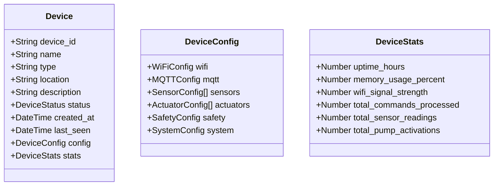

#### 1.3 Device Configuration
- **Remote Configuration Updates** für alle Client-Parameter
- **Sensor Calibration Management** (pH Multi-Point, TDS Single-Point)
- **Actuator Configuration** (Flow-Rates, Cooldowns, Safety-Limits)
- **Safety Parameter Configuration** (Emergency-Stop-Conditions)
- **Network Configuration** (WiFi, MQTT-Broker)

### 2. Live Monitoring & Visualization

#### 2.1 Real-Time Sensor Data
- **Live Sensor Readings** (pH, TDS) mit Raw, Calibrated und Filtered Values
- **Historical Data Visualization** mit konfigurierbaren Zeiträumen
- **Multi-Device Comparison** für mehrere Clients gleichzeitig
- **Data Quality Indicators** (Sensor-Status, Kalibrierungs-Gültigkeit)

#### 2.2 Dashboard Components
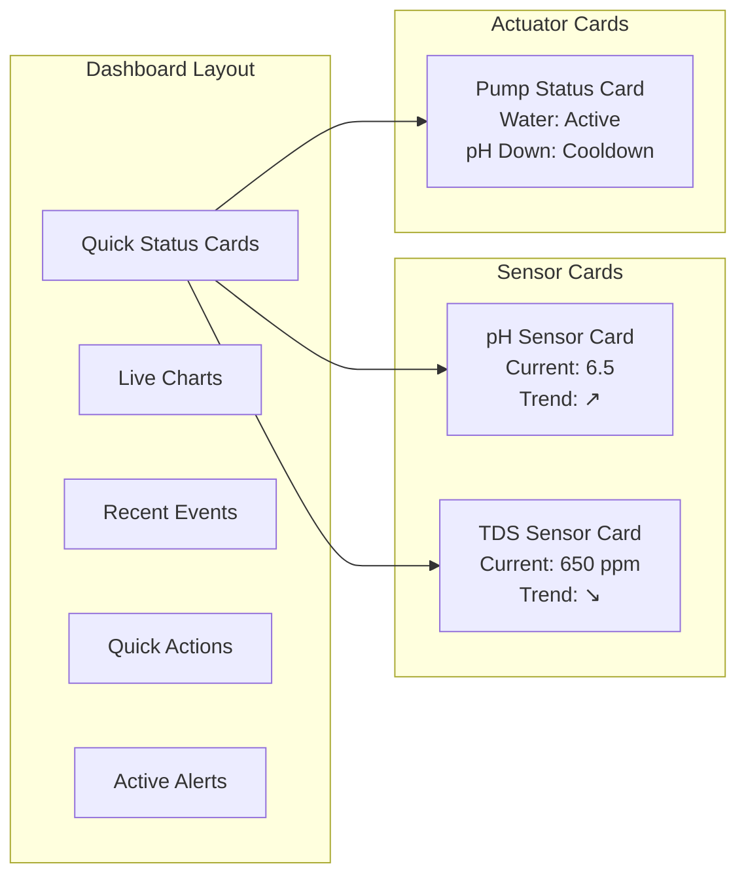

#### 2.3 Chart & Visualization Features
- **Real-Time Charts** mit automatischer Aktualisierung
- **Historical Trend Analysis** (1h, 6h, 24h, 7d, 30d)
- **Multi-Sensor Overlay Charts** für Korrelationsanalyse
- **Export Functionality** (CSV, PDF Reports)
- **Mobile-Optimized Charts** mit Touch-Gesten

### 3. Manual Control System

#### 3.1 Pump Control Interface
- **Individual Pump Control** für alle 7 Pumpen pro Client
  - Wasserpumpe (Circulation)
  - Luftpumpe (Oxygenation)
  - pH-Down Dosierpumpe
  - pH-Up Dosierpumpe
  - Nutrient A Dosierpumpe
  - Nutrient B Dosierpumpe
  - Cal-Mag Dosierpumpe

#### 3.2 Advanced Dosing Controls
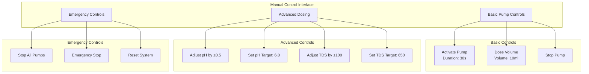

#### 3.3 Scheduling System
- **Pump Scheduling** mit Intervall und Dauer
- **Circulation Schedules** für Wasser- und Luftpumpen
- **Maintenance Schedules** für regelmäßige Systemchecks
- **Schedule Override** für manuelle Eingriffe

### 4. Program Management System

#### 4.1 Growth Program Templates
Basierend auf der v2-Analyse: Mehrstufige Wachstumsprogramme mit phasenspezifischen Parametern.

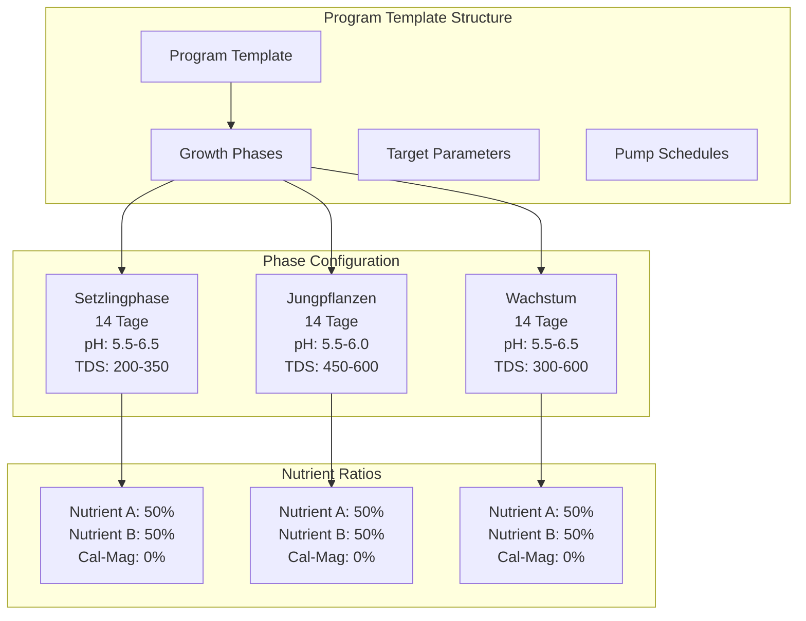

#### 4.2 Program Instance Management
- **Program Execution** mit automatischer Phasen-Progression
- **Real-Time Program Monitoring** mit detailliertem Logging
- **Program Pause/Resume/Stop** Funktionalität
- **Program History & Analytics** für Optimierung
- **Multi-Device Program Coordination** für mehrere Clients

#### 4.3 Program Templates
Vordefinierte Templates basierend auf v2-System:
- **Salat-Programm** (3 Phasen, 42 Tage)
- **Kräuter-Programm** (anpassbare Phasen)
- **Tomaten-Programm** (erweiterte Phasen)
- **Custom Templates** für benutzerdefinierte Programme

### 5. Automation Engine

#### 5.1 Rule-Based Automation
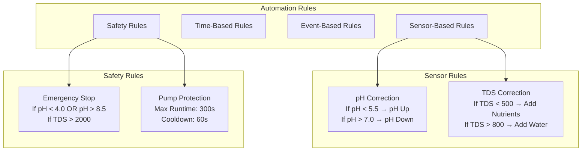

#### 5.2 Intelligent Dosing Algorithms
- **Adaptive pH Correction** basierend auf historischen Daten
- **Nutrient Balancing** mit Multi-Pump-Koordination
- **Learning Algorithms** für optimierte Dosierung
- **Predictive Maintenance** basierend auf Pump-Laufzeiten

### 6. Logging & Analytics

#### 6.1 Comprehensive Logging System
Basierend auf v2-Datenanalyse: Vollständiges Logging aller Systemaktivitäten.

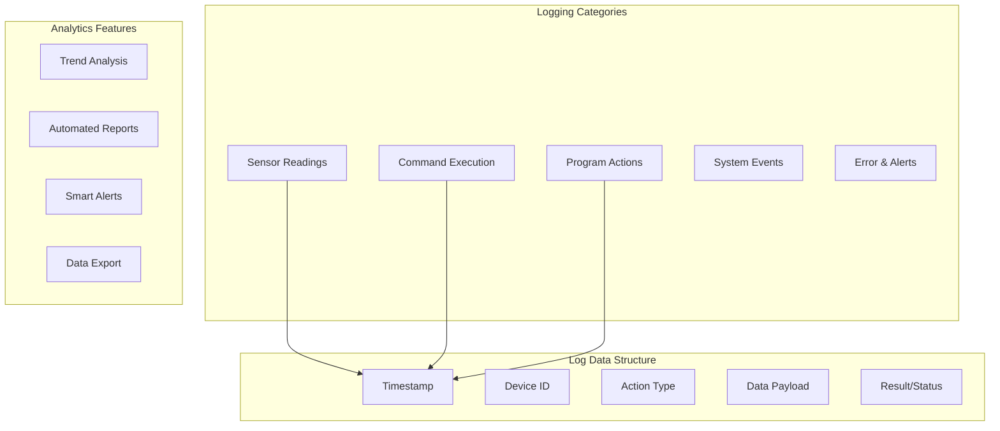

#### 6.2 Historical Data Management
- **Long-Term Data Storage** mit effizienter Komprimierung
- **Data Retention Policies** (Raw: 30d, Aggregated: 1y)
- **Backup & Export** Funktionalität
- **Data Privacy & Security** Compliance

### 7. User Interface Requirements

#### 7.1 Mobile-First Design
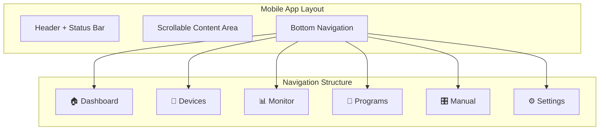

#### 7.2 Progressive Web App (PWA)
- **Offline Capability** für kritische Funktionen
- **Push Notifications** für Alerts und Status-Updates
- **App-like Experience** mit Service Worker
- **Responsive Design** für alle Bildschirmgrößen
- **Touch-Optimized Controls** für mobile Geräte

#### 7.3 Accessibility & UX
- **Dark/Light Mode** Support
- **High Contrast Mode** für bessere Lesbarkeit
- **Keyboard Navigation** Support
- **Screen Reader** Compatibility
- **Multi-Language Support** (DE, EN)

### 8. Service Discovery & Communication

#### 8.1 Bitsperity Beacon Integration
HomeGrow v3 nutzt **Bitsperity Beacon** für automatische Service Discovery und Device Management:

**Service Discovery Flow:**
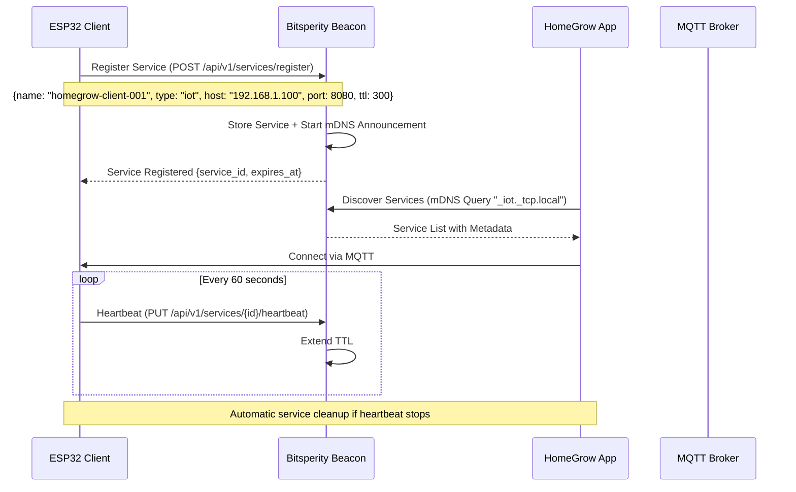

**Beacon Service Registration (ESP32 Client):**
```json
{
  "name": "homegrow-client-001",
  "type": "iot",
  "host": "192.168.1.100",
  "port": 8080,
  "protocol": "mqtt",
  "tags": ["homegrow", "hydroponics", "sensors", "pumps"],
  "metadata": {
    "version": "3.0.0",
    "description": "HomeGrow Hydroponic Controller",
    "capabilities": ["ph_sensor", "tds_sensor", "7_pumps"],
    "mqtt_topics": {
      "sensors": "homegrow/devices/homegrow-client-001/sensors",
      "commands": "homegrow/devices/homegrow-client-001/commands"
    }
  },
  "ttl": 300
}
```

**HomeGrow Service Discovery:**
- **mDNS/Bonjour Discovery** für automatische Client-Erkennung
- **Beacon API Integration** für Service-Metadaten
- **Real-time Service Updates** via Beacon WebSocket
- **Network-agnostic Discovery** funktioniert über Umbrel hinaus

#### 8.2 MQTT v3 Protocol
Erweiterte MQTT-Kommunikation basierend auf Arduino Client v3:

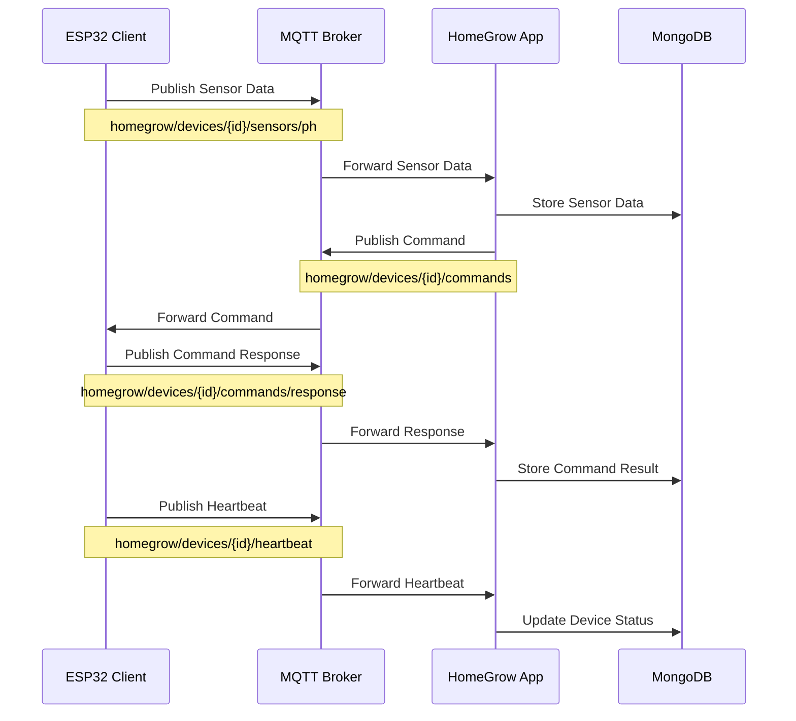

#### 8.3 Topic Schema v3
```
# Sensor Data
homegrow/devices/{device_id}/sensors/ph
homegrow/devices/{device_id}/sensors/tds

# Commands
homegrow/devices/{device_id}/commands
homegrow/devices/{device_id}/commands/response

# System Status
homegrow/devices/{device_id}/heartbeat
homegrow/devices/{device_id}/status
homegrow/devices/{device_id}/logs

# Configuration
homegrow/devices/{device_id}/config/request
homegrow/devices/{device_id}/config/response
```

#### 8.4 Enhanced Payload Formats
**Sensor Data (v3 Enhanced):**
```json
{
  "timestamp": "2024-01-15T10:30:00Z",
  "device_timestamp": 4471512,
  "sensor_id": "ph",
  "values": {
    "raw": 1854,
    "calibrated": 7.0,
    "filtered": 6.98
  },
  "unit": "pH",
  "quality": "good",
  "calibration_status": "valid",
  "filter_config": {
    "type": "moving_average",
    "window_size": 10
  }
}
```

**Advanced Commands (v3 New):**
```json
{
  "command_id": "cmd_003",
  "command": "adjust_ph_by",
  "params": {
    "delta_ph": 0.5,
    "max_volume_ml": 10
  },
  "priority": "normal",
  "timeout_sec": 60,
  "retry_count": 3
}
```

### 9. Data Management

#### 9.1 Database Schema
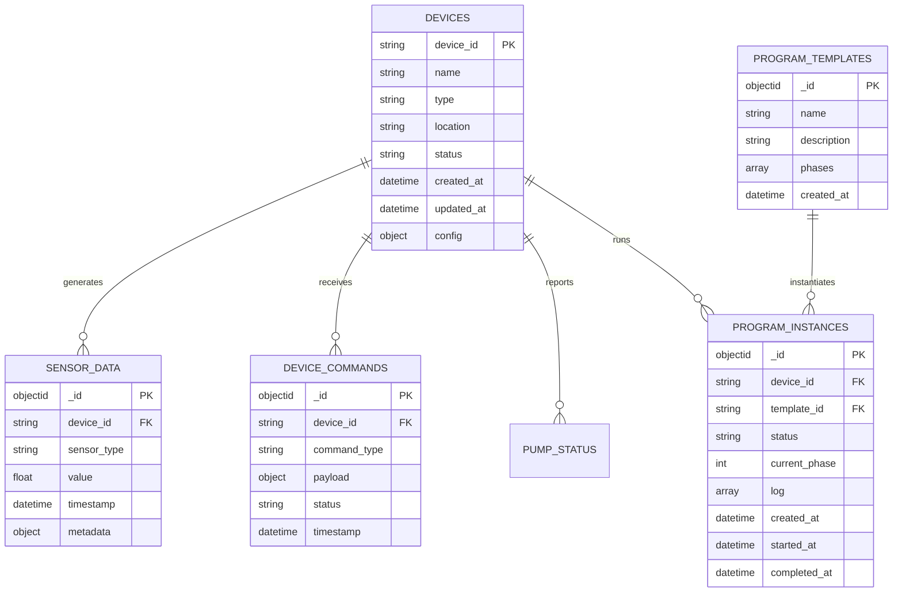

#### 9.2 Data Retention & Performance
- **Hot Data** (Last 7 days): Full resolution in MongoDB
- **Warm Data** (7-30 days): Aggregated hourly data
- **Cold Data** (30+ days): Daily aggregates, optional archival
- **Indexing Strategy** für optimale Query-Performance
- **Data Compression** für Speicher-Effizienz

### 10. Security & Safety

#### 10.1 System Security
- **MQTT Authentication** mit Client-Zertifikaten
- **API Authentication** mit JWT Tokens
- **Role-Based Access Control** (Admin, User, Viewer)
- **Secure Configuration Storage** mit Verschlüsselung
- **Audit Logging** für alle kritischen Aktionen

#### 10.2 Safety Systems
- **Emergency Stop Mechanisms** bei kritischen Werten
- **Pump Protection** gegen Überlastung
- **Sensor Validation** mit Plausibilitätsprüfungen
- **Automatic Failsafe** bei Kommunikationsverlust
- **Manual Override** für alle automatischen Systeme

### 11. Performance Requirements

#### 11.1 Response Times
- **Dashboard Load**: < 2s initial load
- **Real-Time Updates**: < 500ms latency
- **Command Execution**: < 1s acknowledgment
- **Historical Data Queries**: < 3s for 24h data
- **Mobile Performance**: 60fps animations

#### 11.2 Scalability
- **Multi-Device Support**: 10+ concurrent clients
- **Data Throughput**: 1000+ sensor readings/minute
- **Concurrent Users**: 5+ simultaneous web sessions
- **Storage Growth**: 1GB/month per active client
- **MQTT Message Rate**: 100+ messages/second

### 12. Integration & Compatibility

#### 12.1 Umbrel Integration
- **Umbrel App Store** Compliance
- **Docker Container** Deployment
- **Umbrel Services** Integration (MongoDB, MQTT)
- **Bitsperity Beacon** Dependency für Service Discovery
- **Reverse Proxy** Configuration
- **Health Checks** für Umbrel Dashboard

**App Dependencies:**
```yaml
dependencies: 
  - "bitsperity-mongodb"
  - "bitsperity-beacon"
```

**Service Discovery Integration:**
- HomeGrow registriert sich selbst bei Beacon als "homegrow-server"
- HomeGrow nutzt Beacon für ESP32 Client Discovery
- Automatische Konfiguration über Beacon Service-Metadaten
- Fallback auf manuelle Konfiguration wenn Beacon nicht verfügbar

#### 12.2 Hardware Compatibility
- **ESP32 Clients** (Arduino Client v3)
- **Sensor Compatibility** (pH, TDS, Temperature)
- **Pump Compatibility** (Peristaltic, Relay-controlled)
- **Network Requirements** (WiFi, Ethernet)

### 13. Migration Strategy

#### 13.1 v2 to v3 Migration
- **Data Migration Tools** für bestehende v2-Daten
- **Configuration Migration** von v2 zu v3 Format
- **Backward Compatibility** für v2 Clients (temporär)
- **Gradual Migration** ohne Service-Unterbrechung
- **Rollback Capability** bei Migrationsproblemen

#### 13.2 Migration Timeline
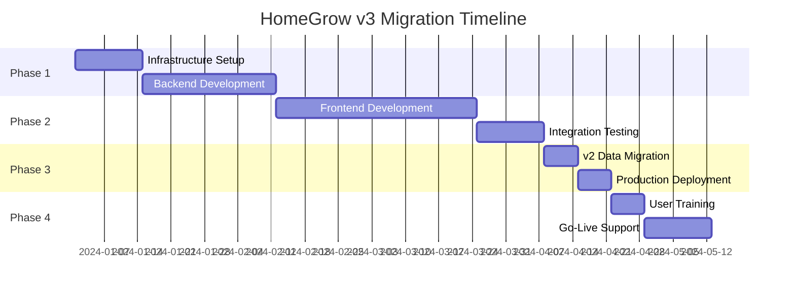

### 14. Success Criteria

#### 14.1 Functional Success
- ✅ Alle v2-Funktionalitäten verfügbar
- ✅ Arduino Client v3 vollständig integriert
- ✅ Mobile-first UI mit PWA-Features
- ✅ Real-time Monitoring funktional
- ✅ Program Management operativ
- ✅ Manual Control vollständig

#### 14.2 Performance Success
- ✅ Dashboard lädt in < 2s
- ✅ Real-time Updates < 500ms
- ✅ 99.9% Uptime
- ✅ Mobile Performance 60fps
- ✅ Multi-device Support (10+ clients)

#### 14.3 User Experience Success
- ✅ Intuitive Navigation
- ✅ Responsive Design
- ✅ Offline Capability
- ✅ Push Notifications
- ✅ Accessibility Compliance

## Technische Implementierung

### Tech Stack
- **Frontend**: SvelteKit 2.0, Tailwind CSS, PWA
- **Backend**: Node.js, Fastify, Socket.io
- **Database**: MongoDB (Umbrel)
- **Message Broker**: MQTT (Umbrel)
- **Service Discovery**: Bitsperity Beacon (mDNS/Bonjour)
- **Container**: Docker Alpine
- **Deployment**: Umbrel App Store

### Beacon Integration Implementation

#### Service Discovery Client (Node.js)
```javascript
// beacon-client.js
class BeaconServiceDiscovery {
  constructor(beaconUrl = 'http://bitsperity-beacon:8080') {
    this.beaconUrl = beaconUrl;
    this.discoveredDevices = new Map();
    this.wsConnection = null;
  }

  async registerHomeGrowServer() {
    const serviceData = {
      name: "homegrow-server",
      type: "web",
      host: process.env.HOMEGROW_HOST || "homegrow-app",
      port: parseInt(process.env.HOMEGROW_PORT) || 3000,
      protocol: "http",
      tags: ["homegrow", "hydroponics", "web-interface"],
      metadata: {
        version: "3.0.0",
        description: "HomeGrow Hydroponic Management Server",
        endpoints: {
          api: "/api/v1",
          websocket: "/ws"
        }
      },
      ttl: 300
    };

    try {
      const response = await fetch(`${this.beaconUrl}/api/v1/services/register`, {
        method: 'POST',
        headers: { 'Content-Type': 'application/json' },
        body: JSON.stringify(serviceData)
      });
      
      const result = await response.json();
      this.serviceId = result.service_id;
      
      // Start heartbeat
      this.startHeartbeat();
      
      return result;
    } catch (error) {
      console.warn('Beacon registration failed, continuing without service discovery:', error);
    }
  }

  async discoverHomeGrowClients() {
    try {
      const response = await fetch(`${this.beaconUrl}/api/v1/services/discover?type=iot&tags=homegrow`);
      const services = await response.json();
      
      for (const service of services) {
        if (service.tags.includes('homegrow')) {
          this.discoveredDevices.set(service.service_id, {
            id: service.service_id,
            name: service.name,
            host: service.host,
            port: service.port,
            metadata: service.metadata,
            last_seen: service.updated_at
          });
        }
      }
      
      return Array.from(this.discoveredDevices.values());
    } catch (error) {
      console.warn('Service discovery failed:', error);
      return [];
    }
  }

  startHeartbeat() {
    if (this.serviceId) {
      setInterval(async () => {
        try {
          await fetch(`${this.beaconUrl}/api/v1/services/${this.serviceId}/heartbeat`, {
            method: 'PUT'
          });
        } catch (error) {
          console.warn('Heartbeat failed:', error);
        }
      }, 60000); // Every 60 seconds
    }
  }

  connectWebSocket() {
    try {
      this.wsConnection = new WebSocket(`${this.beaconUrl.replace('http', 'ws')}/api/v1/ws`);
      
      this.wsConnection.on('message', (data) => {
        const update = JSON.parse(data);
        if (update.type === 'service_registered' && update.service.tags.includes('homegrow')) {
          this.handleNewDevice(update.service);
        } else if (update.type === 'service_deregistered') {
          this.handleDeviceRemoved(update.service_id);
        }
      });
    } catch (error) {
      console.warn('WebSocket connection to Beacon failed:', error);
    }
  }

  handleNewDevice(service) {
    this.discoveredDevices.set(service.service_id, service);
    // Emit event for HomeGrow app to handle new device
    this.emit('device_discovered', service);
  }

  handleDeviceRemoved(serviceId) {
    this.discoveredDevices.delete(serviceId);
    // Emit event for HomeGrow app to handle device removal
    this.emit('device_removed', serviceId);
  }
}

module.exports = BeaconServiceDiscovery;
```

#### ESP32 Client Integration
```cpp
// ESP32 Beacon Registration (Arduino Client v3)
#include <HTTPClient.h>
#include <ArduinoJson.h>

class BeaconClient {
private:
  String beaconUrl = "http://bitsperity-beacon.local:8080";
  String serviceId = "";
  unsigned long lastHeartbeat = 0;
  const unsigned long heartbeatInterval = 60000; // 60 seconds

public:
  bool registerWithBeacon() {
    HTTPClient http;
    http.begin(beaconUrl + "/api/v1/services/register");
    http.addHeader("Content-Type", "application/json");
    
    DynamicJsonDocument doc(1024);
    doc["name"] = "homegrow-client-" + WiFi.macAddress();
    doc["type"] = "iot";
    doc["host"] = WiFi.localIP().toString();
    doc["port"] = 8080;
    doc["protocol"] = "mqtt";
    
    JsonArray tags = doc.createNestedArray("tags");
    tags.add("homegrow");
    tags.add("hydroponics");
    tags.add("sensors");
    tags.add("pumps");
    
    JsonObject metadata = doc.createNestedObject("metadata");
    metadata["version"] = "3.0.0";
    metadata["description"] = "HomeGrow Hydroponic Controller";
    
    JsonArray capabilities = metadata.createNestedArray("capabilities");
    capabilities.add("ph_sensor");
    capabilities.add("tds_sensor");
    capabilities.add("7_pumps");
    
    JsonObject mqttTopics = metadata.createNestedObject("mqtt_topics");
    mqttTopics["sensors"] = "homegrow/devices/" + WiFi.macAddress() + "/sensors";
    mqttTopics["commands"] = "homegrow/devices/" + WiFi.macAddress() + "/commands";
    
    doc["ttl"] = 300;
    
    String payload;
    serializeJson(doc, payload);
    
    int httpResponseCode = http.POST(payload);
    
    if (httpResponseCode == 201) {
      String response = http.getString();
      DynamicJsonDocument responseDoc(512);
      deserializeJson(responseDoc, response);
      serviceId = responseDoc["service_id"].as<String>();
      
      Serial.println("Registered with Beacon: " + serviceId);
      return true;
    } else {
      Serial.println("Beacon registration failed: " + String(httpResponseCode));
      return false;
    }
    
    http.end();
  }
  
  void sendHeartbeat() {
    if (serviceId.length() > 0 && millis() - lastHeartbeat > heartbeatInterval) {
      HTTPClient http;
      http.begin(beaconUrl + "/api/v1/services/" + serviceId + "/heartbeat");
      
      int httpResponseCode = http.PUT("");
      
      if (httpResponseCode == 200) {
        Serial.println("Heartbeat sent successfully");
      } else {
        Serial.println("Heartbeat failed: " + String(httpResponseCode));
      }
      
      lastHeartbeat = millis();
      http.end();
    }
  }
};
```

### Development Phases
1. **Infrastructure & Backend** (4 Wochen)
   - Beacon Service Discovery Client Implementation
   - MQTT Bridge & Database Integration
   - Core API Development
2. **Frontend & UI** (6 Wochen)
   - Device Discovery Interface
   - Real-time Monitoring Dashboard
   - Manual Control & Program Management
3. **Integration & Testing** (2 Wochen)
   - Beacon Integration Testing
   - ESP32 Client v3 Integration
   - End-to-End Testing
4. **Migration & Deployment** (2 Wochen)
   - v2 to v3 Data Migration
   - Umbrel App Store Deployment

**Total Estimated Development Time: 14 Wochen**

### Beacon Integration Benefits
- **Zero-Configuration Discovery**: ESP32 Clients werden automatisch erkannt
- **Network-agnostic**: Funktioniert über Umbrel-Netzwerk hinaus
- **Centralized Service Management**: Alle Bitsperity Services in einem System
- **Real-time Updates**: Sofortige Benachrichtigung bei neuen/entfernten Devices
- **Robust TTL System**: Automatische Cleanup von offline Devices
- **Metadata-rich Discovery**: Umfangreiche Service-Informationen verfügbar

---

*Dieses Requirements-Dokument definiert die vollständige Funktionalität der HomeGrow v3 Umbrel App und gewährleistet eine nahtlose Migration von v2 mit erweiterten Funktionen für den neuen Arduino Client v3.*
