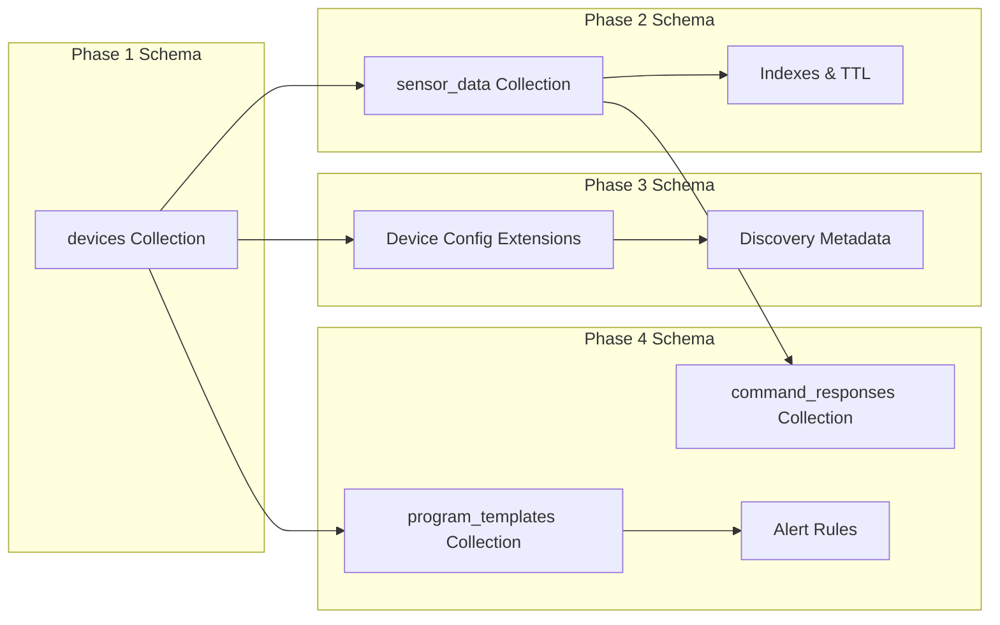
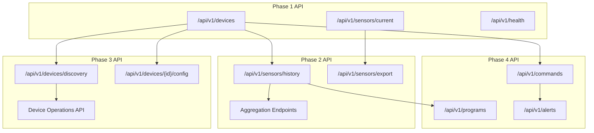
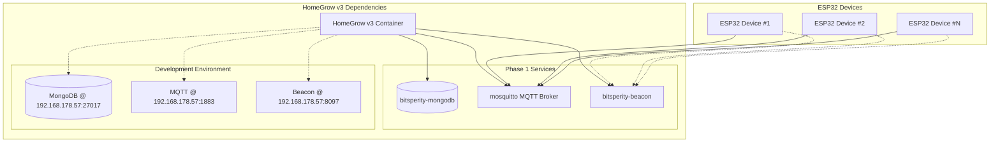
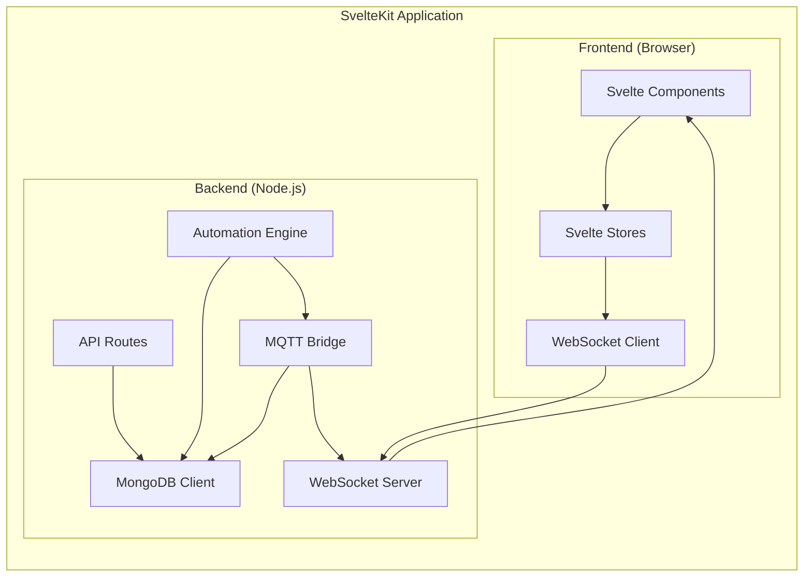

# HomeGrow v3 - Technical Dependencies

## Phase Dependency Mapping

HomeGrow v3 folgt einer strategischen Dependency-Architektur, bei der jede Phase auf den vorherigen aufbaut, aber gleichzeitig eigenständig deploybar bleibt.

```mermaid
graph TD
    A[Phase 1: Core Foundation] --> B[Phase 2: Historical Data]
    A --> C[Phase 3: Device Management]
    B --> D[Phase 4: Automation & Alerts]
    C --> D
    
    subgraph "Phase 1 Foundation"
        A1[SvelteKit App Setup]
        A2[MongoDB Connection]
        A3[Device Collection Schema]
        A4[MQTT Bridge]
        A5[WebSocket Server]
        A6[Basic Dashboard UI]
        A7[Umbrel Integration]
    end
    
    subgraph "Phase 2 Analytics"
        B1[SensorData Collection]
        B2[Historical API Endpoints]
        B3[Chart.js Integration]
        B4[Data Aggregation Pipelines]
        B5[Export Functionality]
    end
    
    subgraph "Phase 3 Management"  
        C1[Device Discovery Service]
        C2[Configuration API]
        C3[Device Forms & Validation]
        C4[Beacon Integration]
        C5[Device Operations]
    end
    
    subgraph "Phase 4 Intelligence"
        D1[Program Templates Collection]
        D2[Automation Engine]
        D3[Alert System]
        D4[Command Processing]
        D5[Notification Service]
    end
    
    %% Critical Dependencies
    A2 --> B1
    A3 --> C1
    A4 --> D2
    A5 --> D5
    B1 --> D2
    C2 --> D2
```



## Component Dependency Matrix

### Database Schema Evolution



### API Evolution Path



## Critical Path Analysis

### Phase 1 Critical Dependencies

**Blocking Dependencies:**
1. **MongoDB Connection** → All subsequent data operations
2. **MQTT Integration** → Real-time sensor data
3. **WebSocket Bridge** → Live UI updates
4. **Umbrel Service Integration** → Production deployment

**Risk Mitigation:**
- Test MQTT connection first (Day 1)
- Validate Umbrel services early (Day 2)
- Implement connection retry logic immediately
- Have offline development mode for MQTT/MongoDB

### Phase 2 Dependencies on Phase 1

**Required from Phase 1:**
- ✅ Stable MongoDB connection with `devices` collection
- ✅ MQTT sensor data ingestion working
- ✅ Basic API infrastructure
- ✅ WebSocket real-time pipeline

**New Dependencies:**
- Chart.js library for visualization
- Data aggregation performance (requires proper indexing)
- Export functionality (CSV generation)

**Risk Factors:**
- Large dataset performance (10k+ sensor readings)
- Chart rendering on mobile devices
- Memory usage with historical data

### Phase 3 Dependencies on Previous Phases

**Required from Phase 1 & 2:**
- ✅ Device CRUD operations
- ✅ Sensor data collection pipeline
- ✅ Real-time updates infrastructure

**New Dependencies:**
- bitsperity-beacon service integration
- Network scanning capabilities
- Form validation framework (Zod)
- Device configuration schema evolution

**Integration Points:**
- Device registration via MQTT auto-discovery
- Config synchronization with ESP32 devices
- Validation of sensor calibration data

### Phase 4 Dependencies on All Previous Phases

**Required Infrastructure:**
- ✅ Complete device management (Phase 3)
- ✅ Historical data analysis (Phase 2) 
- ✅ Real-time monitoring (Phase 1)

**New Systems:**
- Automation decision engine
- Command queuing and processing
- Alert threshold monitoring
- Program execution scheduler

**Complex Integrations:**
- Real-time sensor data → Automation decisions
- Historical trends → Program optimizations
- Device capabilities → Command validation
- Alert rules → Notification delivery

## Service Dependency Architecture

### External Services (Umbrel)



### Internal Service Dependencies



## Development Environment Setup Dependencies

### Phase 1 Development Dependencies

**Required Tools:**
```bash
# Node.js Environment
node >= 18.0.0
npm >= 9.0.0

# Database Access (via MCP)
mongodb @ 192.168.178.57:27017

# MQTT Broker
mosquitto @ 192.168.178.57:1883

# Service Discovery
bitsperity-beacon @ 192.168.178.57:8097

# Development Tools
vite (bundler)
typescript (type checking)
tailwindcss (styling)
```

**Environment Configuration:**
```typescript
// Development environment
const devConfig = {
  mongodb: 'mongodb://192.168.178.57:27017/homegrow',
  mqtt: { host: '192.168.178.57', port: 1883 },
  beacon: 'http://192.168.178.57:8097',
  websocket: { port: 3001 }
};

// Production environment (Umbrel)
const prodConfig = {
  mongodb: 'mongodb://bitsperity-mongodb_mongodb_1:27017/homegrow',
  mqtt: { host: 'mosquitto_broker_1', port: 1883 },
  beacon: 'http://bitsperity-beacon_web_1:8097',
  websocket: { port: 3000 }
};
```

### Package Dependencies Evolution

**Phase 1 Dependencies:**
```json
{
  "dependencies": {
    "@sveltejs/kit": "^2.0.0",
    "svelte": "^4.0.0",
    "typescript": "^5.0.0",
    "mongodb": "^6.0.0",
    "mqtt": "^5.0.0",
    "ws": "^8.0.0",
    "tailwindcss": "^3.0.0"
  }
}
```

**Phase 2 Additional Dependencies:**
```json
{
  "dependencies": {
    "chart.js": "^4.0.0",
    "date-fns": "^2.0.0",
    "papaparse": "^5.0.0"
  }
}
```

**Phase 3 Additional Dependencies:**
```json
{
  "dependencies": {
    "zod": "^3.0.0",
    "node-nmap": "^3.0.0",
    "mdns": "^2.0.0"
  }
}
```

**Phase 4 Additional Dependencies:**
```json
{
  "dependencies": {
    "node-cron": "^3.0.0",
    "nodemailer": "^6.0.0",
    "web-push": "^3.0.0"
  }
}
```

## Risk Analysis Matrix

### High Risk Dependencies

**R-001: MongoDB Connection Stability**
- **Impact**: Complete app failure
- **Mitigation**: Connection pooling, retry logic, health checks
- **Testing**: Connection stress testing, failover scenarios

**R-002: MQTT Broker Performance**
- **Impact**: Real-time data loss, automation failures
- **Mitigation**: Message queuing, duplicate detection, QoS settings
- **Testing**: Load testing with multiple devices, network interruption tests

**R-003: WebSocket Connection Management**
- **Impact**: Frontend becomes stale, no real-time updates
- **Mitigation**: Auto-reconnection, heartbeat monitoring, offline mode
- **Testing**: Connection interruption simulation, mobile network testing

### Medium Risk Dependencies

**R-004: Chart.js Performance (Phase 2)**
- **Impact**: Slow historical data rendering
- **Mitigation**: Data pagination, canvas optimization, loading states
- **Testing**: Large dataset rendering, mobile performance testing

**R-005: Device Discovery Reliability (Phase 3)**
- **Impact**: Manual device configuration required
- **Mitigation**: Multiple discovery methods, manual fallback, clear UI guidance
- **Testing**: Network scanning in various environments, beacon service testing

### Low Risk Dependencies

**R-006: Notification Delivery (Phase 4)**
- **Impact**: Missed alerts, delayed notifications
- **Mitigation**: Multiple notification channels, retry logic, fallback methods
- **Testing**: Push notification testing across platforms, email delivery testing

## Deployment Dependencies

### Umbrel Container Dependencies

```yaml
# docker-compose.yml dependency chain
services:
  homegrow-v3:
    depends_on:
      bitsperity-mongodb:
        condition: service_healthy
      mosquitto:
        condition: service_started
      bitsperity-beacon:
        condition: service_started
    networks:
      - default
      - bitsperity-mongodb_default
      - mosquitto_default  
      - bitsperity-beacon_default
```

### Build Dependencies

**Docker Multi-stage Build:**
```dockerfile
# Stage 1: Build dependencies
FROM node:18-alpine AS builder
WORKDIR /app
COPY package*.json ./
RUN npm ci --only=production

# Stage 2: Application
FROM node:18-alpine AS runtime
COPY --from=builder /app/node_modules ./node_modules
COPY . .
RUN npm run build
```

### Runtime Dependencies

**System Requirements:**
- Memory: 256MB minimum, 512MB recommended
- CPU: 0.25 cores minimum, 0.5 cores recommended  
- Storage: 2GB minimum, 10GB recommended
- Network: Container network access to Umbrel services

**Port Dependencies:**
- 3000: HTTP server (mapped to 3420 on Umbrel)
- Internal: WebSocket server (same port as HTTP)
- Internal: MongoDB client connections
- Internal: MQTT client connections

## Dependency Testing Strategy

### Phase 1 Dependency Validation
```bash
# Critical dependency tests
npm run test:mongodb-connection
npm run test:mqtt-broker  
npm run test:websocket-bridge
npm run test:umbrel-deployment
```

### Continuous Dependency Monitoring
```bash
# Health check endpoints
GET /api/v1/health
{
  "components": {
    "database": "connected",
    "mqtt": "connected", 
    "beacon": "reachable",
    "websocket": "running"
  }
}
```

### Integration Testing Matrix
- [ ] All service dependencies available and responsive
- [ ] Container networking configured correctly
- [ ] Environment variables properly set
- [ ] Data persistence across restarts
- [ ] Performance within acceptable limits

Diese Dependency-Analyse stellt sicher, dass jede Phase auf einer stabilen Grundlage aufbaut und potentielle Risiken früh identifiziert und mitigiert werden. 