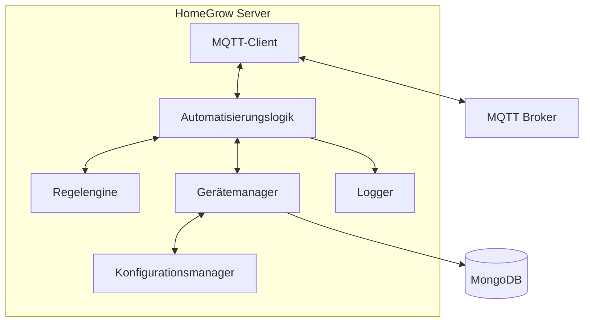
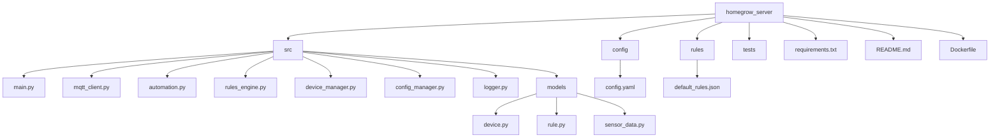
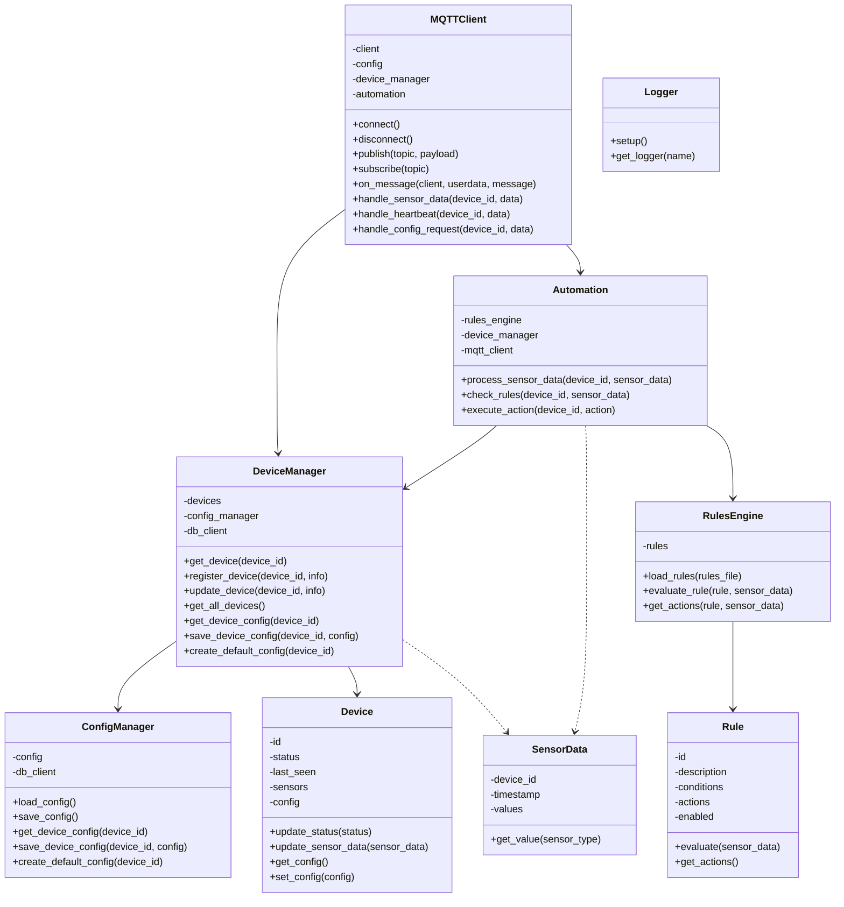
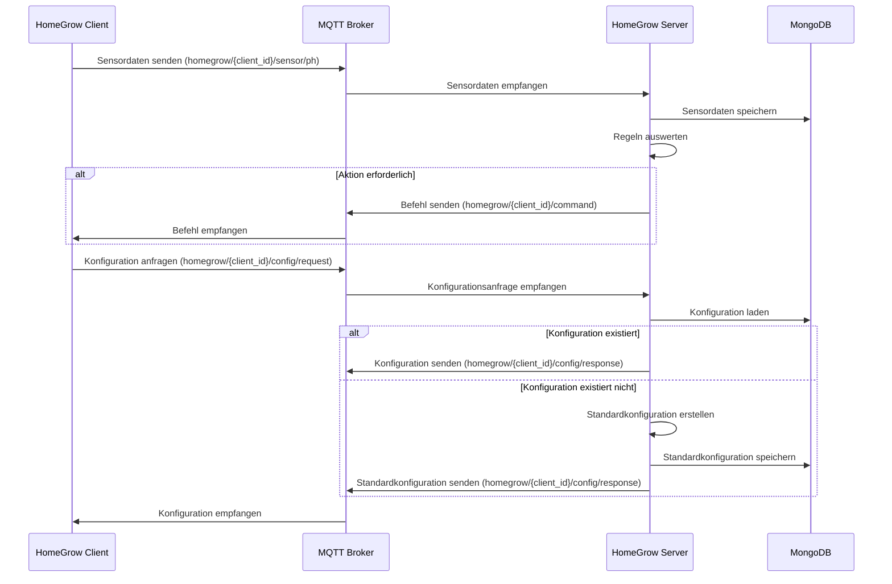

# HomeGrow Server - Implementierungsplan

Dieser Plan beschreibt die Struktur und Implementierung des HomeGrow Servers basierend auf den Anforderungen im README.md.

## Architektur



## Verzeichnisstruktur



## Klassendiagramm



## Datenfluss



## MQTT-Topics

### Abonnierte Topics
- `homegrow/+/sensor/#`: Sensordaten von allen Geräten
- `homegrow/+/heartbeat`: Heartbeat-Nachrichten von allen Geräten
- `homegrow/+/config/request`: Konfigurationsanfragen von allen Geräten

### Veröffentlichte Topics
- `homegrow/{device_id}/command`: Befehle an Geräte
- `homegrow/{device_id}/config/response`: Konfigurationsantworten an Geräte

## Implementierungsdetails

### main.py
- Haupteinstiegspunkt der Anwendung
- Initialisiert alle Komponenten
- Startet den MQTT-Client
- Verarbeitet Signale für sauberes Herunterfahren

### mqtt_client.py
- Verbindung zum MQTT-Broker
- Abonnieren von Topics
- Verarbeitung eingehender Nachrichten
- Weiterleitung an entsprechende Handler

### device_manager.py
- Verwaltung von Geräten
- Laden und Speichern von Gerätekonfigurationen
- Erstellen von Standardkonfigurationen für neue Geräte

### config_manager.py
- Laden und Speichern der Serverkonfiguration
- Verwaltung von Gerätekonfigurationen
- Schnittstelle zur MongoDB

### automation.py
- Verarbeitung von Sensordaten
- Auswertung von Regeln
- Ausführung von Aktionen

### rules_engine.py
- Laden und Verwalten von Regeln
- Auswertung von Bedingungen
- Generierung von Aktionen

### logger.py
- Konfiguration des Loggings
- Bereitstellung von Loggern für andere Komponenten

### models/device.py
- Datenmodell für Geräte
- Status und Konfiguration

### models/rule.py
- Datenmodell für Regeln
- Bedingungen und Aktionen

### models/sensor_data.py
- Datenmodell für Sensordaten
- Zeitstempel und Werte

## MongoDB-Sammlungen

- `devices`: Informationen über Geräte
- `configs`: Gerätekonfigurationen
- `sensor_data`: Historische Sensordaten
- `rules`: Automatisierungsregeln

## Konfigurationsbeispiel (config.yaml)

```yaml
mqtt:
  broker: "localhost"
  port: 1883
  client_id: "homegrow_server"
  username: ""
  password: ""

mongodb:
  uri: "mongodb://localhost:27017"
  database: "homegrow"

logging:
  level: "info"
  file: "/var/log/homegrow/server.log"

automation:
  check_interval: 60  # Sekunden
  rules_file: "/etc/homegrow/rules.json"
```

## Standardkonfiguration für Geräte

```json
{
  "client_id": "{device_id}",
  "sensors": {
    "ph": {
      "pin": 34,
      "calibration": {
        "offset": 0.0,
        "scale": 1.0
      }
    },
    "tds": {
      "pin": 35,
      "calibration": {
        "offset": 0.0,
        "scale": 1.0
      }
    }
  },
  "actuators": {
    "water_pump": {
      "pin": 16,
      "flow_rate": 100.0
    },
    "air_pump": {
      "pin": 17
    },
    "ph_up_pump": {
      "pin": 18,
      "flow_rate": 10.0
    },
    "ph_down_pump": {
      "pin": 19,
      "flow_rate": 10.0
    },
    "nutrient_pump_1": {
      "pin": 21,
      "flow_rate": 10.0
    },
    "nutrient_pump_2": {
      "pin": 22,
      "flow_rate": 10.0
    },
    "nutrient_pump_3": {
      "pin": 23,
      "flow_rate": 10.0
    }
  }
}
``` 