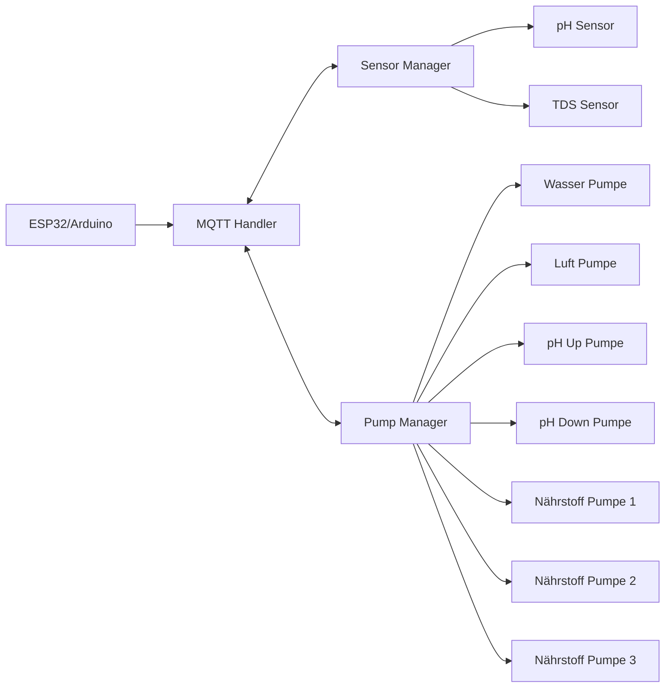
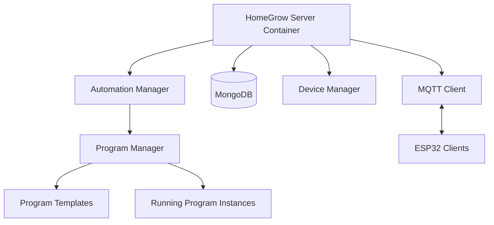
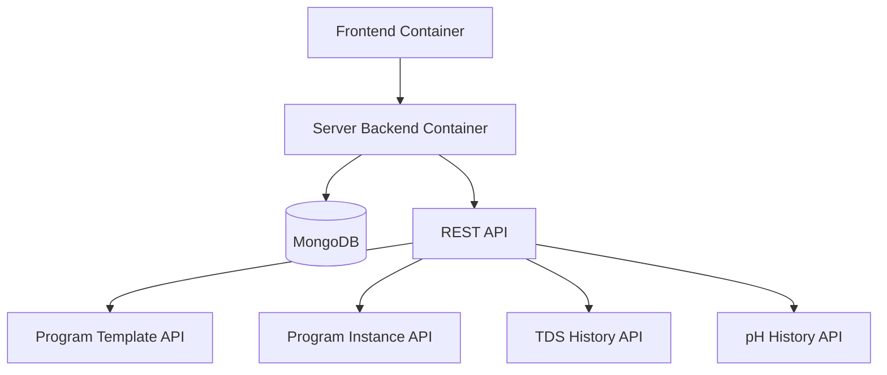
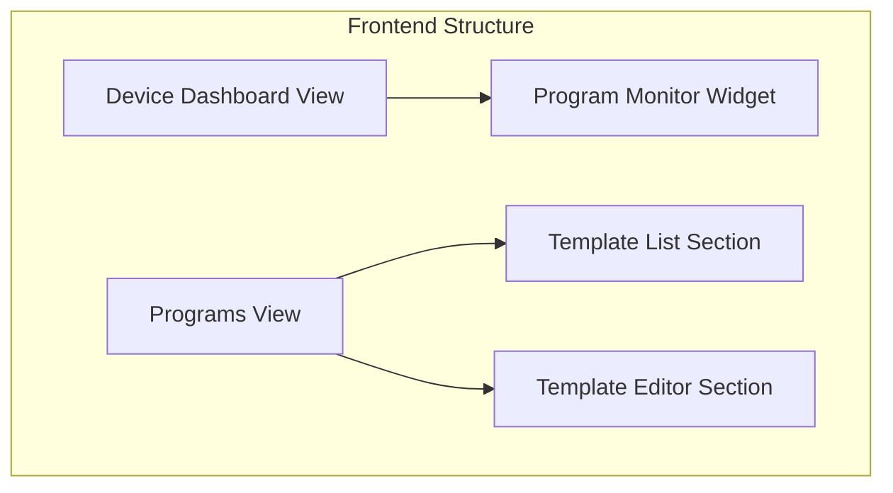
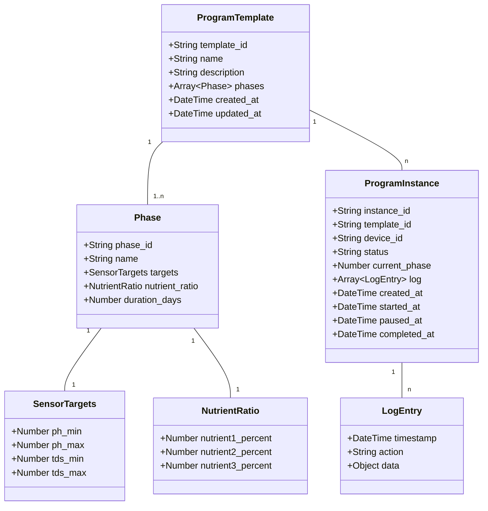
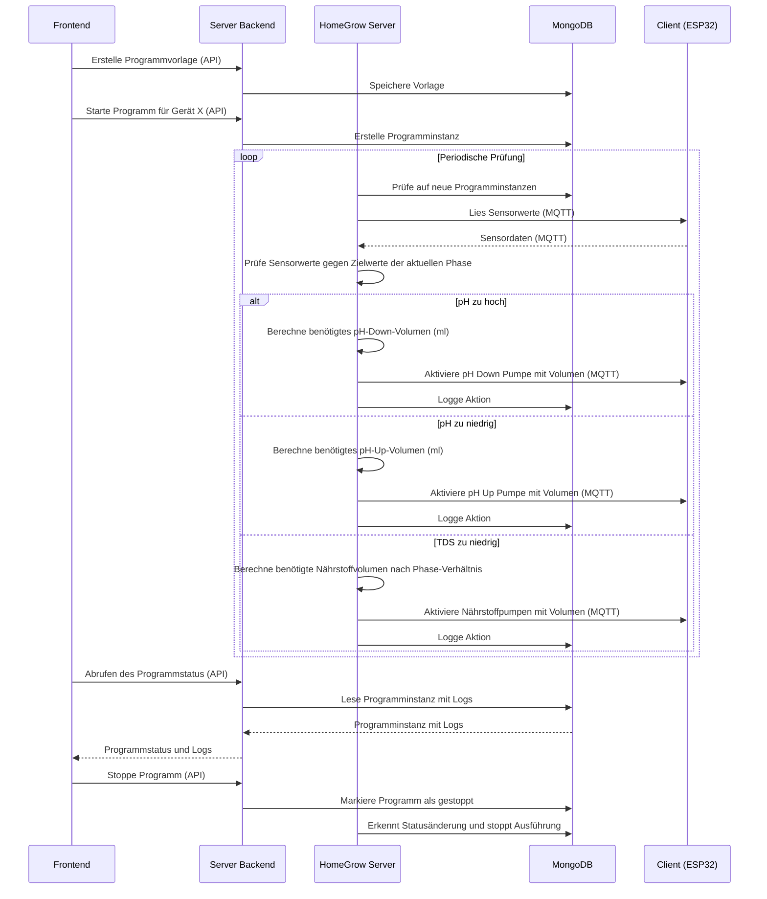
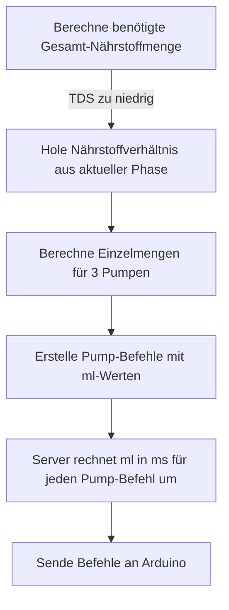

# HomeGrow Automatisierungsplan (Vereinfacht)

In diesem Dokument wird der Plan für die Implementierung der grundlegenden Automatisierungsfunktionen des HomeGrow-Systems beschrieben. Die erste Version konzentriert sich auf einfache Automatisierungen wie das Halten von pH- und TDS-Werten in bestimmten Bereichen.

## Inhaltsverzeichnis
1. [Analyse HomeGrow Client](#analyse-homegrow-client)
2. [Analyse HomeGrow Server](#analyse-homegrow-server)
3. [Analyse Server Backend](#analyse-server-backend)
4. [Analyse Frontend](#analyse-frontend)
5. [Datenmodell](#datenmodell)
6. [Kommunikationsfluss](#kommunikationsfluss)
7. [Nährstoffverhältnisse](#nährstoffverhältnisse)
8. [Gerätekonfiguration für Automatisierung](#gerätekonfiguration-für-automatisierung)
9. [Implementierungsplan](#implementierungsplan)

## Analyse HomeGrow Client



### Vorhandene Schnittstellen

Der HomeGrow Client verfügt bereits über alle notwendigen Schnittstellen für die Automatisierung:

1. **MQTT-Kommunikation**: Ein vollständiger MQTT-Handler ist implementiert
2. **Aktuator-Steuerung**: Der `PumpManager` ermöglicht die Steuerung aller Pumpen
3. **Sensor-Erfassung**: Sensordaten werden über MQTT übertragen

### Wichtiger Hinweis zur Pumpensteuerung

Die aktuelle Client-Implementierung basiert auf zeitlicher Steuerung der Pumpen. Das Frontend rechnet jedoch bereits Volumen (ml) in Zeiten um, basierend auf der Flussrate jeder Pumpe. Dieses Konzept sollte beibehalten werden, da:

1. Das Frontend bereits Volumen → Zeit-Umrechnungen durchführt
2. Die Pumpen im Client kalibriert und mit korrekten Flussraten konfiguriert sind
3. Alle Befehle konsistent in ml spezifiziert werden sollten, niemals in Zeit

**Keine Änderungen am Client notwendig!**

## Analyse HomeGrow Server



Der HomeGrow Server ist als eigenständiger Container (`homegrow_server` in docker-compose.yaml) implementiert und verantwortlich für:

1. **MQTT-Kommunikation** mit den Arduino-Clients
2. **Automatisierungslogik** inkl. Programm-Ausführung
3. **Direkte Datenbankinteraktion** mit MongoDB

### Neue Dateien und Komponenten im HomegrowServer

Der HomeGrow Server wird um folgende Dateien erweitert:

1. **Modelle**:
   - `homegrow_server/src/models/program_template.py` - Programmvorlagen mit Phasen
   - `homegrow_server/src/models/program_instance.py` - Laufende Programminstanzen

2. **Geschäftslogik**:
   - `homegrow_server/src/program_manager.py` - Verwaltung von Programmvorlagen
   - `homegrow_server/src/program_engine.py` - Ausführung von Programmen
   - `homegrow_server/src/nutrient_calculator.py` - Berechnung von Nährstoffmengen

### Datenbank-Erweiterungen

In der MongoDB werden zwei neue Sammlungen angelegt:

1. **program_templates**: Speichert die Vorlagen/Schablonen für Programme
2. **program_instances**: Speichert laufende oder abgeschlossene Programminstanzen mit Ausführungsdaten

## Analyse Server Backend



Das Server Backend ist als eigenständiger Container (`server_backend` in docker-compose.yaml) implementiert und dient als:

1. **API-Gateway** für das Frontend
2. **Datenbereitstellung** für historische Daten und Konfiguration
3. **Vermittler** zwischen Frontend und Datenbank

### Neue Dateien im Server Backend

Folgende Dateien müssen im Server Backend erstellt oder erweitert werden:

1. **API Routes**:
   - `server_backend/src/routes/program_templates.py` - CRUD-Operationen für Programmvorlagen
   - `server_backend/src/routes/program_instances.py` - Status und Steuerung laufender Programme

2. **Service-Schicht**:
   - `server_backend/src/services/program_service.py` - Geschäftslogik für Programmverwaltung

### Neue API-Endpunkte im Server Backend

Das Server Backend erhält folgende neue API-Endpunkte:

#### Program Templates API

```
GET /api/program-templates
POST /api/program-templates
GET /api/program-templates/:id
PUT /api/program-templates/:id
DELETE /api/program-templates/:id
```

#### Program Instances API

```
GET /api/devices/:deviceId/program-instances
GET /api/program-instances/:id
POST /api/program-instances/start
  Body: { device_id: string, template_id: string }
PUT /api/program-instances/:id/pause
PUT /api/program-instances/:id/resume
PUT /api/program-instances/:id/stop
```

## Analyse Frontend



Das Frontend kommuniziert ausschließlich mit dem Server Backend über dessen REST-API und nicht direkt mit dem HomeGrow Server.

### Neue Frontend-Dateien

1. **Views**:
   - `frontend/src/views/ProgramsView.svelte` - Kombination aus Liste und Editor für Programmvorlagen

2. **Komponenten**:
   - `frontend/src/components/Dashboard/ProgramMonitorWidget.svelte` - Widget für DeviceDashboardView
   - `frontend/src/components/Programs/ProgramTemplateList.svelte` - Liste der Programmvorlagen
   - `frontend/src/components/Programs/ProgramTemplateEditor.svelte` - Editor für Programmvorlagen
   - `frontend/src/components/Programs/PhaseEditor.svelte` - Editor für Programmphase inkl. Nährstoffverhältnis

3. **Services**:
   - `frontend/src/services/program-service.js` - Service für API-Kommunikation mit Server Backend

## Datenmodell



### JSON-Beispiel Programmschablone (einfache Version mit einer Phase)

```json
{
  "template_id": "template123",
  "name": "Standard Hydroponik",
  "description": "Hält pH zwischen 5.5-6.5 und TDS zwischen 500-700",
  "phases": [
    {
      "phase_id": "phase1",
      "name": "Standard-Phase",
      "targets": {
        "ph_min": 5.5,
        "ph_max": 6.5,
        "tds_min": 500,
        "tds_max": 700
      },
      "nutrient_ratio": {
        "nutrient1_percent": 50,
        "nutrient2_percent": 30,
        "nutrient3_percent": 20
      },
      "duration_days": 14
    }
  ],
  "created_at": "2023-08-01T12:00:00Z",
  "updated_at": "2023-08-01T12:00:00Z"
}
```

### JSON-Beispiel Programminstanz

```json
{
  "instance_id": "instance456",
  "template_id": "template123",
  "device_id": "device789",
  "status": "running",
  "current_phase": 0,
  "log": [
    {
      "timestamp": "2023-08-01T13:00:00Z",
      "action": "program_started",
      "data": {}
    },
    {
      "timestamp": "2023-08-01T13:05:00Z",
      "action": "ph_correction",
      "data": {
        "previous_value": 7.2,
        "target_range": [5.5, 6.5],
        "pump": "ph_down",
        "volume_ml": 5
      }
    },
    {
      "timestamp": "2023-08-01T13:10:00Z",
      "action": "tds_correction",
      "data": {
        "previous_value": 450,
        "target_range": [500, 700],
        "nutrient_mix": {
          "nutrient1_ml": 10,
          "nutrient2_ml": 6,
          "nutrient3_ml": 4
        }
      }
    }
  ],
  "created_at": "2023-08-01T12:50:00Z",
  "started_at": "2023-08-01T13:00:00Z",
  "paused_at": null,
  "completed_at": null
}
```

## Kommunikationsfluss



### MQTT-Kommunikation (HomegrowServer → Arduino Client)

Die Automatisierungsengine verwendet folgende MQTT-Topics:

1. **Sensor-Daten** (eingehend):
   - `homegrow/devices/{device_id}/sensors/ph`
   - `homegrow/devices/{device_id}/sensors/tds`

2. **Steuerungsbefehle** (ausgehend):
   - `homegrow/devices/{device_id}/commands`
   
Befehlsformat (Beispiel):
```json
{
  "type": "ph_down_pump",
  "duration": 1000
}
```

Wichtig: Die Umrechnung von ml zu Millisekunden erfolgt auf Server-Seite!

## Nährstoffverhältnisse

Ein zentraler Aspekt des Automatisierungssystems ist die korrekte Mischung der drei Nährstofflösungen:

### Hintergrund

1. Der TDS-Wert misst die Gesamtkonzentration gelöster Feststoffe im Wasser
2. Zur Erhöhung des TDS-Werts müssen Nährstoffe hinzugefügt werden
3. Es gibt 3 verschiedene Nährstoffpumpen, die unterschiedliche Lösungen bereitstellen
4. Diese müssen im korrekten Verhältnis gemischt werden

### Implementierung

Die `NutrientCalculator`-Klasse im HomeGrow Server übernimmt folgende Aufgaben:

1. Berechnet die Gesamtmenge (ml) an Nährstoffen, die zur Erreichung des Ziel-TDS-Werts benötigt wird
2. Verteilt diese Gesamtmenge auf die 3 Pumpen entsprechend des konfigurierten Verhältnisses der aktuellen Phase
3. Gibt die exakten Mengen für jede Pumpe zurück



### Vorteile dieses Ansatzes

1. **Phasenbasierte Zusammensetzung**: Jede Phase eines Programms kann eigene Nährstoffverhältnisse haben
2. **Flexibilität für Erweiterungen**: Für komplexere Programme können mehrere Phasen mit unterschiedlichen Verhältnissen konfiguriert werden
3. **Einfache Benutzeroberfläche**: Nährstoffverhältnisse werden direkt im Phasen-Editor konfiguriert
4. **Vereinfachtes Datenmodell**: Keine separate Collection für Nährstoffverhältnisse nötig

## Gerätekonfiguration für Automatisierung

Um die Automatisierungsfunktionen effektiv nutzen zu können, muss die Gerätekonfiguration um neue Parameter erweitert werden. Statt einzelne Werte separat zu konfigurieren (was umständlich wäre), wird ein integrierter Ansatz verfolgt, der die Konfiguration vereinfacht.

### Erweiterung der bestehenden Konfiguration

Die aktuelle Gerätekonfiguration enthält bereits:
- Pumpeneinstellungen mit Flussraten (`flow_rate`)
- Sensorkonfigurationen mit Kalibrierungswerten
- Grenzwerte für Sensoren

### Neue Konfigurationsstruktur für Automatisierung

Die Gerätekonfiguration wird um einen neuen `nutrient_control`-Bereich erweitert:

```json
"nutrient_control": {
  "water_volume_liters": 20,
  "solution_strengths": {
    "nutrient1": "standard",
    "nutrient2": "standard",
    "nutrient3": "standard",
    "ph_up": "standard",
    "ph_down": "standard"
  },
  "dose_limits": {
    "max_nutrient_percent": 0.1,
    "min_nutrient_percent": 0.005,
    "max_ph_percent": 0.025,
    "min_ph_percent": 0.0025
  },
  "calibration": {
    "tds_per_ml": 10.0,
    "ph_up_per_ml": 0.1,
    "ph_down_per_ml": 0.1
  },
  "wait_times": {
    "nutrient_minutes": 30,
    "ph_minutes": 5
  }
}
```

### Vorteile dieser Konfigurationsstruktur

1. **Wasservolumen als Grundlage**: Das Wasservolumen des Pods (konstant durch Schwimmerventil) dient als Basis für Berechnungen
2. **Vordefinierte Lösungsstärken**: Vereinfachte Auswahl für den Benutzer (z.B. "schwach", "standard", "stark")
3. **Flexible Dosierungslimits als Prozentsatz**: Die maximalen und minimalen Dosen werden als Prozentsatz des Wasservolumens angegeben (z.B. 0.1% = 20ml bei 20L Wasservolumen)
4. **Optionale Kalibrierungsparameter**: Für Fortgeschrittene können die genauen Werte angepasst werden
5. **Wartezeiten zwischen Aktionen**: Vermeidet zu häufige Korrekturen

### Frontend-Integration

Die neue Konfigurationsstruktur soll nahtlos in die bestehende Konfigurationsoberfläche integriert werden:

1. Ein neuer Tab "Automatisierung" in der Gerätekonfiguration
2. Einfache Auswahlfelder für Standardwerte (Wasservolumen, Lösungsstärken)
3. Erweiterte Einstellungen für fortgeschrittene Benutzer (Kalibrierungswerte)
4. Validierung der Eingaben und sinnvolle Standardwerte

### Implementierung in NutrientCalculator

Der `NutrientCalculator` wird angepasst, um diese Konfiguration zu nutzen:

1. Standardwerte für fehlende Parameter
2. Intelligente Berechnungen basierend auf dem Wasservolumen und der Lösungsstärke
3. Automatische Umrechnung von Prozentwerten in absolute Mengen basierend auf dem Wasservolumen
4. Automatische Anpassung an die kalibrierten Pumpenflussraten aus der bestehenden Konfiguration

## Implementierungsplan

### Phase 1: HomeGrow Server Erweiterungen

1. **Modelle erstellen**:
   - Erstelle `homegrow_server/src/models/program_template.py` und `homegrow_server/src/models/program_instance.py`
   - Erweitere `homegrow_server/src/database.py` für die neuen Sammlungen

2. **Program Manager implementieren**:
   - Erstelle `homegrow_server/src/program_manager.py`
   - Implementiere Methoden zum Lesen und Verarbeiten von Programmvorlagen und -instanzen

3. **Nutrient Calculator implementieren**:
   - Erstelle `homegrow_server/src/nutrient_calculator.py`
   - Implementiere Logik zur Volumenberechnung und Verteilung auf die Pumpen

4. **Program Engine implementieren**:
   - Erstelle `homegrow_server/src/program_engine.py`
   - Implementiere Programmausführung und Sensordatenauswertung
   - Integriere die Komponente in den Hauptserver (`homegrow_server/src/main.py`)

### Phase 2: Server Backend Erweiterungen

1. **API-Endpunkte implementieren**:
   - Erstelle `server_backend/src/routes/program_templates.py`
   - Erstelle `server_backend/src/routes/program_instances.py`
   - Implementiere alle API-Endpunkte für CRUD-Operationen

2. **Service-Schicht erstellen**:
   - Erstelle `server_backend/src/services/program_service.py` 
   - Implementiere die Geschäftslogik für die API-Endpunkte

3. **Hauptrouter aktualisieren**:
   - Aktualisiere `server_backend/src/routes/index.py` um die neuen Routen einzubinden

### Phase 3: Frontend-Komponenten

1. **Programmverwaltungs-View**:
   - Erstelle `frontend/src/views/ProgramsView.svelte`
   - Implementiere Anzeige und CRUD-Funktionen für Programmvorlagen

2. **Phasen-Editor**:
   - Erstelle `frontend/src/components/Programs/PhaseEditor.svelte`
   - Integriere Nährstoffverhältnis-Einstellungen direkt in den Phasen-Editor

3. **Dashboard-Widget**:
   - Erstelle `frontend/src/components/Dashboard/ProgramMonitorWidget.svelte`
   - Integriere das Widget in `frontend/src/views/DeviceDashboardView.svelte`

4. **Service-Schicht**:
   - Erstelle `frontend/src/services/program-service.js`
   - Implementiere alle API-Aufrufe zum Server Backend

### Phase 4: Integration und Tests

1. **Integration der Komponenten**:
   - Stelle sicher, dass alle Container korrekt miteinander kommunizieren
   - Überprüfe die Datenbankzugriffe und API-Aufrufe

2. **End-to-End Tests**:
   - Teste den gesamten Workflow vom Frontend bis zum Arduino-Client
   - Überwache die MQTT-Kommunikation und Datenbankeinträge

3. **Kalibrierung und Feinabstimmung**:
   - Kalibriere die Nährstoffberechnungen basierend auf realen Messungen
   - Optimiere die Ausführungsintervalle und Reaktionszeiten

## Erweiterungsmöglichkeiten

Für zukünftige Versionen vorgesehen:

1. **Mehrphasige Programme**: Unterstützung für mehrere Phasen mit unterschiedlichen Parametern und automatischen Übergängen
2. **Zeitgesteuerte Aktionen**: Regelmäßige Aktionen unabhängig von Sensorwerten
3. **Komplexe Nährstoffpläne**: Unterstützung für verschiedene Wachstumsphasen mit spezifischen Nährstoffkonzentrationen
4. **Visueller Timeline-Editor**: Grafische Bearbeitung von Programmphasen