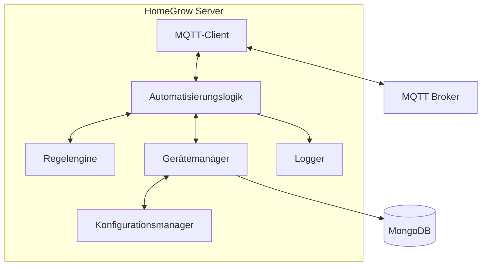
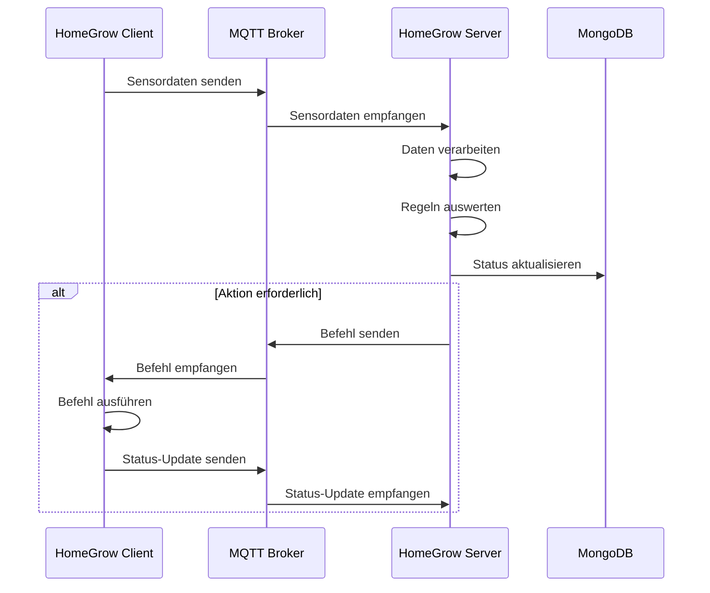

# HomeGrow Server

Der HomeGrow Server ist die zentrale Komponente für die Automatisierungslogik des HomeGrow-Systems. Er empfängt Sensordaten über MQTT, verarbeitet diese basierend auf konfigurierbaren Regeln und sendet bei Bedarf Befehle an die Geräte zurück.

## Funktionen

- **Automatisierungslogik**: Führt automatisierte Aktionen basierend auf Sensordaten aus
- **Regelbasierte Steuerung**: Konfigurierbare Regeln für verschiedene Szenarien
- **MQTT-Kommunikation**: Empfängt Sensordaten und sendet Befehle über MQTT
- **Geräteüberwachung**: Überwacht den Status aller verbundenen Geräte
- **Alarme und Benachrichtigungen**: Sendet Benachrichtigungen bei kritischen Ereignissen
- **Konfigurationsmanagement**: Verwaltet Gerätekonfigurationen und Automatisierungsregeln

## Architektur



## Datenfluss



## MQTT-Topics

Der HomeGrow Server verwendet folgende MQTT-Topics:

### Abonnierte Topics

- `homegrow/devices/+/sensors/#`: Empfängt Sensordaten von allen Geräten
- `homegrow/devices/+/status`: Empfängt Statusmeldungen von allen Geräten
- `homegrow/devices/+/config/request`: Empfängt Konfigurationsanfragen

### Veröffentlichte Topics

- `homegrow/devices/{device_id}/commands`: Sendet Befehle an Geräte
- `homegrow/devices/{device_id}/config/response`: Sendet Konfigurationen an Geräte
- `homegrow/system/notifications`: Sendet Systembenachrichtigungen

## Automatisierungsregeln

Der HomeGrow Server unterstützt konfigurierbare Regeln im JSON-Format. Die Regeln definieren Bedingungen und Aktionen, wobei die eigentliche Logik im Server implementiert ist:

```json
{
  "rule_id": "ph_control",
  "description": "Hält den pH-Wert im optimalen Bereich",
  "conditions": [
    {
      "sensor": "ph",
      "operator": "<",
      "value": 5.5
    }
  ],
  "actions": [
    {
      "device_id": "homegrow_client_1",
      "command": "nutrient_pump_1",
      "params": {
        "volume_ml": 10
      }
    }
  ],
  "enabled": true
}
```

Der Server berechnet selbst, wie lange die Pumpe laufen muss, basierend auf der gewünschten Menge und der bekannten Durchflussrate der Pumpe. Die Clients führen nur einfache Befehle aus, ohne eigene Logik zu implementieren.

Beispiele für Befehle:

```json
// Pumpe für bestimmtes Volumen aktivieren
{
  "command": "nutrient_pump_1",
  "params": {
    "volume_ml": 10
  }
}

// Luftpumpe ein-/ausschalten
{
  "command": "air_pump",
  "params": {
    "state": true
  }
}

// Wasserpumpe für bestimmte Zeit aktivieren
{
  "command": "water_pump",
  "params": {
    "duration_sec": 30
  }
}
```

## Konfiguration

Der HomeGrow Server kann über eine Konfigurationsdatei oder Umgebungsvariablen konfiguriert werden:

```yaml
mqtt:
  broker: "localhost"
  port: 1883
  client_id: "homegrow_server"
  username: ""
  password: ""

mongodb:
  uri: "mongodb://localhost:27017"
  database: "homegrow"

logging:
  level: "info"
  file: "/var/log/homegrow/server.log"

automation:
  check_interval: 60  # Sekunden
  rules_file: "/etc/homegrow/rules.json"
```

## Installation

1. Stelle sicher, dass Python 3.8+ installiert ist
2. Klone das Repository
3. Installiere die Abhängigkeiten: `pip install -r requirements.txt`
4. Konfiguriere die Anwendung über die Konfigurationsdatei oder Umgebungsvariablen
5. Starte den Server: `python src/main.py`

## Entwicklung

Der HomeGrow Server ist in Python geschrieben und verwendet die folgenden Bibliotheken:

- paho-mqtt: MQTT-Client
- pymongo: MongoDB-Client
- colorlog: Farbiges Logging
- pyyaml: YAML-Konfiguration

### Verzeichnisstruktur

```
homegrow_server/
├── src/
│   ├── main.py              # Hauptprogramm
│   ├── mqtt_client.py       # MQTT-Client
│   ├── automation.py        # Automatisierungslogik
│   ├── rules_engine.py      # Regelengine
│   ├── device_manager.py    # Gerätemanager
│   ├── config_manager.py    # Konfigurationsmanager
│   └── logger.py            # Logger
├── config/                  # Konfigurationsdateien
├── rules/                   # Regeldefinitionen
├── tests/                   # Tests
└── requirements.txt         # Abhängigkeiten
```

## Fehlerbehandlung

Der HomeGrow Server implementiert folgende Fehlerbehandlungsstrategien:

- **MQTT-Verbindungsverlust**: Automatische Wiederverbindung
- **Ungültige Sensordaten**: Logging und Ignorieren
- **Regelauswertungsfehler**: Logging und Fortfahren mit der nächsten Regel
- **Befehlsausführungsfehler**: Wiederholungsversuche und Benachrichtigung 