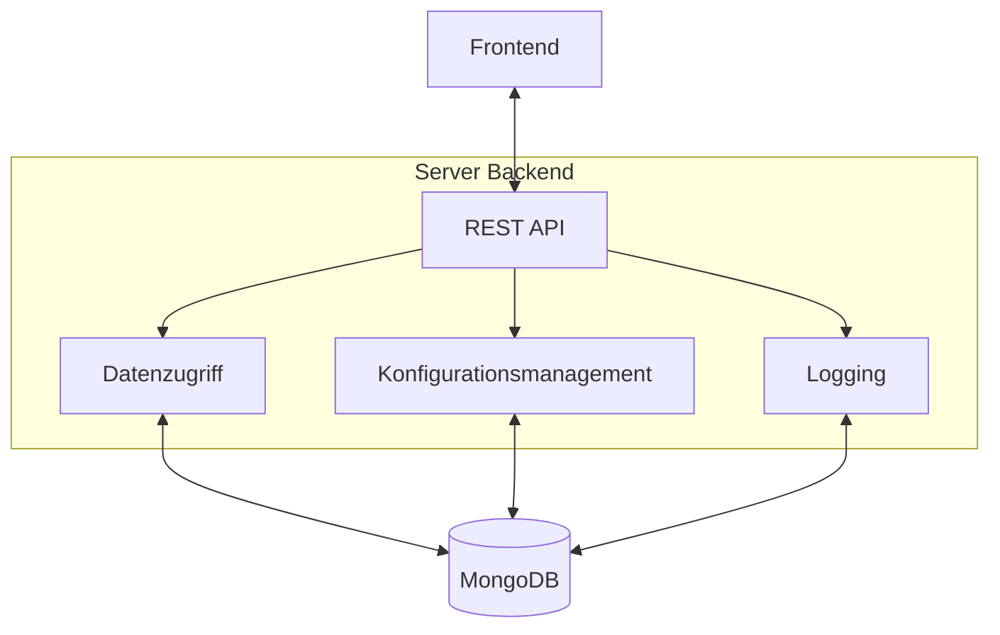
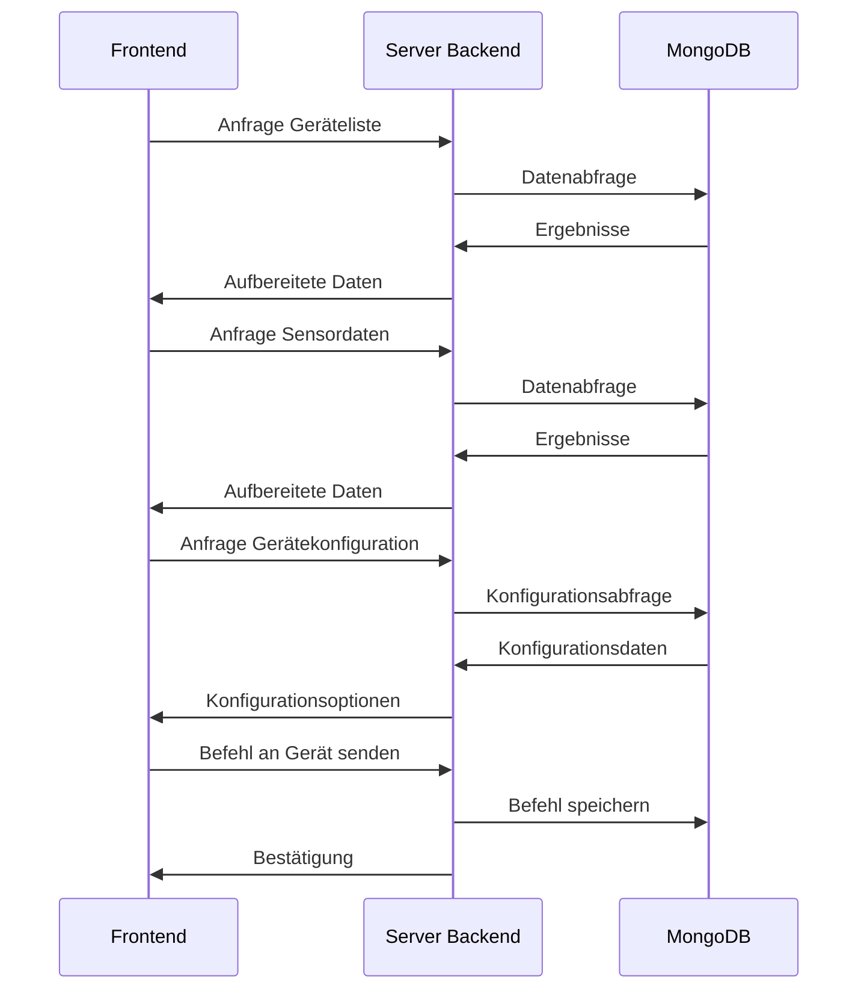

# HomeGrow Server Backend

Das HomeGrow Server Backend ist die Komponente, die als Brücke zwischen dem Frontend und der MongoDB-Datenbank fungiert. Es stellt historische Daten und Logs für das Frontend bereit und ermöglicht die Steuerung der Geräte über MQTT.

## Funktionen

- **Datenabfrage**: Stellt REST-API-Endpunkte für den Zugriff auf Geräte- und Sensordaten bereit
- **Gerätekonfiguration**: Ermöglicht das Abrufen und Aktualisieren von Gerätekonfigurationen
- **Gerätesteuerung**: Ermöglicht das Senden von Befehlen an Geräte
- **Logging**: Stellt Logs für Sensordaten und Gerätestatus bereit

## Architektur



## Datenfluss



## API-Endpunkte

Das Backend stellt folgende REST-API-Endpunkte bereit:

### Allgemein

- `GET /api/health` - Health-Check-Endpunkt

### Geräte

- `GET /api/devices` - Liste aller Geräte abrufen
- `GET /api/devices/{device_id}` - Informationen zu einem bestimmten Gerät abrufen
- `POST /api/devices/{device_id}/command` - Befehl an ein Gerät senden

### Konfiguration

- `GET /api/devices/{device_id}/config` - Konfiguration eines Geräts abrufen
- `POST /api/devices/{device_id}/config` - Konfiguration eines Geräts aktualisieren

### Gerätename

- `GET /api/device_name/{device_id}` - Namen eines Geräts abrufen
- `POST /api/device_name/{device_id}` - Namen eines Geräts aktualisieren

### Sensordaten

- `GET /api/sensor-data/{device_id}` - Historische Sensordaten für ein Gerät abrufen

### Logs

- `GET /api/logs/{device_id}/{topic}` - Logs für ein Gerät und einen bestimmten Topic abrufen

## MongoDB-Datenbankstruktur

Die Datenbank `homegrow` enthält folgende Collections:

- `devices`: Enthält Informationen über die Geräte mit vollständiger Konfiguration und Sensordaten
- `configs`: Enthält Konfigurationen für die Geräte
- `device_config`: Enthält MQTT-Nachrichten zu Konfigurationsanfragen und -antworten
- `rules`: Enthält Regeln für die Automatisierung
- `ph_sensor_data`: Enthält MQTT-Nachrichten mit pH-Sensordaten
- `tds_sensor_data`: Enthält MQTT-Nachrichten mit TDS-Sensordaten
- `mqtt_messages`: Enthält MQTT-Heartbeat-Nachrichten
- `sensor_data`: Enthält aufbereitete Sensordaten (aus den MQTT-Nachrichten extrahiert)

## Datenmodelle

### Gerät (devices Collection)

```json
{
  "_id": "67c438d57df80eceb98df87e",
  "device_id": "homegrow_client_1",
  "actuators": {},
  "config": {
    "sensors": {
      "ph": {
        "enabled": true,
        "calibration": {
          "offset": 0.0,
          "slope": 1.0
        },
        "limits": {
          "min": 5.5,
          "max": 6.5
        },
        "reading_interval": 60
      },
      "tds": {
        "enabled": true,
        "calibration": {
          "offset": 0.0,
          "slope": 1.0
        },
        "limits": {
          "min": 500,
          "max": 1500
        },
        "reading_interval": 60
      }
    },
    "actuators": {
      "pump_ph_up": {
        "enabled": true,
        "pin": 16,
        "active_low": false
      },
      "pump_ph_down": {
        "enabled": true,
        "pin": 17,
        "active_low": false
      },
      "pump_nutrient": {
        "enabled": true,
        "pin": 18,
        "active_low": false
      }
    },
    "automation": {
      "enabled": true,
      "check_interval": 300
    },
    "network": {
      "mqtt": {
        "client_id": "homegrow_client_homegrow_client_1",
        "topic_prefix": "homegrow"
      }
    }
  },
  "last_seen": "2025-03-02T18:33:54.631000",
  "name": "HomeGrow Device homegrow_client_1",
  "online": false,
  "sensors": {
    "ph": {
      "value": 0,
      "timestamp": "2025-03-02T18:33:54.587000"
    },
    "tds": {
      "value": 0,
      "timestamp": "2025-03-02T18:33:54.631000"
    }
  }
}
```

### Konfiguration (configs Collection)

```json
{
  "_id": "67c4394a7df80eceb98df96e",
  "device_id": "homegrow_client_1",
  "config": {
    "sensors": {
      "ph": {
        "enabled": true,
        "calibration": {
          "offset": 0.0,
          "slope": 1.0
        },
        "limits": {
          "min": 5.5,
          "max": 6.5
        },
        "reading_interval": 60
      },
      "tds": {
        "enabled": true,
        "calibration": {
          "offset": 0.0,
          "slope": 1.0
        },
        "limits": {
          "min": 500,
          "max": 1500
        },
        "reading_interval": 60
      }
    },
    "actuators": {
      "pump_ph_up": {
        "enabled": true,
        "pin": 16,
        "active_low": false
      },
      "pump_ph_down": {
        "enabled": true,
        "pin": 17,
        "active_low": false
      },
      "pump_nutrient": {
        "enabled": true,
        "pin": 18,
        "active_low": false
      }
    },
    "automation": {
      "enabled": true,
      "check_interval": 300
    },
    "network": {
      "mqtt": {
        "client_id": "homegrow_client_homegrow_client_1",
        "topic_prefix": "homegrow"
      }
    }
  },
  "updated_at": "2025-03-02T10:56:10.667000"
}
```

### MQTT-Nachricht (ph_sensor_data, tds_sensor_data, mqtt_messages Collections)

```json
{
  "_id": "67c438d5942e1fd077c1c567",
  "topic": "homegrow/homegrow_client_1/sensor/ph",
  "topic_parts": [
    "homegrow",
    "homegrow_client_1",
    "sensor",
    "ph"
  ],
  "payload": {
    "value": 0,
    "timestamp": 475465
  },
  "timestamp": "2025-03-02T10:54:13.179000",
  "device_id": "homegrow_client_1"
}
```

### Sensordaten (sensor_data Collection)

```json
{
  "_id": "67c438d5667c4e85e89f583e",
  "device_id": "homegrow_client_1",
  "sensor_type": "ph",
  "value": 0,
  "timestamp": "2025-03-02T10:54:13.179000",
  "metadata": {}
}
```

## Installation

1. Stelle sicher, dass Python 3.9+ installiert ist
2. Klone das Repository
3. Installiere die Abhängigkeiten: `pip install -r requirements.txt`
4. Starte das Backend: `python src/main.py`

## Docker

Das Backend kann auch als Docker-Container ausgeführt werden:

```bash
docker build -t homegrow-server-backend .
docker run -p 5005:5005 homegrow-server-backend
```

Oder mit Docker Compose:

```bash
docker-compose up server_backend
```

## Entwicklung

Das Backend ist in Python mit Flask geschrieben und verwendet PyMongo für den Zugriff auf die MongoDB-Datenbank.

### Abhängigkeiten

- Flask: Web-Framework
- Flask-CORS: Cross-Origin Resource Sharing
- PyMongo: MongoDB-Treiber
- colorlog: Farbiges Logging
- requests: HTTP-Anfragen

### Verzeichnisstruktur

```
server_backend/
├── src/
│   └── main.py         # Hauptanwendung
├── requirements.txt    # Abhängigkeiten
└── Dockerfile          # Docker-Konfiguration
``` 