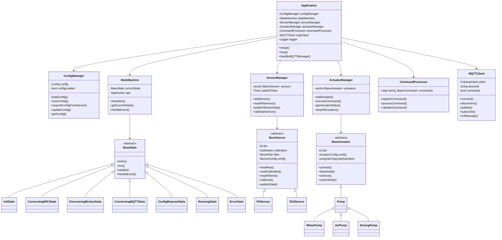
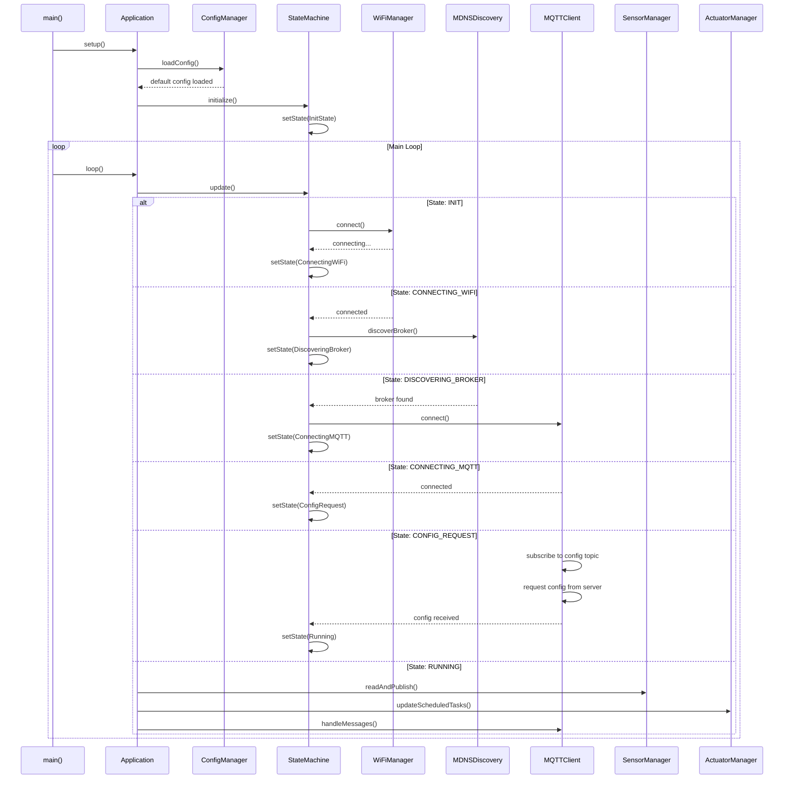
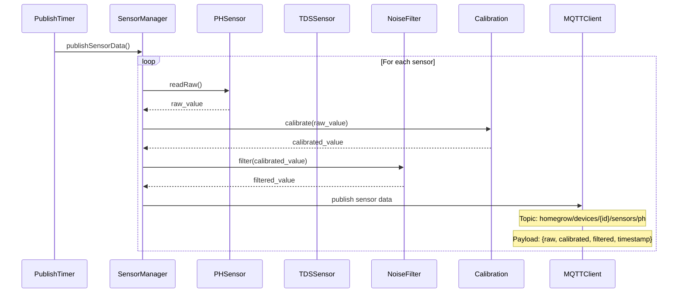
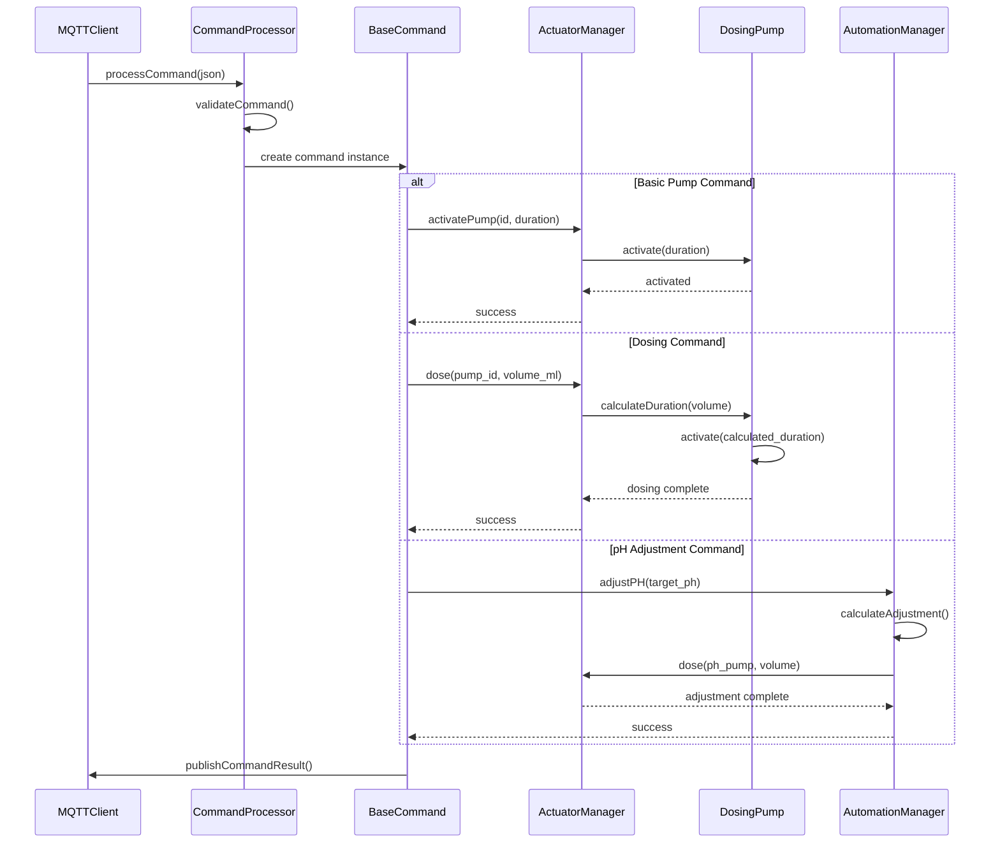

# HomeGrow Client v3 - Design Plan

## Übersicht

HomeGrow Client v3 ist eine komplette Neuentwicklung des Arduino/ESP32-basierten Clients mit Fokus auf elegante MQTT-basierte Kommunikation, modulare Architektur und erweiterte Automatisierungsfunktionen.

## Arduino Client v3 - Hybrid Architecture

### Architektur-Entscheidung: **Hybrid-Ansatz**
Der Arduino bietet eine **reiche Command-Palette** und die Umbrel App hält die **Business Logic**. Dies ermöglicht:
- **Flexibilität**: Programme können dynamisch angepasst werden
- **Skalierbarkeit**: Komplexe Wachstumsprogramme möglich
- **Einfachheit**: Arduino bleibt lightweight und fokussiert
- **Wartbarkeit**: Business Logic zentral in der App

### Arduino Funktionsumfang

#### 1. Sensor-Datenerfassung
- **pH-Sensor**: Raw, kalibriert, gefiltert (konfigurierbare Hz-Rate)
- **TDS-Sensor**: Raw, kalibriert, gefiltert (konfigurierbare Hz-Rate)
- **Kontinuierliches Publishing**: Alle Sensordaten über MQTT
- **Qualitätsindikatoren**: Sensor-Status, Kalibrierungs-Gültigkeit

#### 2. Aktor-Steuerung (Command Interface)

##### Basic Pump Commands
```
- activate_pump(pump_id, duration_sec)
- dose_volume(pump_id, volume_ml)
- stop_pump(pump_id)
- stop_all_pumps()
```

##### Advanced Dosing Commands
```
- adjust_ph_by(delta_ph)           # "erhöhe pH um 0.5"
- set_ph_target(target_ph)         # "bringe pH auf 6.0"
- adjust_tds_by(delta_tds)         # "erhöhe TDS um 100"
- set_tds_target(target_tds)       # "bringe TDS auf 800"
```

##### Scheduled Operations
```
- schedule_pump(pump_id, interval_min, duration_sec)
- cancel_schedule(pump_id)
- set_circulation_schedule(on_min, off_min)
```

##### System Commands
```
- emergency_stop()
- reset_system()
- calibrate_sensor(sensor_id, points[])
- update_config(config_section)
```

#### 3. Lokale Intelligenz (Minimal)
Der Arduino behält **nur grundlegende Sicherheitsfunktionen**:

##### Safety-Monitoring
- **Emergency Stop**: Bei kritischen pH/TDS-Werten (< 4.0 pH, > 2000 TDS)
- **Pump Protection**: Max-Laufzeiten, Cooldown-Perioden
- **Sensor Validation**: Plausibilitätsprüfungen, Outlier-Erkennung


#### 4. Status & Monitoring
- **Real-time Heartbeat**: System-Status, Uptime, Memory
- **Pump Status**: Aktueller Zustand, Betriebsstunden
- **Command Acknowledgments**: Bestätigung aller ausgeführten Befehle
- **Error Reporting**: Detaillierte Fehlermeldungen
- **Performance Metrics**: Timing, Speicherverbrauch

### Umbrel App Verantwortlichkeiten

#### Business Logic
- **Wachstumsprogramme**: Dynamische pH/TDS-Anpassung über Zeit
- **Komplexe Dosierung**: Berücksichtigung von Pflanzenwachstum, Umgebung
- **Scheduling**: Intelligente Pumpen-Zeitpläne
- **Optimierung**: ML-basierte Anpassungen

#### Command Orchestration
- **Regelmäßige Commands**: pH/TDS-Anpassungen basierend auf Programm
- **Monitoring**: Überwachung der Arduino-Responses
- **Fehlerbehandlung**: Retry-Logic, Fallback-Strategien
- **Logging**: Historische Daten, Trends, Analysen

### Kommunikations-Flow

#### Arduino → App
```
1. Kontinuierliche Sensor-Daten (pH, TDS)
2. Heartbeat mit System-Status
3. Command-Acknowledgments
4. Error/Warning-Meldungen
```

#### App → Arduino
```
1. Regelmäßige pH/TDS-Anpassungen
2. Pumpen-Schedule-Updates
3. Konfigurationsänderungen
4. Manual-Override-Commands
```

### Vorteile des Hybrid-Ansatzes

#### Für die Entwicklung
- **Klare Trennung**: Arduino = Hardware-Interface, App = Business Logic
- **Testbarkeit**: Commands können isoliert getestet werden
- **Skalierbarkeit**: Neue Features hauptsächlich in der App
- **Debugging**: Einfache Command-Nachverfolgung

#### Für den Betrieb
- **Flexibilität**: Programme können ohne Arduino-Update geändert werden
- **Robustheit**: Arduino bleibt einfach und stabil
- **Erweiterbarkeit**: Neue Sensoren/Aktoren einfach integrierbar
- **Monitoring**: Vollständige Transparenz aller Operationen

### Failsafe-Mechanismen
- **Connection Loss**: Arduino behält letzte bekannte Parameter
- **Command Timeout**: Grundlegende Sicherheitsfunktionen bleiben aktiv
- **Emergency Conditions**: Sofortiger Stopp bei kritischen Werten
- **Graceful Degradation**: Weiterbetrieb auch bei Teilausfällen

## Erkenntnisse aus v2 System (MongoDB-Analyse)

### Aktuelle MQTT-Topics (v2)
```
homegrow/homegrow_client_1/sensor/ph          # pH-Sensordaten mit raw + value
homegrow/homegrow_client_1/sensor/tds         # TDS-Sensordaten mit raw + value
homegrow/homegrow_client_1/command            # Befehle an Client
homegrow/homegrow_client_1/command/response   # Antworten vom Client
homegrow/homegrow_client_1/heartbeat          # Heartbeat-Nachrichten
```

### Aktuelle Sensordaten-Struktur (v2)
```json
{
  "value": 6.464615345,    // Kalibrierter Wert
  "raw": 1870,             // Rohwert vom ADC
  "timestamp": 4471512     // Client-Timestamp (millis())
}
```

### Aktuelle Befehls-Struktur (v2)
```json
{
  "type": "ph_down_pump",     // Pumpentyp
  "duration": 1423            // Dauer in Millisekunden
}
```

### Aktuelle Pumpen (v2)
- `water_pump` - Wasserpumpe für Kreislauf
- `air_pump` - Luftpumpe für Sauerstoff
- `ph_up_pump` - pH-Up Dosierpumpe
- `ph_down_pump` - pH-Down Dosierpumpe
- `nutrient_pump_1` - Nährstoffpumpe 1
- `nutrient_pump_2` - Nährstoffpumpe 2
- `nutrient_pump_3` - Nährstoffpumpe 3

### Aktuelle Konfiguration (v2)
```json
{
  "sensors": {
    "ph": {
      "calibration": {
        "point1_raw": 2252, "point1_value": 4,
        "point2_raw": 1721, "point2_value": 7
      },
      "pin": "A3",
      "reading_interval": 60
    },
    "tds": {
      "calibration": {
        "raw": 1156, "value": 342
      },
      "pin": "A2",
      "reading_interval": 60
    }
  },
  "actuators": {
    "pump_nutrient_1": { "flow_rate": 2.67 },
    "pump_ph_down": { "flow_rate": 2.67 }
  },
  "automation": {
    "check_interval": 300,
    "enabled": true
  }
}
```

### Automatisierungs-Logik (v2)
Das System führt automatische pH- und TDS-Korrekturen durch:
- **pH-Korrektur**: Zielbereich 6.0-7.0, verwendet ph_up/ph_down Pumpen
- **TDS-Korrektur**: Zielbereich 500-700, verwendet nutrient_pumps
- **Wartezeiten**: 30 Minuten zwischen Nährstoff-/pH-Anpassungen
- **Dosierung**: Berechnet basierend auf Abweichung vom Zielwert

### Verbesserungen für v3
1. **Erweiterte Sensordaten**: Zusätzlich gefilterte Werte
2. **Bessere Topic-Struktur**: Einheitlichere Namenskonvention
3. **Mehr Pumpen**: 5 Dosierpumpen statt 3
4. **Konfigurierbare Automatisierung**: Flexiblere Parameter
5. **Heartbeat-Verbesserung**: Mehr Systeminformationen
6. **Fehlerbehandlung**: Robustere Kommunikation

## Vollständige Client-Konfiguration

```json
{
  "device": {
    "id": "homegrow_client_001",
    "name": "Hauptsystem Garten",
    "location": "Gewächshaus A",
    "firmware_version": "3.0.0",
    "hardware_version": "1.2"
  },
  "wifi": {
    "ssid": "HomeGrow_Network",
    "password": "secure_password",
    "hostname": "homegrow-client-001",
    "static_ip": null,
    "dns_servers": ["8.8.8.8", "8.8.4.4"]
  },
  "mqtt": {
    "broker_discovery": {
      "enabled": true,
      "service_name": "_mqtt._tcp",
      "fallback_host": "192.168.1.100",
      "fallback_port": 1883
    },
    "auth": {
      "username": "homegrow_client",
      "password": "mqtt_password"
    },
    "qos": 1,
    "retain": false,
    "keepalive": 60,
    "clean_session": true
  },
  "sensors": {
    "ph": {
      "enabled": true,
      "pin": 34,
      "calibration": {
        "type": "multi_point",
        "points": [
          {"raw": 1365, "ph": 4.0},
          {"raw": 1854, "ph": 7.0},
          {"raw": 2343, "ph": 10.0}
        ],
        "last_calibrated": "2024-01-10T14:30:00Z"
      },
      "noise_filter": {
        "enabled": true,
        "type": "moving_average",
        "window_size": 10,
        "outlier_threshold": 2.0
      },
      "publishing": {
        "rate_hz": 1.0,
        "publish_raw": true,
        "publish_calibrated": true,
        "publish_filtered": true
      }
    },
    "tds": {
      "enabled": true,
      "pin": 35,
      "calibration": {
        "type": "single_point",
        "reference_point": {"raw": 1156, "tds": 342},
        "last_calibrated": "2024-01-10T14:35:00Z"
      },
      "noise_filter": {
        "enabled": true,
        "type": "exponential",
        "alpha": 0.1,
        "outlier_threshold": 100.0
      },
      "publishing": {
        "rate_hz": 0.5,
        "publish_raw": true,
        "publish_calibrated": true,
        "publish_filtered": true
      }
    },

  },
  "actuators": {
    "water_pump": {
      "enabled": true,
      "pin": 16,
      "type": "relay",
      "flow_rate_ml_per_sec": 50.0,
      "max_runtime_sec": 300,
      "cooldown_sec": 60,
      "scheduled": {
        "enabled": true,
        "interval_minutes": 30,
        "duration_seconds": 120
      }
    },
    "air_pump": {
      "enabled": true,
      "pin": 17,
      "type": "relay",
      "max_runtime_sec": 1800,
      "cooldown_sec": 30,
      "scheduled": {
        "enabled": true,
        "interval_minutes": 15,
        "duration_seconds": 300
      }
    },
    "dosing_pumps": [
      {
        "id": "ph_down",
        "enabled": true,
        "pin": 18,
        "type": "peristaltic",
        "flow_rate_ml_per_sec": 0.5,
        "max_runtime_sec": 60,
        "cooldown_sec": 300,
        "substance": "pH Down (H3PO4)",
        "concentration": "85%"
      },
      {
        "id": "ph_up",
        "enabled": true,
        "pin": 19,
        "type": "peristaltic",
        "flow_rate_ml_per_sec": 0.5,
        "max_runtime_sec": 60,
        "cooldown_sec": 300,
        "substance": "pH Up (KOH)",
        "concentration": "40%"
      },
      {
        "id": "nutrient_a",
        "enabled": true,
        "pin": 20,
        "type": "peristaltic",
        "flow_rate_ml_per_sec": 1.0,
        "max_runtime_sec": 120,
        "cooldown_sec": 60,
        "substance": "Nutrient A",
        "concentration": "100%"
      },
      {
        "id": "nutrient_b",
        "enabled": true,
        "pin": 21,
        "type": "peristaltic",
        "flow_rate_ml_per_sec": 1.0,
        "max_runtime_sec": 120,
        "cooldown_sec": 60,
        "substance": "Nutrient B",
        "concentration": "100%"
      },
      {
        "id": "cal_mag",
        "enabled": true,
        "pin": 22,
        "type": "peristaltic",
        "flow_rate_ml_per_sec": 0.8,
        "max_runtime_sec": 90,
        "cooldown_sec": 120,
        "substance": "Cal-Mag",
        "concentration": "100%"
      }
    ]
  },
  "safety": {
    "emergency_stop_conditions": {
      "ph_min": 4.0,
      "ph_max": 8.5,
      "tds_max": 2000
    },
    "pump_protection": {
      "max_runtime_sec": 300,
      "cooldown_sec": 60
    },
    "sensor_validation": {
      "outlier_threshold": 2.0,
      "plausibility_checks": true
    }
  },

  "system": {
    "watchdog": {
      "enabled": true,
      "timeout_sec": 30
    },
    "ota": {
      "enabled": true,
      "password": "ota_password",
      "port": 3232
    },
    "logging": {
      "level": "INFO",
      "serial": true,
      "mqtt": true,
      "buffer_size": 1024
    },
    "status": {
      "heartbeat_interval_sec": 30,
      "memory_monitoring": true,
      "uptime_reporting": true
    }
  }
}
```

## Dateistruktur homegrow_client3

```
homegrow_client3/
├── platformio.ini                    # PlatformIO Konfiguration
├── PLAN.md                          # Dieses Dokument
├── README.md                        # Benutzer-Dokumentation
├── src/
│   ├── main.cpp                     # Hauptprogramm (minimal)
│   ├── config/
│   │   ├── Config.h                 # Konfigurationsklasse
│   │   ├── Config.cpp
│   │   ├── ConfigManager.h          # Konfigurationsverwaltung
│   │   ├── ConfigManager.cpp
│   │   └── default_config.h         # Standard-Konfiguration
│   ├── core/
│   │   ├── Application.h            # Hauptanwendungsklasse
│   │   ├── Application.cpp
│   │   ├── Logger.h                 # Logging-System
│   │   ├── Logger.cpp
│   │   ├── Timer.h                  # Timer-Utilities
│   │   └── Timer.cpp
│   ├── network/
│   │   ├── WiFiManager.h            # WiFi-Verbindungsmanagement
│   │   ├── WiFiManager.cpp
│   │   ├── MQTTClient.h             # MQTT-Client
│   │   ├── MQTTClient.cpp
│   │   ├── MDNSDiscovery.h          # mDNS Broker-Discovery
│   │   ├── MDNSDiscovery.cpp
│   │   ├── OTAManager.h             # OTA Update Manager
│   │   └── OTAManager.cpp
│   ├── sensors/
│   │   ├── SensorManager.h          # Sensor-Verwaltung
│   │   ├── SensorManager.cpp
│   │   ├── BaseSensor.h             # Abstrakte Sensor-Basisklasse
│   │   ├── BaseSensor.cpp
│   │   ├── PHSensor.h               # pH-Sensor
│   │   ├── PHSensor.cpp
│   │   ├── TDSSensor.h              # TDS-Sensor
│   │   ├── TDSSensor.cpp
│   │   ├── filters/
│   │   │   ├── NoiseFilter.h        # Abstrakte Filter-Basisklasse
│   │   │   ├── MovingAverageFilter.h
│   │   │   ├── MovingAverageFilter.cpp
│   │   │   ├── ExponentialFilter.h
│   │   │   └── ExponentialFilter.cpp
│   │   └── calibration/
│   │       ├── Calibration.h        # Kalibrierungs-Interface
│   │       ├── LinearCalibration.h
│   │       ├── LinearCalibration.cpp
│   │       ├── MultiPointCalibration.h
│   │       └── MultiPointCalibration.cpp
│   ├── actuators/
│   │   ├── ActuatorManager.h        # Aktor-Verwaltung
│   │   ├── ActuatorManager.cpp
│   │   ├── BaseActuator.h           # Abstrakte Aktor-Basisklasse
│   │   ├── BaseActuator.cpp
│   │   ├── Pump.h                   # Basis-Pumpenklasse
│   │   ├── Pump.cpp
│   │   ├── WaterPump.h              # Wasserpumpe
│   │   ├── WaterPump.cpp
│   │   ├── AirPump.h                # Luftpumpe
│   │   ├── AirPump.cpp
│   │   ├── DosingPump.h             # Dosierpumpe
│   │   ├── DosingPump.cpp

│   ├── commands/
│   │   ├── CommandProcessor.h       # Befehlsverarbeitung
│   │   ├── CommandProcessor.cpp
│   │   ├── BaseCommand.h            # Abstrakte Befehlsbasis
│   │   ├── BaseCommand.cpp
│   │   ├── PumpCommand.h            # Pumpen-Befehle
│   │   ├── PumpCommand.cpp
│   │   ├── DosingCommand.h          # Dosier-Befehle
│   │   ├── DosingCommand.cpp
│   │   ├── PHAdjustCommand.h        # pH-Anpassungs-Befehle
│   │   ├── PHAdjustCommand.cpp
│   │   └── SystemCommand.h          # System-Befehle
│   ├── state/
│   │   ├── StateMachine.h           # Zustandsmaschine
│   │   ├── StateMachine.cpp
│   │   ├── BaseState.h              # Abstrakte Zustandsbasis
│   │   ├── BaseState.cpp
│   │   ├── InitState.h              # Initialisierungszustand
│   │   ├── InitState.cpp
│   │   ├── ConnectingWiFiState.h    # WiFi-Verbindungszustand
│   │   ├── ConnectingWiFiState.cpp
│   │   ├── DiscoveringBrokerState.h # Broker-Suchzustand
│   │   ├── DiscoveringBrokerState.cpp
│   │   ├── ConnectingMQTTState.h    # MQTT-Verbindungszustand
│   │   ├── ConnectingMQTTState.cpp
│   │   ├── ConfigRequestState.h     # Konfiguration anfordern
│   │   ├── ConfigRequestState.cpp
│   │   ├── RunningState.h           # Normalbetriebszustand
│   │   ├── RunningState.cpp
│   │   ├── ErrorState.h             # Fehlerzustand
│   │   └── ErrorState.cpp
│   └── utils/
│       ├── JsonUtils.h              # JSON-Hilfsfunktionen
│       ├── JsonUtils.cpp
│       ├── MathUtils.h              # Mathematische Hilfsfunktionen
│       ├── MathUtils.cpp
│       ├── TimeUtils.h              # Zeit-Hilfsfunktionen
│       └── TimeUtils.cpp
├── lib/                             # Externe Bibliotheken
├── test/                            # Unit-Tests
│   ├── test_sensors/
│   ├── test_actuators/
│   ├── test_automation/
│   └── test_commands/
└── docs/                            # Zusätzliche Dokumentation
    ├── API.md                       # MQTT API Dokumentation
    ├── CALIBRATION.md               # Kalibrierungs-Anleitung
    └── TROUBLESHOOTING.md           # Fehlerbehebung
```

## Klassendiagramm



## Sequenzdiagramm - Systemstart



## Sequenzdiagramm - Sensorwerte publizieren



## Sequenzdiagramm - Befehlsverarbeitung



## MQTT Topics Schema v3 (Verbessert)

### Sensor-Daten
```
homegrow/devices/{device_id}/sensors/ph
homegrow/devices/{device_id}/sensors/tds
```

**Payload Format (v3 - Erweitert):**
```json
{
  "timestamp": "2024-01-15T10:30:00Z",
  "device_timestamp": 4471512,
  "sensor_id": "ph",
  "values": {
    "raw": 1854,
    "calibrated": 7.0,
    "filtered": 6.98
  },
  "unit": "pH",
  "quality": "good",
  "calibration_status": "valid",
  "filter_config": {
    "type": "moving_average",
    "window_size": 10
  }
}
```

**Vergleich v2 vs v3:**
- ✅ v3: Zusätzlicher `filtered` Wert
- ✅ v3: Qualitätsindikatoren
- ✅ v3: Kalibrierungsstatus
- ✅ v3: Filter-Konfiguration
- ✅ v3: Sowohl Server- als auch Device-Timestamp

### Befehle
```
homegrow/devices/{device_id}/commands
homegrow/devices/{device_id}/commands/response
```

**Basic Pump Command (v3 - Erweitert):**
```json
{
  "command_id": "cmd_001",
  "command": "activate_pump",
  "params": {
    "pump_id": "water_pump",
    "duration_sec": 30
  },
  "priority": "normal",
  "timeout_sec": 60,
  "retry_count": 3
}
```

**Dosing Command (v3 - Erweitert):**
```json
{
  "command_id": "cmd_002",
  "command": "dose",
  "params": {
    "pump_id": "ph_down",
    "volume_ml": 10,
    "flow_rate_override": null
  },
  "safety_checks": {
    "max_volume_ml": 50,
    "cooldown_sec": 300
  }
}
```

**Advanced Dosing Commands (v3 - Neu):**
```json
{
  "command_id": "cmd_003",
  "command": "adjust_ph_by",
  "params": {
    "delta_ph": 0.5,
    "max_volume_ml": 10
  }
}
```

```json
{
  "command_id": "cmd_004",
  "command": "set_ph_target",
  "params": {
    "target_ph": 6.0,
    "tolerance": 0.1,
    "max_attempts": 3
  }
}
```

```json
{
  "command_id": "cmd_005",
  "command": "schedule_pump",
  "params": {
    "pump_id": "water_pump",
    "interval_minutes": 30,
    "duration_seconds": 120
  }
}
```

**Command Response (v3 - Erweitert):**
```json
{
  "command_id": "cmd_001",
  "status": "completed",
  "result": {
    "actual_duration_sec": 29.8,
    "volume_dispensed_ml": 15.2
  },
  "timestamp": "2024-01-15T10:30:00Z",
  "device_timestamp": 4471512,
  "execution_time_ms": 29800
}
```

**Vergleich v2 vs v3:**
- ✅ v3: Command IDs für Tracking
- ✅ v3: Prioritäten und Timeouts
- ✅ v3: Safety Checks
- ✅ v3: Detaillierte Responses
- ✅ v3: Retry-Mechanismus
- ✅ v3: Advanced Dosing Commands
- ✅ v3: Hybrid Architecture (App-gesteuert)

### Konfiguration
```
homegrow/devices/{device_id}/config/request    # Client -> Server
homegrow/devices/{device_id}/config/response   # Server -> Client
```

### Status & Monitoring
```
homegrow/devices/{device_id}/status
homegrow/devices/{device_id}/heartbeat
homegrow/devices/{device_id}/logs
homegrow/devices/{device_id}/diagnostics
```

**Heartbeat (v3 - Erweitert):**
```json
{
  "timestamp": "2024-01-15T10:30:00Z",
  "device_timestamp": 4471512,
  "status": "online",
  "uptime_sec": 86400,
  "memory": {
    "free_heap": 45000,
    "total_heap": 520000,
    "fragmentation": 12
  },
  "wifi": {
    "rssi": -45,
    "quality": "excellent"
  },
  "mqtt": {
    "connection_quality": "stable",
    "messages_sent": 1234,
    "messages_failed": 2
  },
  "sensors": {
    "ph": { "status": "ok", "last_reading": "2024-01-15T10:29:55Z" },
    "tds": { "status": "ok", "last_reading": "2024-01-15T10:29:55Z" }
  },
  "actuators": {
    "water_pump": { "status": "idle", "runtime_hours": 12.5 },
    "ph_down": { "status": "idle", "runtime_hours": 2.3 }
  },
  "safety": {
    "emergency_conditions_active": false,
    "last_safety_check": "2024-01-15T10:29:50Z"
  },
  
}
```

**Vergleich v2 vs v3:**
- ✅ v3: Detaillierte Systeminformationen
- ✅ v3: Speicher-Monitoring
- ✅ v3: WiFi-Qualität
- ✅ v3: MQTT-Statistiken
- ✅ v3: Sensor/Aktor-Status
- ✅ v3: Betriebsstunden-Tracking

## Quality of Life Features

### 1. OTA Updates
- Automatische Update-Erkennung
- Sichere Firmware-Übertragung
- Rollback bei Fehlern
- Update-Status über MQTT

### 2. Watchdog System
- Hardware-Watchdog für ESP32
- Software-Watchdog für kritische Tasks
- Automatischer Neustart bei Hängern
- Crash-Logs über MQTT

### 3. Logging System
- Verschiedene Log-Level (DEBUG, INFO, WARN, ERROR)
- Lokale Log-Pufferung
- MQTT-basierte Log-Übertragung
- Strukturierte JSON-Logs

### 4. Monitoring & Diagnostics
- Speicher-Überwachung (Heap, Stack)
- WiFi-Signal-Stärke
- MQTT-Verbindungsqualität
- Sensor-Gesundheitschecks
- Aktor-Betriebsstunden

### 5. Konfigurationsmanagement
- Hot-Reload von Konfigurationen
- Konfigurationsvalidierung
- Backup/Restore von Einstellungen
- Factory Reset Funktion

### 6. Fehlerbehandlung
- Graceful Degradation bei Sensor-Ausfällen
- Automatische Wiederverbindung
- Fehler-Recovery-Strategien
- Benutzerfreundliche Fehlermeldungen

## Implementierungsreihenfolge (Basierend auf v2 Erkenntnissen)

### Phase 1: Migration & Grundgerüst (Woche 1-2)
1. **v2 Kompatibilität**: Bestehende MQTT-Topics unterstützen
2. **Projektstruktur**: Neue modulare Architektur
3. **Basis-Klassen**: Abstrakte Sensor/Aktor-Interfaces
4. **Konfigurationssystem**: Erweiterte Config-Struktur
5. **Logging-System**: Strukturierte JSON-Logs

### Phase 2: Erweiterte Kommunikation (Woche 3-4)
1. **MQTT-Client v3**: Erweiterte Topics und Payloads
2. **Command-System**: Command IDs, Responses, Retry-Logic
3. **WiFi-Manager**: Robuste Verbindungslogik
4. **mDNS-Discovery**: Broker-Erkennung
5. **OTA-Manager**: Sichere Updates

### Phase 3: Sensoren & Filter (Woche 5-6)
1. **Sensor-Framework**: Raw, Calibrated, Filtered Values
2. **pH/TDS-Sensoren**: Kompatibel mit v2 Kalibrierung
3. **Rauschfilter**: Moving Average, Exponential
4. **Kalibrierungs-System**: Multi-Point Kalibrierung
5. **Sensor-Validierung**: Plausibilitätsprüfungen

### Phase 4: Aktoren & Commands (Woche 7-8)
1. **Pumpen-Framework**: 5 Dosierpumpen + Wasser/Luft
2. **Safety-System**: Cooldowns, Max-Volumes, Emergency-Stop
3. **Command-System**: Reiche Command-Palette
4. **Flow-Rate-Kalkulation**: Präzise Dosierung
5. **Betriebsstunden-Tracking**: Wartungsplanung

### Phase 5: Integration & Monitoring (Woche 9-10)
1. **Command-Responses**: Detaillierte Acknowledgments
2. **Erweiterte Diagnostics**: Memory, WiFi, MQTT-Monitoring
3. **Heartbeat-System**: Detaillierte Statusinformationen
4. **Error-Handling**: Robuste Fehlerbehandlung
5. **Performance-Optimierung**: Speicher und Timing

### Migration von v2 zu v3
- **Backward Compatibility**: v2 Topics werden weiterhin unterstützt
- **Graduelle Migration**: Neue Features optional aktivierbar
- **Konfiguration**: Automatische Migration von v2 Config
- **Testing**: Parallelbetrieb möglich

## Technische Spezifikationen

### Hardware-Anforderungen
- ESP32 (min. 4MB Flash, 520KB RAM)
- pH-Sensor (analog)
- TDS-Sensor (analog)
- 5x Dosierpumpen (12V)
- 1x Wasserpumpe (12V)
- 1x Luftpumpe (12V)
- Relais-Module für Pumpensteuerung

### Software-Dependencies
- PlatformIO Framework
- Arduino Core für ESP32
- WiFi Library
- PubSubClient (MQTT)
- ArduinoJson

- ESPmDNS
- ArduinoOTA

### Performance-Ziele
- Sensor-Lesezyklen: 0.1-1 Hz konfigurierbar
- MQTT-Latenz: < 100ms
- Speicherverbrauch: < 80% verfügbarer RAM
- Uptime: > 99.9%
- OTA-Update-Zeit: < 2 Minuten

Dieses Design bietet eine solide, erweiterbare und wartbare Basis für den HomeGrow Client v3 mit allen geforderten Funktionen und Quality-of-Life-Features. 