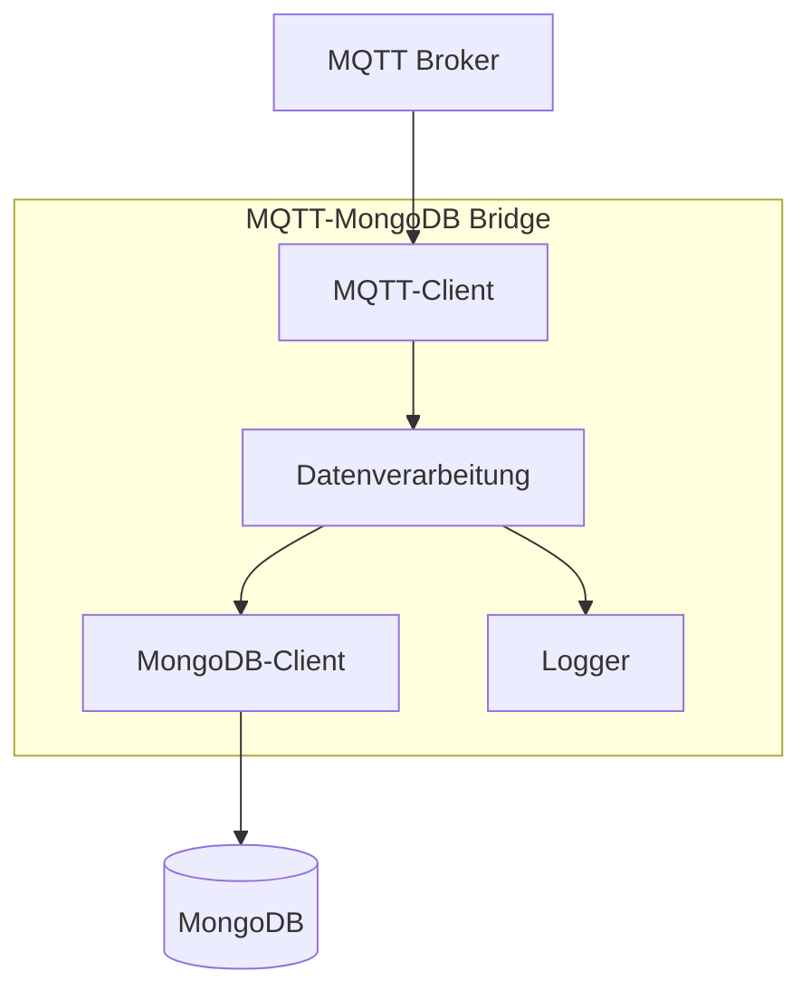
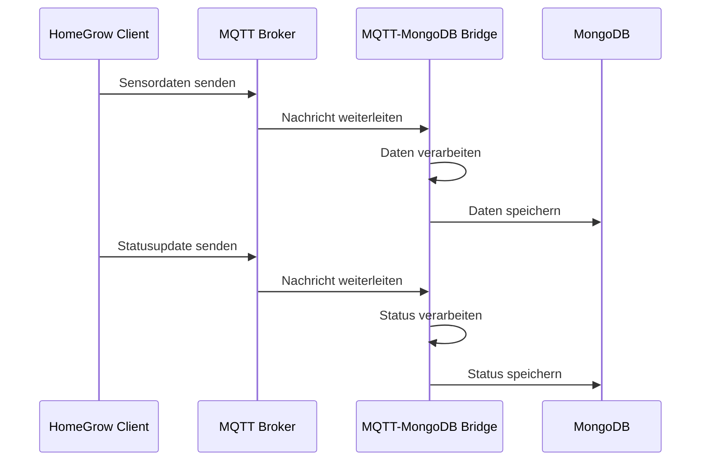

# MQTT-MongoDB Bridge

Die MQTT-MongoDB Bridge ist eine Komponente, die MQTT-Nachrichten empfängt und in die MongoDB-Datenbank schreibt. Sie dient als Verbindung zwischen dem MQTT-Broker und der Datenbank, um Sensordaten und Gerätestatus zu persistieren.

## Funktionen

- **MQTT-Abonnement**: Abonniert relevante MQTT-Topics für Sensordaten und Gerätestatus
- **Datenpersistenz**: Speichert empfangene Daten in der MongoDB-Datenbank
- **Datenverarbeitung**: Transformiert MQTT-Nachrichten in das Datenbankformat
- **Fehlerbehandlung**: Behandelt Verbindungsfehler und ungültige Nachrichten
- **Logging**: Protokolliert Aktivitäten und Fehler

## Architektur



## Datenfluss



## MQTT-Topics

Die Bridge abonniert folgende MQTT-Topics:

- `homegrow/devices/+/sensors/#`: Alle Sensordaten von allen Geräten
- `homegrow/devices/+/status`: Statusmeldungen von allen Geräten
- `homegrow/devices/+/logs`: Logs von allen Geräten

## Datenmodelle

### Sensordaten

```json
{
  "device_id": "homegrow_client_1",
  "sensor_type": "ph",
  "value": 6.5,
  "timestamp": "2023-06-15T14:30:00Z"
}
```

### Gerätestatus

```json
{
  "device_id": "homegrow_client_1",
  "status": "online",
  "last_seen": "2023-06-15T14:35:00Z",
  "pumps": {
    "water": false,
    "air": true,
    "nutrient1": false,
    "nutrient2": false
  }
}
```

## Konfiguration

Die Bridge kann über eine Konfigurationsdatei oder Umgebungsvariablen konfiguriert werden:

```yaml
mqtt:
  broker: "localhost"
  port: 1883
  client_id: "mqtt_mongo_bridge"
  username: ""
  password: ""

mongodb:
  uri: "mongodb://localhost:27017"
  database: "homegrow"
  collections:
    sensor_data: "sensor_data"
    device_status: "device_status"
    logs: "logs"

logging:
  level: "info"
  file: "/var/log/homegrow/bridge.log"
```

## Installation

1. Stelle sicher, dass Python 3.8+ installiert ist
2. Klone das Repository
3. Installiere die Abhängigkeiten: `pip install -r requirements.txt`
4. Konfiguriere die Anwendung über die Konfigurationsdatei oder Umgebungsvariablen
5. Starte die Bridge: `python src/main.py`

## Entwicklung

Die Bridge ist in Python geschrieben und verwendet die folgenden Bibliotheken:

- paho-mqtt: MQTT-Client
- pymongo: MongoDB-Client
- colorlog: Farbiges Logging

### Verzeichnisstruktur

```
mqtt_mongo_bridge/
├── src/
│   ├── main.py          # Hauptprogramm
│   ├── mqtt_client.py   # MQTT-Client
│   ├── mongo_client.py  # MongoDB-Client
│   ├── processor.py     # Datenverarbeitung
│   └── logger.py        # Logger
├── config/              # Konfigurationsdateien
├── tests/               # Tests
└── requirements.txt     # Abhängigkeiten
```

## Fehlerbehandlung

Die Bridge implementiert folgende Fehlerbehandlungsstrategien:

- **MQTT-Verbindungsverlust**: Automatische Wiederverbindung
- **MongoDB-Verbindungsfehler**: Pufferung von Nachrichten und Wiederverbindungsversuche
- **Ungültige Nachrichten**: Logging und Überspringen
- **Datenverarbeitungsfehler**: Logging und Fortfahren mit der nächsten Nachricht 