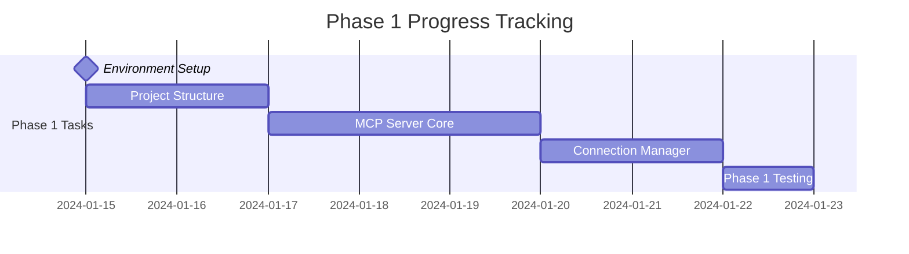
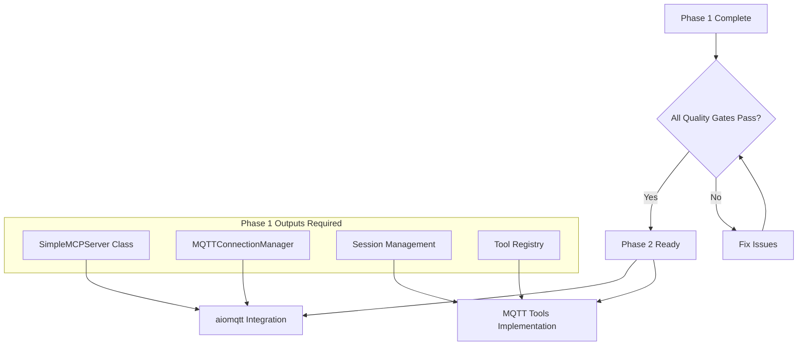

# bitsperity-mqtt-mcp - Current Phase Status

## Current Phase: Phase 1 - MCP Foundation

### Phase Status
- **Phase**: 1 von 4
- **Status**: 🚀 Ready to Start  
- **Timeline**: Week 1 (7 Tage)
- **Goal**: Funktionsfähiger MCP Server mit Session Management

### Phase Progress Tracking



### Current Deliverables Status

#### Day 1-2: Project Setup & Environment ⏳ Next
- [ ] **Environment Setup**
  - [ ] Python 3.11+ Installation und Virtual Environment
  - [ ] Git Repository Setup (bitsperity-mqtt-mcp)
  - [ ] Development Tools (VSCode, Docker Desktop)
  - [ ] SSH Key Setup für Umbrel Access

- [ ] **Project Structure**
  - [ ] src/ Ordner Struktur erstellen
  - [ ] requirements.txt und requirements-dev.txt
  - [ ] .gitignore für Python projects
  - [ ] README.md mit development setup
  - [ ] pytest configuration (pytest.ini)
  - [ ] tests/ directory structure

#### Day 3-5: MCP Server Core Implementation ⏸️ Blocked
- [ ] **JSON-RPC 2.0 Foundation**
  - [ ] SimpleMCPServer class (src/simple_mcp_server.py)
  - [ ] Tool registration mechanism
  - [ ] Parameter validation framework
  - [ ] Error response standardization

- [ ] **Session Management Foundation**
  - [ ] MQTTConnectionManager class (src/mqtt_connection_manager.py)
  - [ ] Credential encryption with Fernet
  - [ ] Session TTL management (1 hour)
  - [ ] Automatic cleanup of expired sessions

- [ ] **Basic Tools Implementation**
  - [ ] establish_connection tool
  - [ ] list_active_connections tool
  - [ ] close_connection tool

#### Day 6: Phase 1 Testing & Integration ⏸️ Blocked
- [ ] **Unit Tests**
  - [ ] Test JSON-RPC 2.0 request parsing
  - [ ] Test session management
  - [ ] Test basic tools

- [ ] **Integration Testing**
  - [ ] Test SSH + docker exec integration
  - [ ] Test STDIO communication
  - [ ] Performance testing (memory usage)

### Phase 1 Success Criteria

```mermaid
stateDiagram-v2
    [*] --> Development
    Development --> Testing : Code Complete
    Testing --> Validation : Tests Pass
    Validation --> Complete : Criteria Met
    
    Testing --> Development : Tests Fail
    Validation --> Testing : Criteria Not Met
    
    Complete --> [*]
    
    note right of Validation
        ✅ AI Assistant can reach MCP server via SSH
        ✅ Session management works (create, list, close)
        ✅ Credential encryption functional
        ✅ Basic tool registration works
        ✅ Error responses are JSON-RPC 2.0 compliant
        ✅ Memory usage under 128MB
    end note
```



### Phase 1 Quality Gates
- [ ] **SSH Integration**: AI Assistant kann MCP Server über SSH erreichen
- [ ] **Session Management**: create, list, close sessions funktioniert
- [ ] **Encryption**: Credential encryption mit Fernet works
- [ ] **Tool Registry**: Basic tool registration und execution works
- [ ] **JSON-RPC 2.0**: Error responses sind compliant
- [ ] **Performance**: Memory usage unter 128MB

### Technical Risk Status

#### 🔴 High Priority Risks (Monitor Daily)
- **RISK-002: SSH Integration**: Status ⚠️ Untested
  - *Action*: Test SSH integration on Day 3
  - *Mitigation*: Copy MongoDB MCP patterns exactly

#### 🟡 Medium Priority Risks  
- **RISK-003: Performance**: Status ✅ Baseline Planning
  - *Action*: Implement memory monitoring from Day 1

### Dependencies for Next Phase

#### Phase 1 → Phase 2 Requirements


**Required Handoffs to Phase 2**:
- ✅ Functional SimpleMCPServer with tool registration
- ✅ Working session management with encryption
- ✅ SSH + docker exec integration verified
- ✅ Basic error handling framework
- ✅ Unit test framework established

### Current Action Items

#### Immediate Next Steps (Today)
1. **Setup Development Environment**
   ```bash
   # Create virtual environment
   python3.11 -m venv venv
   source venv/bin/activate
   
   # Clone and setup project
   git clone <repo> bitsperity-mqtt-mcp
   cd bitsperity-mqtt-mcp
   ```

2. **Create Project Structure**
   ```bash
   mkdir -p src tests ai_docs/implementation
   touch src/simple_mcp_server.py
   touch src/mqtt_connection_manager.py  
   touch src/mqtt_tools.py
   ```

3. **Setup Development Dependencies**
   ```python
   # requirements.txt
   cryptography==41.0.8
   
   # requirements-dev.txt  
   pytest==7.4.3
   pytest-asyncio==0.21.1
   black==23.11.0
   mypy==1.7.1
   ```

#### This Week's Focus
- **Monday-Tuesday**: Environment und project structure
- **Wednesday-Friday**: MCP server core implementation
- **Saturday**: Testing und integration
- **Sunday**: Phase 1 review und Phase 2 planning

### Development Environment Status

#### Required Tools
- [ ] Python 3.11+ installed
- [ ] Virtual environment created
- [ ] Git repository initialized
- [ ] SSH access to umbrel.local configured
- [ ] Docker Desktop running
- [ ] Development IDE setup (VSCode recommended)

#### Test Environment Access  
- [ ] SSH key added to umbrel.local
- [ ] MQTT broker access (192.168.178.57:1883) verified
- [ ] Docker exec permissions validated
- [ ] Network connectivity confirmed

### Phase Completion Checklist

#### Code Quality Gates
- [ ] All unit tests passing (>90% coverage)
- [ ] Code formatted with black
- [ ] Type hints validated with mypy
- [ ] No linter errors (ruff)
- [ ] Git commit history clean

#### Integration Quality Gates  
- [ ] SSH + docker exec workflow tested
- [ ] MCP protocol compliance verified
- [ ] Session lifecycle tested
- [ ] Error handling robust
- [ ] Performance baseline established

#### Documentation Quality Gates
- [ ] README.md updated with setup instructions
- [ ] Code documented with docstrings
- [ ] Phase 1 progress documented
- [ ] Known issues documented
- [ ] Next phase handoff documented

### Communication & Handoff

#### Phase 1 → Phase 2 Handoff Meeting
**Agenda**:
1. Phase 1 deliverables review
2. Quality gates validation
3. Known issues and technical debt
4. Phase 2 dependencies confirmation
5. Risk assessment update

**Attendees**: Development team, architecture review

**Deliverables**:
- [ ] Phase 1 completion report
- [ ] Updated .cursorrules with implementation status
- [ ] Phase 2 implementation planning
- [ ] Risk mitigation status update

### Success Metrics Tracking

#### Technical Metrics (Phase 1)
- **Memory Usage**: Target <128MB *(Current: Not measured)*
- **Response Time**: Target <1s for basic tools *(Current: Not measured)*
- **Test Coverage**: Target >90% *(Current: 0%)*
- **Error Rate**: Target <1% in testing *(Current: Not measured)*

#### Quality Metrics (Phase 1)
- **Code Review**: All code reviewed before merge
- **Documentation**: All public interfaces documented
- **Testing**: All critical paths covered by tests
- **Standards**: All code follows Python conventions

### Notes & Lessons Learned

#### Development Notes
*This section will be updated as development progresses*

#### Technical Decisions
*Document major technical decisions and rationale*

#### Known Issues
*Track issues that need resolution in future phases*

#### Improvements for Next Phase
*Document what could be done better in Phase 2*

---

**Last Updated**: Phase Planning Complete
**Next Update**: After Day 1-2 completion
**Status**: Ready to begin implementation 