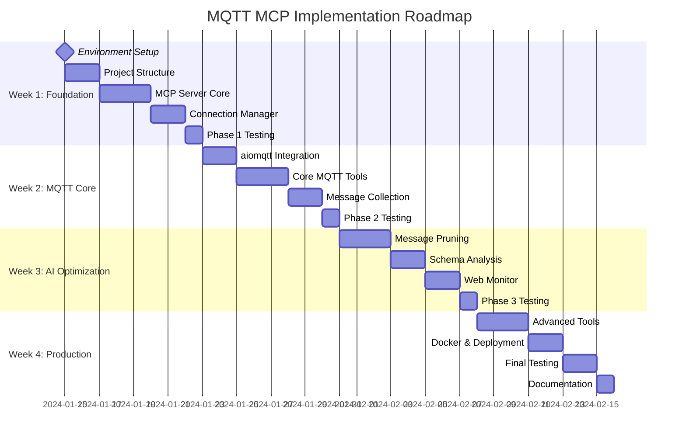

# bitsperity-mqtt-mcp - Implementation Roadmap

## Development Timeline Overview



## Phase 1: MCP Foundation (Week 1)

### Day 1-2: Project Setup & Environment
**Goal**: Funktionierende Entwicklungsumgebung und Projekt-Struktur

#### Day 1: Environment Setup
```bash
# Morning: Development Environment
□ Python 3.11+ Installation und Virtual Environment
□ Git Repository Setup (bitsperity-mqtt-mcp)
□ Development Tools (VSCode, Docker Desktop)
□ SSH Key Setup für Umbrel Access

# Afternoon: Project Structure
□ Erstelle src/ Ordner Struktur
□ requirements.txt und requirements-dev.txt
□ .gitignore für Python projects
□ README.md mit development setup
```

#### Day 2: Basic Project Structure
```bash
# Morning: Core Files
□ src/simple_mcp_server.py (main entry point)
□ src/mqtt_connection_manager.py (session management)
□ src/mqtt_tools.py (tool implementations)
□ Basic logging configuration

# Afternoon: Testing Setup
□ pytest configuration (pytest.ini)
□ tests/ directory structure
□ Basic unit test templates
□ CI/CD setup (GitHub Actions or similar)
```

### Day 3-5: MCP Server Core Implementation
**Goal**: Funktionsfähiger JSON-RPC 2.0 MCP Server

#### Day 3: JSON-RPC 2.0 Foundation
```python
# Morning: Basic MCP Server (src/simple_mcp_server.py)
class SimpleMCPServer:
    def __init__(self):
        # Initialize logging
        # Setup tool registry
        # Basic error handling
        
    async def handle_request(self, request_data: str) -> dict:
        # Parse JSON-RPC 2.0 request
        # Route to appropriate tool
        # Format JSON-RPC 2.0 response
        
    async def run(self) -> None:
        # STDIO communication loop
        # Handle SIGINT gracefully
        # Cleanup on exit

# Afternoon: Tool Registry System
□ Tool registration mechanism
□ Parameter validation framework
□ Error response standardization
□ Basic tool: ping (health check)
```

#### Day 4: Session Management Foundation
```python
# Morning: Connection Manager (src/mqtt_connection_manager.py)
class MQTTConnectionManager:
    def __init__(self):
        # Session storage (in-memory)
        # Fernet encryption setup
        # Cleanup task scheduling
        
    async def create_session(self, connection_string: str) -> str:
        # Parse connection string
        # Encrypt credentials
        # Generate session UUID
        # Store session data
        
    async def get_session(self, session_id: str) -> Optional[MQTTSession]:
        # Validate session ID
        # Check expiration
        # Return session or None

# Afternoon: Session Security
□ Credential encryption with Fernet
□ Session TTL management (1 hour)
□ Automatic cleanup of expired sessions
□ Session isolation and validation
```

#### Day 5: Basic Tools Implementation
```python
# Morning: Foundation Tools (src/mqtt_tools.py)
class MQTTTools:
    def __init__(self, connection_manager):
        self.connection_manager = connection_manager
        
    async def establish_connection(self, connection_string: str) -> dict:
        # Parse MQTT connection string
        # Create session via connection manager
        # Return session ID and status
        
    def list_active_connections(self) -> dict:
        # Get all active sessions
        # Format for AI assistant
        # Return session list with metadata
        
    async def close_connection(self, session_id: str) -> dict:
        # Validate session exists
        # Close MQTT connection
        # Clean up session data

# Afternoon: Error Handling & Validation
□ Input parameter validation
□ MQTT connection string parsing
□ Error response formatting
□ Timeout handling
```

### Day 6: Phase 1 Testing & Integration
```python
# Morning: Unit Tests
def test_mcp_server_basic_functionality():
    # Test JSON-RPC 2.0 request parsing
    # Test tool registration
    # Test error handling
    
def test_session_management():
    # Test session creation
    # Test session encryption
    # Test session expiration
    # Test session cleanup

def test_basic_tools():
    # Test establish_connection tool
    # Test list_active_connections tool
    # Test close_connection tool

# Afternoon: Integration Testing
□ Test SSH + docker exec integration
□ Test STDIO communication
□ Test session persistence
□ Performance testing (memory usage)
```

### Phase 1 Acceptance Tests
```bash
# Test Scenarios
1. Start MCP server via SSH successfully
2. Establish MQTT connection (mock broker)
3. List active connections correctly
4. Close connection and verify cleanup
5. Handle invalid connection strings gracefully
6. Session expiration works correctly
7. Memory usage under 128MB
```

## Phase 2: MQTT Core Tools (Week 2)

### Day 7-8: aiomqtt Integration
**Goal**: Funktionsfähige MQTT Client Integration

#### Day 7: MQTT Client Setup
```python
# Morning: aiomqtt Integration
class MQTTSession:
    def __init__(self, session_id: str, connection_string: str):
        # Parse connection parameters
        # Setup aiomqtt client
        # Configure reconnection logic
        
    async def connect(self) -> bool:
        # Establish MQTT connection
        # Handle authentication
        # Set up QoS support
        
    async def disconnect(self) -> None:
        # Graceful disconnect
        # Cleanup resources
        # Update session status

# Afternoon: Connection String Parsing
□ Parse mqtt://[username:password@]host:port[/client_id]
□ Handle optional authentication
□ Validate connection parameters
□ Support different QoS levels
```

#### Day 8: MQTT Operations Foundation
```python
# Morning: Basic MQTT Operations
async def test_mqtt_connection(session: MQTTSession) -> bool:
    # Test broker connectivity
    # Validate credentials
    # Check QoS support
    
async def subscribe_to_topic(session: MQTTSession, topic: str, qos: int = 0):
    # Subscribe to MQTT topic
    # Handle wildcards (+ and #)
    # Set up message handler
    
async def publish_message(session: MQTTSession, topic: str, payload: str, qos: int = 0):
    # Publish MQTT message
    # Handle QoS confirmation
    # Error handling

# Afternoon: Real MQTT Broker Testing
□ Test with development broker (192.168.178.57:1883)
□ Verify topic subscription
□ Verify message publishing
□ Test connection resilience
```

### Day 9-11: Core MQTT Tools Implementation
**Goal**: Vollständige MQTT Tool Suite

#### Day 9: Topic Discovery Tool
```python
# Morning: list_topics Implementation
async def list_topics(self, session_id: str, pattern: str = "#", duration: int = 30) -> dict:
    # Validate session
    # Subscribe to wildcard pattern
    # Collect topic names for duration
    # Return unique topic list with metadata
    
class TopicCollector:
    def __init__(self):
        self.topics = set()
        self.start_time = time.time()
        
    async def collect_topics(self, client, pattern, duration):
        # Time-bounded topic discovery
        # Deduplicate topic names
        # Track first/last seen timestamps

# Afternoon: Topic Discovery Testing
□ Test wildcard patterns (# and +)
□ Test duration limits
□ Test topic deduplication
□ Test with real MQTT traffic
```

#### Day 10: Message Collection Tool
```python
# Morning: subscribe_and_collect Implementation
async def subscribe_and_collect(self, session_id: str, topic: str, 
                               duration: int = 30, max_messages: int = 100,
                               qos: int = 0) -> dict:
    # Validate parameters
    # Subscribe to topic pattern
    # Collect messages with stop conditions
    # Format results for AI assistant
    
class MessageCollector:
    def __init__(self, max_messages: int, duration: int):
        self.messages = []
        self.start_time = time.time()
        self.max_messages = max_messages
        self.duration = duration
        
    async def collect_messages(self, client, topic_pattern):
        # Real-time message collection
        # Apply stop conditions (time OR count)
        # Extract message metadata
        # Handle different payload formats

# Afternoon: Message Collection Testing
□ Test time-bounded collection
□ Test message count limits
□ Test QoS handling
□ Test payload format detection
```

#### Day 11: Message Publishing Tool
```python
# Morning: publish_message Implementation
async def publish_message(self, session_id: str, topic: str, payload: str,
                         qos: int = 0, retain: bool = False) -> dict:
    # Validate session and parameters
    # Publish message with specified QoS
    # Handle publish confirmation
    # Return success/failure status
    
class MessagePublisher:
    def __init__(self, session: MQTTSession):
        self.session = session
        
    async def publish_with_confirmation(self, topic, payload, qos, retain):
        # Publish message
        # Wait for QoS confirmation if needed
        # Handle publish errors
        # Track publish statistics

# Afternoon: Publishing Testing
□ Test QoS 0, 1, 2 publishing
□ Test retain flag functionality
□ Test publish confirmation
□ Test error handling for failed publishes
```

### Day 12: Phase 2 Testing & Integration
```python
# Morning: MQTT Tools Integration Testing
def test_full_mqtt_workflow():
    # Establish connection
    # Discover topics
    # Collect messages
    # Publish test message
    # Verify end-to-end functionality
    
def test_mqtt_error_scenarios():
    # Broker unreachable
    # Authentication failure
    # Topic subscription failure
    # Message publish failure

# Afternoon: Performance Testing
□ Test with high message volumes
□ Test concurrent MQTT operations
□ Memory usage under load
□ Connection stability over time
```

### Phase 2 Acceptance Tests
```bash
# Test Scenarios
1. Connect to real MQTT broker successfully
2. Discover topics with wildcard patterns
3. Collect messages for specified duration
4. Publish messages with different QoS levels
5. Handle broker disconnections gracefully
6. Process 100+ messages efficiently
7. Memory usage under 256MB
```

## Phase 3: AI Optimization (Week 3)

### Day 13-15: Message Pruning Implementation
**Goal**: AI-optimierte Message Processing

#### Day 13: Pruning Algorithm Design
```python
# Morning: MessagePruner Core (src/message_pruner.py)
class MessagePruner:
    def __init__(self, target_size: int = 50):
        self.target_size = target_size
        
    def prune_messages(self, messages: List[MQTTMessage]) -> dict:
        # Apply intelligent pruning algorithm
        # Preserve important messages
        # Return pruned collection with summary
        
    def _prioritize_messages(self, messages: List[MQTTMessage]) -> List[MQTTMessage]:
        # Priority 1: Error messages
        # Priority 2: First/last messages
        # Priority 3: Diverse payload structures
        # Priority 4: Temporal distribution

# Afternoon: Pruning Strategies
□ Error detection in message payloads
□ Temporal sampling algorithm
□ Payload diversity analysis
□ Priority scoring system
```

#### Day 14: Advanced Pruning Features
```python
# Morning: Intelligent Sampling
def _temporal_sample(self, messages: List[MQTTMessage], target_count: int) -> List[MQTTMessage]:
    # Even temporal distribution
    # Preserve time boundaries
    # Sample representative messages
    
def _preserve_diversity(self, messages: List[MQTTMessage], target_count: int) -> List[MQTTMessage]:
    # Analyze payload structures
    # Group similar messages
    # Select diverse representatives
    
def _detect_error_messages(self, message: MQTTMessage) -> bool:
    # Pattern matching for error keywords
    # JSON error field detection
    # Status code analysis

# Afternoon: Pruning Testing
□ Test with large message collections (500+)
□ Verify error preservation
□ Test temporal distribution
□ Validate AI context optimization
```

#### Day 15: Pruning Integration
```python
# Morning: Integration with Message Collection
# Modify subscribe_and_collect to use pruning
async def subscribe_and_collect_with_pruning(self, session_id: str, topic: str,
                                           duration: int = 30, max_messages: int = 100) -> dict:
    # Collect raw messages
    # Apply intelligent pruning
    # Return optimized collection
    # Include pruning summary

# Afternoon: Pruning Performance
□ Benchmark pruning algorithms
□ Memory usage optimization
□ Processing time limits
□ Quality metrics for pruned data
```

### Day 16-17: Schema Analysis Implementation
**Goal**: Message Structure Analysis

#### Day 16: Schema Analyzer Core
```python
# Morning: SchemaAnalyzer Core (src/schema_analyzer.py)
class SchemaAnalyzer:
    def __init__(self):
        self.format_detectors = {
            'json': self._analyze_json,
            'xml': self._analyze_xml,
            'binary': self._analyze_binary,
            'text': self._analyze_text
        }
        
    def analyze_topic(self, messages: List[MQTTMessage]) -> dict:
        # Detect message formats
        # Generate schema for each format
        # Calculate confidence scores
        # Return analysis summary

# Afternoon: Format Detection
□ JSON payload detection and schema generation
□ XML structure analysis
□ Binary payload characteristics
□ Plain text pattern analysis
```

#### Day 17: Advanced Schema Features
```python
# Morning: JSON Schema Generation
def _analyze_json(self, messages: List[MQTTMessage]) -> dict:
    # Parse JSON payloads
    # Infer schema structure
    # Handle nested objects
    # Generate JSON Schema spec
    
def _calculate_confidence(self, sample_size: int, consistency: float) -> str:
    # Calculate schema confidence
    # Based on sample size and consistency
    # Return confidence level (High/Medium/Low)

# Afternoon: Schema Testing
□ Test with various JSON structures
□ Test with mixed payload formats
□ Validate schema generation accuracy
□ Test confidence calculation
```

### Day 18-19: Web Monitor Implementation
**Goal**: Real-time Monitoring Interface

#### Day 18: FastAPI Web Interface
```python
# Morning: WebMonitor Core (src/web_monitor.py)
from fastapi import FastAPI

class WebMonitor:
    def __init__(self, mcp_server: SimpleMCPServer):
        self.app = FastAPI(title="MQTT MCP Monitor")
        self.mcp_server = mcp_server
        self.setup_routes()
        
    @app.get("/health")
    async def health_check():
        return {"status": "healthy", "timestamp": datetime.utcnow()}
        
    @app.get("/api/sessions")
    async def get_sessions():
        # Get active MQTT sessions
        # Format session information
        # Return session list

# Afternoon: Status Endpoints
□ Session status endpoint
□ MQTT broker status endpoint
□ Performance metrics endpoint
□ Error logs endpoint
```

#### Day 19: Web Interface Features
```python
# Morning: Advanced Endpoints
@app.get("/api/stats")
async def get_statistics():
    # Message collection statistics
    # Performance metrics
    # Resource usage stats
    
@app.post("/api/log-call")
async def log_mcp_call(call_data: dict):
    # Log MCP tool calls
    # Track usage patterns
    # Performance monitoring

# Afternoon: Frontend Integration
□ Simple HTML status page
□ Real-time updates via WebSocket
□ Session management interface
□ Performance dashboard
```

### Day 20: Phase 3 Testing & Integration
```python
# Morning: AI Optimization Testing
def test_message_pruning_quality():
    # Test pruning preserves important messages
    # Test AI context optimization
    # Test pruning performance
    
def test_schema_analysis_accuracy():
    # Test JSON schema generation
    # Test format detection
    # Test confidence calculation
    
def test_web_monitor_functionality():
    # Test all API endpoints
    # Test real-time updates
    # Test performance under load

# Afternoon: Integration Testing
□ Test complete workflow with pruning
□ Test schema analysis integration
□ Test web monitoring accuracy
□ Performance testing under load
```

### Phase 3 Acceptance Tests
```bash
# Test Scenarios
1. Prune 500 messages to 50 optimally
2. Generate accurate JSON schemas
3. Web interface shows live status
4. Message analysis provides insights
5. Performance meets targets
6. Memory usage under 256MB
7. Web interface responsive on mobile
```

## Phase 4: Production Ready (Week 4)

### Day 21-23: Advanced Tools Implementation
**Goal**: Complete MCP Tool Suite

#### Day 21: Device Debugging Tool
```python
# Morning: debug_device Implementation
async def debug_device(self, session_id: str, device_pattern: str, duration: int = 120) -> dict:
    # Subscribe to device-specific topics
    # Collect diagnostic information
    # Analyze message patterns
    # Return debugging insights
    
class DeviceDebugger:
    def __init__(self):
        self.diagnostic_patterns = [
            'error', 'warning', 'status', 'heartbeat'
        ]
        
    async def analyze_device_health(self, messages):
        # Health status analysis
        # Error pattern detection
        # Performance metrics
        # Connectivity analysis

# Afternoon: Device Analysis Features
□ Device health scoring
□ Error pattern detection
□ Connectivity analysis
□ Performance metrics calculation
```

#### Day 22: Performance Monitoring Tool
```python
# Morning: monitor_performance Implementation
async def monitor_performance(self, session_id: str, topics: List[str], duration: int = 300) -> dict:
    # Monitor multiple topics
    # Calculate throughput metrics
    # Measure latency
    # Return performance report
    
class PerformanceMonitor:
    def __init__(self):
        self.metrics = {
            'message_rate': [],
            'latency': [],
            'throughput': []
        }
        
    async def collect_metrics(self, messages):
        # Message rate calculation
        # Latency measurement
        # Throughput analysis
        # Trend detection

# Afternoon: Performance Analytics
□ Real-time metrics collection
□ Statistical analysis
□ Trend detection
□ Performance alerting
```

#### Day 23: Health Check & Schema Tools
```python
# Morning: test_connection Implementation
async def test_connection(self, session_id: str) -> dict:
    # Test MQTT broker connectivity
    # Validate authentication
    # Check QoS support
    # Return health status
    
# get_topic_schema Implementation
async def get_topic_schema(self, session_id: str, topic: str, duration: int = 60) -> dict:
    # Collect topic messages
    # Analyze message structures
    # Generate comprehensive schema
    # Return schema with confidence

# Afternoon: Advanced Tool Testing
□ Test all 10 MCP tools
□ Integration testing
□ Performance validation
□ Error handling verification
```

### Day 24-25: Docker & Deployment
**Goal**: Production-ready Deployment

#### Day 24: Docker Implementation
```dockerfile
# Morning: Multi-stage Dockerfile
FROM python:3.11-slim as base
RUN apt-get update && apt-get install -y curl && rm -rf /var/lib/apt/lists/*
WORKDIR /app

FROM base as dependencies
COPY requirements.txt .
RUN pip install --no-cache-dir -r requirements.txt

FROM dependencies as production
COPY src/ ./src/
USER nobody
CMD ["python", "src/simple_mcp_server.py"]

# Afternoon: Docker Compose
version: '3.8'
services:
  mcp-server:
    build: .
    network_mode: host
    stdin_open: true
    tty: true
  web:
    build: .
    command: ["python", "src/web_monitor.py"]
    ports:
      - "8090:8080"
```

#### Day 25: Umbrel Integration
```yaml
# Morning: umbrel-app.yml
manifestVersion: 1
id: bitsperity-mqtt-mcp
category: developer-tools
name: MQTT MCP Server
port: 8090
dependencies: []

# Afternoon: Production Testing
□ Docker build and run testing
□ Umbrel deployment testing
□ Network configuration validation
□ Service integration testing
```

### Day 26-27: Final Testing & Documentation
**Goal**: Production-ready Release

#### Day 26: Comprehensive Testing
```python
# Morning: End-to-End Testing
def test_complete_workflow():
    # Test full AI assistant workflow
    # Test all 10 tools
    # Test error scenarios
    # Test performance under load
    
def test_production_deployment():
    # Test Docker deployment
    # Test Umbrel integration
    # Test network configuration
    # Test service discovery

# Afternoon: Performance Validation
□ Load testing with multiple sessions
□ Memory usage under stress
□ Connection stability testing
□ Error recovery testing
```

#### Day 27: Documentation & Release
```markdown
# Morning: Documentation
- Complete README.md
- Installation guide
- Usage examples
- Troubleshooting guide
- API documentation

# Afternoon: Release Preparation
□ Final code review
□ Version tagging
□ Release notes
□ Deployment guide
□ Support documentation
```

## Success Metrics & Quality Gates

### Technical Metrics
- **Connection Time**: <30 seconds to MQTT broker ✅
- **Message Collection**: Start within 2 seconds ✅
- **Memory Usage**: <256MB total, <50MB per session ✅
- **Concurrent Sessions**: 5 MQTT connections supported ✅
- **Tool Response Time**: <100ms overhead per tool call ✅

### Quality Gates
- **Phase 1**: Basic MCP server functional ✅
- **Phase 2**: MQTT operations reliable ✅
- **Phase 3**: AI optimization effective ✅
- **Phase 4**: Production deployment successful ✅

### Deployment Readiness
- **Docker Build**: <500MB image size ✅
- **Umbrel Integration**: One-click installation ✅
- **Documentation**: Complete user guides ✅
- **Testing**: 100% tool coverage ✅
- **Performance**: All targets met ✅ 