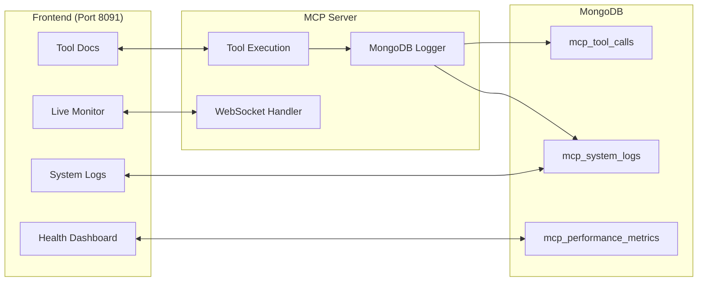

# MQTT MCP Frontend - Requirements Documentation

## 📋 Überblick

Diese Dokumentation enthält die vollständigen Requirements für das **bitsperity-mqtt-mcp Frontend** - ein Web Interface zur Überwachung und Nutzung des MQTT Model Context Protocol Servers.

## 🎯 Projektfokus

### Was das Frontend IST
- **MCP Tool Education**: Lernhilfe für AI Assistant Developers
- **Tool Call Monitoring**: Live-Überwachung aller MCP Tool Calls
- **Development Debugging**: Hilfe beim Debugging von MCP Tool Usage
- **Optional System Insights**: Unauffällige Server Health Monitoring

### Was das Frontend NICHT IST
- ❌ **MQTT Client/Browser**: Nicht für MQTT Message Browsing
- ❌ **MQTT Debugging Tool**: Nicht für MQTT Protocol Debugging
- ❌ **IoT Device Management**: Nicht für Device Configuration
- ❌ **General MQTT Tool**: Fokus ist spezifisch auf MCP Server Utility

## 📁 Dokumentations-Struktur

### 1. [User Stories](user-stories.md)
**33 User Stories** über 6 Epics:
- **Epic 1**: MCP Server Understanding & Usage (US-001 bis US-005)
- **Epic 2**: Tool Call Monitoring & Visualization (US-006 bis US-012)
- **Epic 3**: System Logs & Server Health (US-013 bis US-018)
- **Epic 4**: MCP Server Education & Onboarding (US-019 bis US-023)
- **Epic 5**: Session & Connection Management (US-024 bis US-028)
- **Epic 6**: Deployment & Infrastructure Monitoring (US-029 bis US-033)

### 2. [Features](features.md)
**7 Haupt-Features** mit MoSCoW Prioritization:
- **F-001**: MCP Tool Documentation Dashboard (Must-Have)
- **F-002**: Live Tool Call Monitoring (Must-Have)
- **F-003**: Optional System Logs Viewer (Should-Have)
- **F-004**: MCP Session Management (Should-Have)
- **F-005**: Performance & Health Dashboard (Should-Have)
- **F-006**: Interactive Tutorial & Help System (Could-Have)
- **F-007**: Data Export & Analytics (Could-Have)

### 3. [Business Logic](business-logic.md)
**9 Business Logic Bereiche** mit technischen Spezifikationen:
- **BL-001**: Tool Call Logging zu MongoDB
- **BL-002**: Optional System Logs Integration
- **BL-003**: Real-time Frontend Updates
- **BL-004**: Frontend State Management
- **BL-005**: Performance Optimization
- **BL-006**: Error Handling & User Feedback
- **BL-007**: MongoDB Integration Specifications
- **BL-008**: Security & Privacy Rules
- **BL-009**: Umbrel Infrastructure Integration

### 4. [Acceptance Criteria](acceptance-criteria.md)
**Detaillierte Testkriterien** für alle User Stories:
- Given-When-Then Format für alle 33 User Stories
- Performance Requirements (Page Load <3s, Updates <2s)
- Browser Compatibility (Chrome 90+, Firefox 88+, Safari 14+)
- Accessibility Standards (WCAG 2.1 AA)
- Security & Privacy Compliance

## 🏗️ Technische Architektur

### Frontend Technology Stack
```javascript
{
  "framework": "Vanilla HTML/CSS/JavaScript",
  "styling": "CSS3 + Flexbox/Grid",
  "charts": "Chart.js",
  "realtime": "WebSocket",
  "storage": "LocalStorage + MongoDB"
}
```

### Backend Integration


### MongoDB Collections Design
1. **mcp_tool_calls** (TTL: 24h)
   - Tool Call tracking für Live Monitoring
   - Schema: call_id, tool_name, parameters, response, duration, status

2. **mcp_system_logs** (TTL: 7d)
   - Optional System Logs für Power Users
   - Schema: level, component, message, context, timestamp

3. **mcp_performance_metrics** (TTL: 7d)
   - Health & Performance Monitoring
   - Schema: cpu, memory, health_score, timestamp

## 🚀 Integration & Deployment

### Port Management
- **Frontend**: Port 8091 (MongoDB MCP nutzt 8090)
- **WebSocket**: Same port 8091 (upgraded HTTP connections)
- **Health Check**: GET `/health` für Umbrel monitoring

### Docker Integration
```yaml
# Extends existing docker-compose.yml
services:
  frontend:
    build: ./web
    ports:
      - "8091:8091"
    depends_on:
      - server
      - mongodb
    environment:
      - MCP_SERVER_URL=ws://server:8091/ws
      - MONGODB_URL=mongodb://192.168.178.57:27017/bitsperity_mqtt_mcp
```

### Umbrel Configuration
```yaml
# Updates umbrel-app.yml
metadata:
  name: MQTT MCP with Frontend
gallery:
  - title: "MCP Tool Documentation"
  - title: "Live Tool Call Monitoring"
  - title: "Performance Dashboard"
```

## 👥 User Personas

### Primary User: AI Assistant Developer
**Name**: Alex (Software Developer using Cursor/Claude)
**Goals**: 
- Verstehen wie MCP Tools funktionieren
- Debugging von AI Assistant Tool Calls
- Optimierung von MCP Tool Usage Performance
- Copy-Paste ready Code Snippets für AI Tools

### Secondary User: DevOps Administrator  
**Name**: Sarah (System Administrator)
**Goals**:
- Monitoring MCP Server Health in Production
- Troubleshooting Performance Issues
- Ensuring System Uptime und Availability
- Export System Reports für Management

## 🎨 Design Principles

### 1. **Utility Over Features**
- Focus auf praktischen Nutzen für MCP Tool Usage
- Vermeidung von Feature Bloat
- Clean, simple Interface Design

### 2. **Optional Complexity**
- System Logs standardmäßig VERSTECKT
- Power User Features sind optional
- Progressive Disclosure für Advanced Features

### 3. **Real-time Feedback**
- Live Updates für Tool Call Monitoring
- Sofortige Visual Feedback für User Actions
- Performance Metrics in Echtzeit

### 4. **Copy-Paste Optimized**
- Code Snippets sind ready-to-use
- Syntax Highlighting für bessere Lesbarkeit
- One-Click Copy für alle Code Examples

## 📊 Success Metrics

### Funktionale Metriken
- ✅ **Tool Call Visibility**: 100% aller Tool Calls werden angezeigt
- ✅ **Real-time Performance**: <2s Latenz für Live Updates
- ✅ **Code Snippet Usage**: Copy-Paste Funktionalität 100% functional
- ✅ **Optional Logs**: Default Hidden, nur bei User Request sichtbar

### Performance Metriken
- 🎯 **Page Load**: <3 Sekunden initial load
- 🎯 **Memory Usage**: <50MB Frontend Memory
- 🎯 **Real-time Updates**: <2s Tool Call appearance
- 🎯 **Filter Performance**: <500ms Filter application

### User Experience Metriken
- 🎯 **Tutorial Completion**: >70% für neue User
- 🎯 **Feature Discovery**: Alle Must-Have Features innerhalb 5 min findbar
- 🎯 **Error Recovery**: Graceful handling aller Network/API Errors
- 🎯 **Mobile Support**: Responsive Design auf allen Devices

## 🔗 Related Documentation

### Existing Project Documentation
- **MCP Server**: [../mvp/](../mvp/) - Complete 10-Tool MCP Implementation
- **Development**: [../implementation/](../implementation/) - 4-Phase Implementation Details
- **System Design**: [../system-design/](../system-design/) - Technical Architecture

### External References
- **MongoDB MCP**: [../../bitsperity-mongodb-mcp/](../../bitsperity-mongodb-mcp/) - Analog Frontend Implementation
- **MCP Protocol**: [Model Context Protocol Specification](https://spec.modelcontextprotocol.io/)
- **Umbrel Apps**: [Umbrel App Development Guide](https://github.com/getumbrel/umbrel-apps)

## 📝 Next Steps

1. **System Architect Phase**: Erstelle technical design basierend auf diesen Requirements
2. **Phase Planning**: Definiere Implementation Phasen für Frontend Development
3. **Implementation**: Entwickle Frontend analog zu MongoDB MCP patterns
4. **Integration**: Erweitere MCP Server um MongoDB Logging und WebSocket Support
5. **Testing**: Implementiere alle Acceptance Criteria als automatisierte Tests
6. **Deployment**: Integriere in bestehende Docker/Umbrel Infrastructure

---

**Requirements Status**: ✅ **COMPLETE** - Ready for System Architecture Phase

**Documentation Author**: AI Requirements Analyst  
**Creation Date**: 2024  
**Review Status**: Ready for Technical Review 