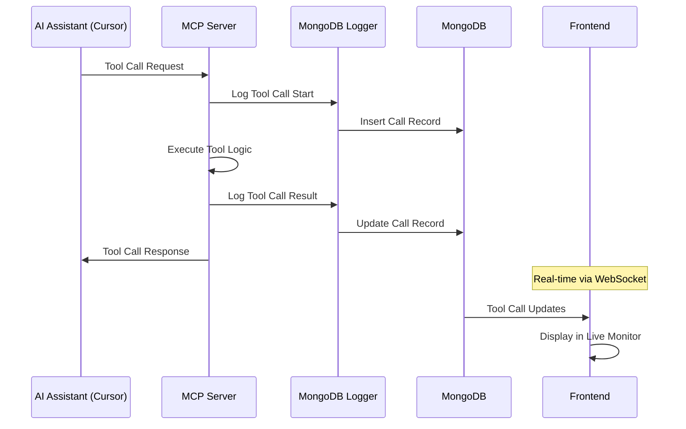
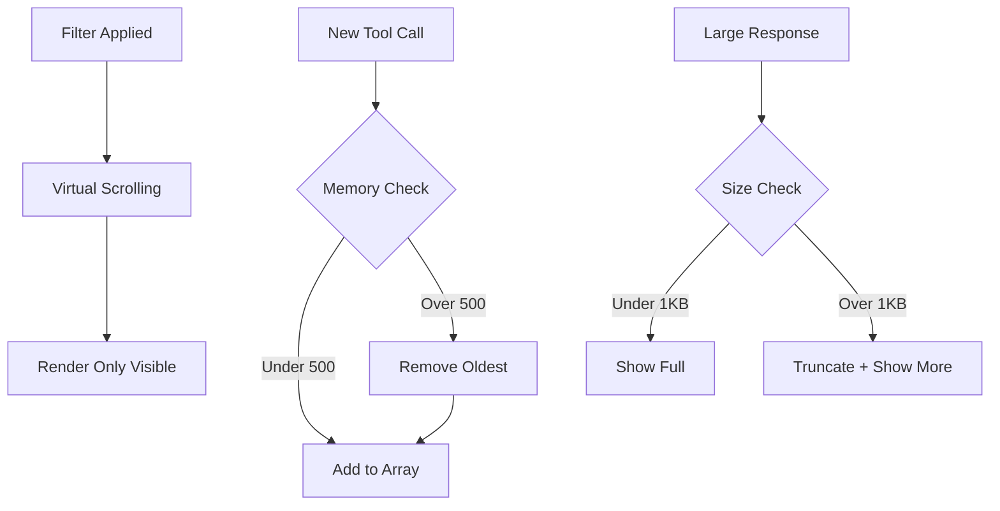
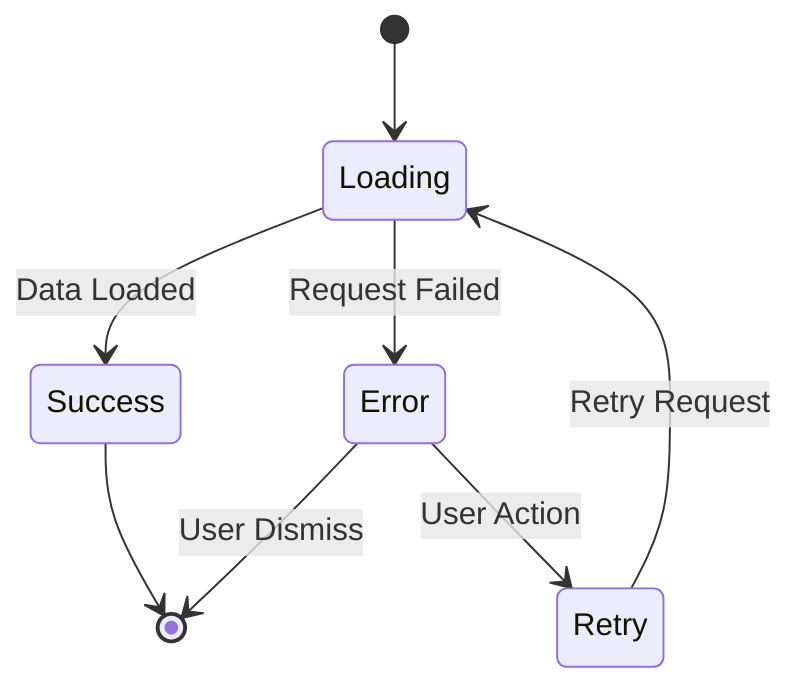

# MQTT MCP Frontend - Business Logic

## BL-001: MCP Tool Call Logging zu MongoDB
**Description**: Alle MCP Tool Calls werden automatisch zu MongoDB geloggt für Frontend Monitoring

### Data Flow


### Business Rules
- **Tool Call Tracking**: Jeder MCP Tool Call wird geloggt mit:
  - `call_id` (UUID)
  - `timestamp_start` (ISO datetime)
  - `tool_name` (string)
  - `parameters` (JSON object)
  - `session_id` (string)
  - `duration_ms` (integer, nach completion)
  - `status` ("success" | "error")
  - `response` (JSON object | error message)
  - `timestamp_end` (ISO datetime)

- **MongoDB Collection Schema**: `mcp_tool_calls`
```javascript
{
  _id: ObjectId,
  call_id: "uuid-string",
  timestamp_start: ISODate,
  timestamp_end: ISODate,
  tool_name: "establish_connection|list_topics|...",
  parameters: {
    // Tool-specific parameters
  },
  session_id: "session-uuid",
  duration_ms: 1234,
  status: "success" | "error",
  response: {
    // Tool response or error details
  },
  created_at: ISODate,
  expires_at: ISODate  // TTL index: 24 hours
}
```

- **TTL Policy**: Tool Call Records expiren nach 24 Stunden automatisch
- **Memory Management**: Frontend zeigt max. 500 recent Tool Calls
- **Error Handling**: Failed Tool Calls werden separat highlight

## BL-002: Optional System Logs Integration
**Description**: MCP Server System Logs werden optional zu MongoDB geloggt

### System Log Levels
- **DEBUG**: Detailed debugging information (nur development)
- **INFO**: General information about server operations
- **WARN**: Warning conditions that should be noted
- **ERROR**: Error conditions that need attention

### MongoDB Collection Schema: `mcp_system_logs`
```javascript
{
  _id: ObjectId,
  timestamp: ISODate,
  level: "DEBUG" | "INFO" | "WARN" | "ERROR",
  component: "mqtt_tools" | "connection_manager" | "server" | "health_monitor",
  message: "Log message text",
  context: {
    // Additional context data
    session_id: "uuid",
    tool_name: "tool_name",
    error_details: {...}
  },
  created_at: ISODate,
  expires_at: ISODate  // TTL index: 7 days
}
```

### Business Rules
- **Default State**: System Logs sind NICHT sichtbar im Frontend
- **User Activation**: User muss explizit "Show System Logs" aktivieren
- **Log Retention**: System Logs expiren nach 7 Tagen
- **Performance Impact**: Logging darf MCP Performance nicht beeinträchtigen
- **Privacy**: Keine sensitive MQTT Message Daten in System Logs

## BL-003: Real-time Frontend Updates
**Description**: Frontend erhält Real-time Updates über WebSocket Connection

### WebSocket Event Types
1. **tool_call_started**
   ```javascript
   {
     event: "tool_call_started",
     data: {
       call_id: "uuid",
       tool_name: "establish_connection",
       parameters: {...},
       session_id: "session-uuid",
       timestamp: "ISO-datetime"
     }
   }
   ```

2. **tool_call_completed**
   ```javascript
   {
     event: "tool_call_completed", 
     data: {
       call_id: "uuid",
       duration_ms: 1234,
       status: "success" | "error",
       response: {...},
       timestamp: "ISO-datetime"
     }
   }
   ```

3. **system_log** (only if logs enabled)
   ```javascript
   {
     event: "system_log",
     data: {
       level: "INFO",
       component: "mqtt_tools",
       message: "Connection established",
       timestamp: "ISO-datetime"
     }
   }
   ```

4. **health_update**
   ```javascript
   {
     event: "health_update",
     data: {
       cpu_percent: 12.5,
       memory_mb: 45.2,
       active_sessions: 3,
       health_score: 95
     }
   }
   ```

### Connection Management
- **Auto-Reconnect**: WebSocket reconnects bei Verbindungsverlust
- **Heartbeat**: Ping/Pong every 30 seconds
- **Error Handling**: Graceful degradation bei WebSocket Problemen
- **Backoff Strategy**: Exponential backoff bei Reconnect-Fehlern

## BL-004: Frontend State Management
**Description**: Frontend State wird effizient verwaltet ohne external libraries

### State Structure
```javascript
const appState = {
  // Tool Documentation
  tools: {
    available: [],      // Array of tool definitions
    loading: false,
    error: null
  },
  
  // Live Tool Call Monitoring
  toolCalls: {
    items: [],          // Rolling window of 500 calls
    filters: {
      toolType: 'all',
      status: 'all',
      sessionId: 'all',
      timeRange: '1h'
    },
    stats: {
      totalCalls: 0,
      successRate: 0.95,
      averageDuration: 150
    }
  },
  
  // System Logs (optional)
  systemLogs: {
    enabled: false,     // User toggle state
    items: [],          // Max 200 log entries
    filters: {
      level: 'all',
      component: 'all'
    }
  },
  
  // Session Management
  sessions: {
    active: [],         // Active MCP sessions
    loading: false
  },
  
  // Health Monitoring
  health: {
    current: {
      cpu: 0,
      memory: 0,
      healthScore: 100
    },
    history: []         // 24h performance history
  },
  
  // UI State
  ui: {
    activeTab: 'tools', // 'tools' | 'monitor' | 'health' | 'sessions'
    sidebarCollapsed: false,
    tutorialCompleted: false
  }
}
```

### State Update Patterns
- **Immutable Updates**: Spread operators für State Changes
- **Optimistic Updates**: UI Updates sofort, dann Server Confirmation
- **Error Recovery**: Rollback bei Server Errors
- **Memory Management**: Auto-cleanup von alten Data

## BL-005: Performance Optimization
**Description**: Frontend Performance wird durch intelligente Data Handling optimiert

### Data Pruning Strategy


### Virtualization Rules
- **Tool Call List**: Virtual scrolling für große Listen
- **Log Entries**: Nur sichtbare Logs werden DOM-rendered
- **Chart Data**: Sampling für Performance bei vielen Data Points
- **Search**: Debounced search mit 300ms delay

### Caching Strategy
- **Tool Definitions**: Cache in localStorage für 1 Stunde
- **User Preferences**: Persist in localStorage
- **Chart Data**: In-memory cache für 5 Minuten
- **Session Data**: No caching (always fresh)

## BL-006: Error Handling & User Feedback
**Description**: Robuste Error Handling und Clear User Feedback

### Error Categories
1. **Network Errors**
   - WebSocket connection lost
   - HTTP API timeouts
   - MongoDB connection issues

2. **Data Errors**
   - Invalid tool call responses
   - Malformed log entries
   - Missing session data

3. **UI Errors**
   - Chart rendering failures
   - Export generation errors
   - Browser compatibility issues

### User Feedback Patterns


### Toast Notification Rules
- **Success**: Green toast für 3 seconds
- **Info**: Blue toast für 5 seconds  
- **Warning**: Yellow toast für 7 seconds
- **Error**: Red toast, manual dismiss required

## BL-007: MongoDB Integration Specifications
**Description**: Spezifische MongoDB Integration Requirements

### Collections Design
1. **mcp_tool_calls**
   - **Indexes**: `{timestamp_start: -1}`, `{session_id: 1}`, `{tool_name: 1}`
   - **TTL Index**: `{expires_at: 1}` für auto-cleanup
   - **Size Limit**: Capped Collection bei 100MB

2. **mcp_system_logs**
   - **Indexes**: `{timestamp: -1}`, `{level: 1}`, `{component: 1}`
   - **TTL Index**: `{expires_at: 1}` für 7-day retention
   - **Size Limit**: Capped Collection bei 50MB

3. **mcp_performance_metrics**
   - **Indexes**: `{timestamp: -1}`
   - **TTL Index**: `{expires_at: 1}` für 7-day retention
   - **Aggregation Pipeline**: Pre-computed hourly/daily stats

### Connection Reuse
- **Shared Connection**: Frontend und MCP Server nutzen gleiche MongoDB Instance
- **Connection String**: `mongodb://192.168.178.57:27017/bitsperity_mqtt_mcp`
- **Database Isolation**: Eigene Database für MQTT MCP Data
- **Authentication**: None (local network deployment)

### Performance Requirements
- **Insert Rate**: Support für 100 tool calls/minute
- **Query Performance**: Queries unter 500ms
- **Memory Usage**: MongoDB cache max. 256MB
- **Concurrent Users**: Support für 5 concurrent Frontend users

## BL-008: Security & Privacy Rules
**Description**: Security Considerations für Local Network Deployment

### Data Privacy
- **No External Access**: Frontend nur auf lokalem Netz erreichbar
- **No Authentication**: Simplified für local development use
- **MQTT Credentials**: Nicht in Logs oder Frontend angezeigt
- **Session Isolation**: Sessions können nicht gegenseitig access

### Audit Trail
- **Tool Call Logging**: Vollständige Audit Trail für debugging
- **No User Tracking**: Keine User Identification oder Tracking
- **Local Storage Only**: Alle Data bleibt auf lokalem System
- **No Analytics**: Keine External Analytics oder Telemetry

### Data Retention
- **Tool Calls**: 24 Stunden automatic cleanup
- **System Logs**: 7 Tage automatic cleanup
- **Performance Metrics**: 7 Tage automatic cleanup
- **User Preferences**: Persistent bis User cleared

## BL-009: Integration mit bestehender Umbrel Infrastructure
**Description**: Nahtlose Integration in bestehende Umbrel App Ecosystem

### Port Management
- **Frontend Port**: 8091 (MongoDB MCP nutzt 8090)
- **WebSocket Port**: 8091 (gleicher Port, upgraded connection)
- **Health Check**: HTTP GET `/health` für Umbrel monitoring

### Service Discovery
- **MongoDB**: Automatic connection zu `bitsperity-mongodb-mcp`
- **MQTT Broker**: Connection zu bestehenden MQTT Services
- **Docker Network**: Shared network für inter-service communication

### Resource Limits
- **Memory**: 256MB limit (gleich wie MCP Server)
- **CPU**: 0.5 CPU limit
- **Storage**: 1GB für MongoDB Data
- **Network**: Host network mode für einfachen access 