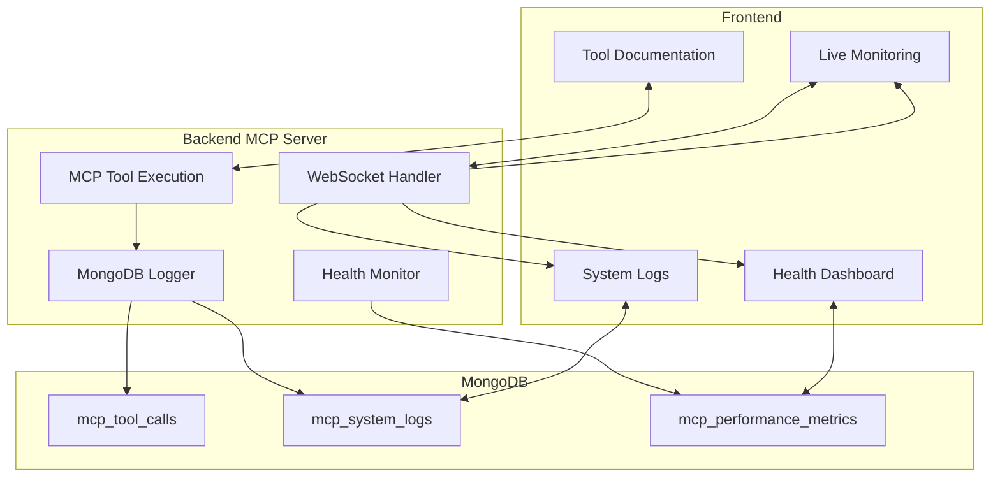

# MQTT MCP Frontend - Feature Specifications

## F-001: MCP Tool Documentation Dashboard
**Description**: Zentrale Übersicht aller verfügbaren MCP Tools mit Dokumentation
**Priority**: Must-Have (MVP)
**User Stories**: US-001, US-002, US-003, US-004, US-005

**Functional Requirements**:
- Anzeige aller 10 MCP Tools in übersichtlicher Card-Darstellung
- Für jedes Tool: Name, Zweck, Parameter, Return Values
- Interaktive Beispiel-Aufrufe mit Copy-Paste Funktionalität
- Syntax-highlighted Code Snippets für jeden Tool Call
- Suchfunktion um Tools schnell zu finden

**Business Rules**:
- Tool Dokumentation wird aus MCP Server Schema automatisch generiert
- Beispiele müssen immer funktionsfähige Parameter enthalten
- Code Snippets müssen ready-to-use für Cursor/Claude sein
- Tools werden nach Verwendungshäufigkeit sortiert

**Acceptance Criteria**:
- [ ] Alle 10 Tools sind sichtbar mit korrekter Dokumentation
- [ ] Beispiel-Aufrufe sind copy-paste ready
- [ ] Tool-Suche findet Tools innerhalb von 0.5s
- [ ] Code Snippets sind syntax-highlighted
- [ ] Mobile responsive Design

**Technical Specifications**:
- Components: `ToolGrid`, `ToolCard`, `CodeSnippet`, `SearchBar`
- Data Source: MCP Server `/list_tools` endpoint
- Update Frequency: On page load + manual refresh

## F-002: Live Tool Call Monitoring
**Description**: Echtzeit-Überwachung aller MCP Tool Calls mit visueller Aufbereitung
**Priority**: Must-Have (MVP)
**User Stories**: US-006, US-007, US-008, US-009, US-010, US-011

**Functional Requirements**:
- Live-Stream aller Tool Calls in chronologischer Reihenfolge
- Anzeige von: Timestamp, Tool Name, Parameters, Response, Duration
- Unterscheidung zwischen Success (grün) und Error (rot) Calls
- Filter nach: Tool Type, Session ID, Success/Error, Zeitraum
- Expandable Detail View für große Responses
- Performance Metrics: Average Duration, Success Rate

**Business Rules**:
- Maximum 500 Tool Calls in Memory (rolling window)
- Auto-refresh every 2 seconds
- Error Details müssen vollständig angezeigt werden
- Long Responses werden nach 1000 Chars truncated mit "Show More"
- Tool Calls älter als 1 Stunde werden automatisch entfernt

**Acceptance Criteria**:
- [ ] Tool Calls erscheinen in <2s nach Ausführung
- [ ] Filter funktionieren ohne Page Reload
- [ ] Success/Error Status ist sofort erkennbar
- [ ] Performance Metrics aktualisieren in Echtzeit
- [ ] Detail View lädt in <0.5s
- [ ] Memory Usage bleibt unter 50MB

**Technical Specifications**:
- Components: `CallStream`, `CallItem`, `FilterBar`, `PerformanceWidget`
- Data Source: MongoDB Collection `mcp_tool_calls`
- Real-time: WebSocket connection to MCP Server
- Storage: MongoDB mit TTL index (1 hour)

## F-003: Optional System Logs Viewer
**Description**: Dezente, optionale Anzeige von MCP Server System Logs
**Priority**: Should-Have
**User Stories**: US-013, US-017, US-018

**Functional Requirements**:
- Toggle Button "Show System Logs" (default: OFF)
- Log Level Filter: DEBUG, INFO, WARN, ERROR
- Logs in kleiner, unauffälliger Darstellung
- Collapsible/Expandable Log Panel am unteren Bildschirmrand
- Search in Logs Funktionalität
- Auto-scroll zu neuesten Logs

**Business Rules**:
- System Logs sind standardmäßig VERSTECKT
- Nur die letzten 200 Log Entries werden angezeigt
- Logs werden nur angezeigt wenn explizit aktiviert
- Error Logs haben rote Highlight-Farbe
- System Logs nehmen max. 25% der Bildschirmhöhe ein

**Acceptance Criteria**:
- [ ] Logs sind standardmäßig nicht sichtbar
- [ ] Toggle funktioniert ohne Page Reload
- [ ] Log Level Filter funktioniert sofort
- [ ] Logs sind dezent und nicht störend
- [ ] Search findet Logs in <1s
- [ ] Panel ist resizable

**Technical Specifications**:
- Components: `LogToggle`, `LogPanel`, `LogEntry`, `LogFilter`
- Data Source: MongoDB Collection `mcp_system_logs`
- Default State: Hidden/Collapsed
- Max Height: 25vh

## F-004: MCP Session Management
**Description**: Übersicht und Verwaltung aktiver MCP Sessions und MQTT Connections
**Priority**: Should-Have
**User Stories**: US-024, US-025, US-026, US-027, US-028

**Functional Requirements**:
- Liste aller aktiven MCP Sessions mit Session IDs
- MQTT Connection Details: Broker URL, Status, Connected Since
- Connection Statistics: Messages sent/received, Uptime
- Health Status Indicators: Green (healthy), Yellow (warning), Red (error)
- Manual Session Close Button für Debugging
- Session Timeline mit wichtigen Events

**Business Rules**:
- Sessions mit Status "unhealthy" werden rot markiert
- Session Close erfordert Bestätigung
- Statistics aktualisieren alle 10 Sekunden
- Max. 5 concurrent Sessions werden unterstützt
- Geschlossene Sessions verschwinden nach 5 Sekunden

**Acceptance Criteria**:
- [ ] Alle Sessions sind mit aktuellem Status sichtbar
- [ ] MQTT Connection Details sind korrekt angezeigt
- [ ] Health Indicators reflektieren realen Status
- [ ] Session Close funktioniert sofort
- [ ] Statistics sind accurate und aktuell
- [ ] UI ist responsive und performant

**Technical Specifications**:
- Components: `SessionList`, `SessionCard`, `ConnectionHealth`, `StatsWidget`
- Data Source: MCP Server `/list_active_connections` endpoint
- Update Frequency: 10 seconds
- Real-time Health: WebSocket updates

## F-005: Performance & Health Dashboard
**Description**: Übersicht über MCP Server Performance und System Health
**Priority**: Should-Have
**User Stories**: US-014, US-015, US-016, US-029, US-030

**Functional Requirements**:
- Live Performance Metrics: CPU, Memory, Network Usage
- MCP Server Uptime und Availability
- Error Rate Tracking: Success vs. Failure Rate über Zeit
- Response Time Charts: Average, P95, P99
- Resource Usage History über 24h
- Health Score (0-100) basierend auf allen Metrics

**Business Rules**:
- Performance Daten werden jede Minute gesammelt
- Health Score unter 80 triggert Yellow Warning
- Health Score unter 60 triggert Red Alert
- Historical Data wird 7 Tage gespeichert
- Charts zeigen letzten 24h per default

**Acceptance Criteria**:
- [ ] Performance Metrics sind akkurat und aktuell
- [ ] Charts laden in <3s
- [ ] Health Score reflektiert realen Status
- [ ] Warnings/Alerts sind klar sichtbar
- [ ] Historical Data ist vollständig
- [ ] Resource Usage ist memory-efficient

**Technical Specifications**:
- Components: `HealthDashboard`, `MetricsChart`, `HealthScore`, `AlertPanel`
- Data Source: MongoDB Collection `mcp_performance_metrics`
- Charts: Chart.js for real-time visualization
- Collection Frequency: 1 minute
- Retention: 7 days

## F-006: Interactive Tutorial & Help System
**Description**: Interaktiver Leitfaden für neue Benutzer des MCP Servers
**Priority**: Could-Have
**User Stories**: US-019, US-020, US-021, US-022, US-023

**Functional Requirements**:
- Schritt-für-Schritt Tutorial für MCP Tool Usage
- Häufige Use Cases mit vorgefertigten Beispielen
- Tool Combination Patterns (welche Tools zusammen nutzen)
- Copy-Paste Code Snippets für jedes Tool
- Contextual Help Tooltips im gesamten Interface
- Quick Start Guide für neuen Benutzer

**Business Rules**:
- Tutorial startet automatisch bei erstem Besuch
- Tutorial kann jederzeit übersprungen werden
- Help System ist über "?" Icon immer erreichbar
- Code Snippets sind für Cursor/Claude optimiert
- Use Cases basieren auf realen MQTT Scenarios

**Acceptance Criteria**:
- [ ] Tutorial ist selbsterklärend und intuitiv
- [ ] Code Snippets funktionieren out-of-the-box
- [ ] Help System ist kontextuell relevant
- [ ] Use Cases decken 80% der häufigen Anwendungen ab
- [ ] Tutorial dauert max. 5 Minuten
- [ ] Skip Option funktioniert jederzeit

**Technical Specifications**:
- Components: `TutorialOverlay`, `HelpTooltip`, `UseCaseLibrary`, `CodeSnippetManager`
- Storage: LocalStorage für Tutorial Progress
- Content: JSON-based tutorial steps
- Trigger: First visit detection

## F-007: Data Export & Analytics
**Description**: Export von Tool Call History und Performance Analytics
**Priority**: Could-Have
**User Stories**: US-012, US-033

**Functional Requirements**:
- Export Tool Call History als JSON/CSV
- Performance Reports als PDF
- Custom Date Range Selection
- Filter Export nach Tool Types, Sessions, Success/Error
- Analytics Dashboard mit Key Metrics
- Automated Report Scheduling (daily/weekly)

**Business Rules**:
- Export max. 10,000 Tool Calls auf einmal
- PDF Reports enthalten Charts und Summary
- Exports werden lokal generiert (keine Server Load)
- Historical Data max. 30 Tage zurück
- Large Exports zeigen Progress Bar

**Acceptance Criteria**:
- [ ] Export generiert in <10s für 1000 calls
- [ ] PDF Reports sind professional formatiert
- [ ] Date Range Selection ist intuitiv
- [ ] Filter funktionieren korrekt beim Export
- [ ] Progress wird bei großen Exports angezeigt
- [ ] Files haben descriptive Namen mit Timestamp

**Technical Specifications**:
- Components: `ExportPanel`, `DateRangePicker`, `ExportProgress`, `ReportGenerator`
- Libraries: jsPDF für PDF generation, CSV export nativ
- Data Processing: Client-side für Performance
- File Naming: `mqtt-mcp-{type}-{date}.{ext}`

## Technical Architecture für alle Features

### Frontend Technology Stack
- **Framework**: Vanilla HTML/CSS/JavaScript (wie MongoDB MCP)
- **Styling**: CSS3 mit Flexbox/Grid, responsive design
- **Charts**: Chart.js für Performance Visualisierung
- **Real-time**: WebSocket für Live Updates
- **Storage**: LocalStorage für User Preferences

### Backend Integration Requirements
- **MCP Server Extensions**: Logging zu MongoDB
- **MongoDB Collections**: 
  - `mcp_tool_calls` (Tool Call Logging)
  - `mcp_system_logs` (System Logs)
  - `mcp_performance_metrics` (Health Metrics)
- **WebSocket Endpoints**: 
  - `/ws/tool_calls` (Live Tool Call Stream)
  - `/ws/health` (Real-time Health Updates)
- **REST API Endpoints**:
  - `GET /api/tools` (Tool Documentation)
  - `GET /api/sessions` (Active Sessions)
  - `GET /api/health` (Current Health Status)

### Data Flow Architecture

### Security & Performance Requirements
- **No Authentication**: Läuft auf localnet (wie MongoDB MCP)
- **Memory Limits**: Frontend max. 50MB, Backend Logging max. 100MB
- **Performance**: Page Load <3s, Tool Call Display <2s
- **Browser Support**: Chrome 90+, Firefox 88+, Safari 14+
- **Mobile Responsive**: Unterstützt Smartphones/Tablets

### Deployment Integration
- **Port**: 8091 (MongoDB MCP uses 8090)
- **Docker Integration**: Extends existing docker-compose.yml
- **Umbrel Ready**: umbrel-app.yml mit Web Interface Config
- **Health Checks**: HTTP endpoint für Container Health 