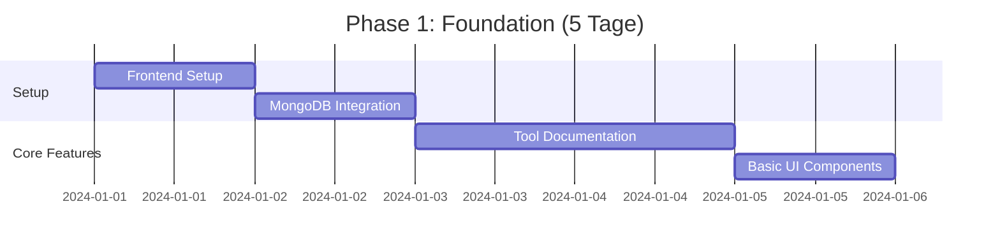
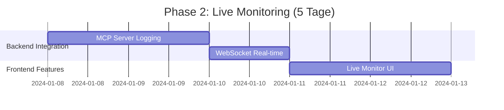
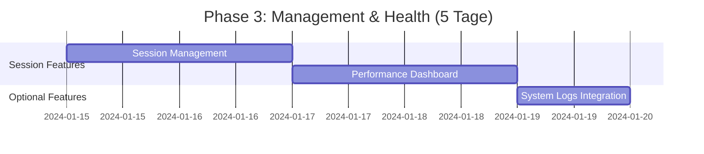
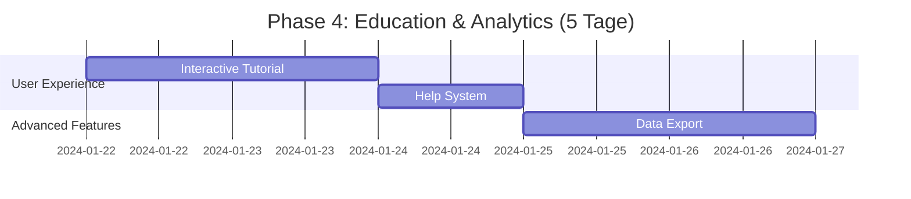
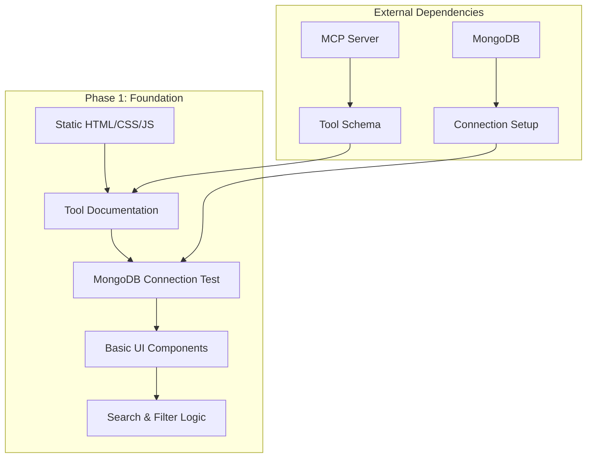
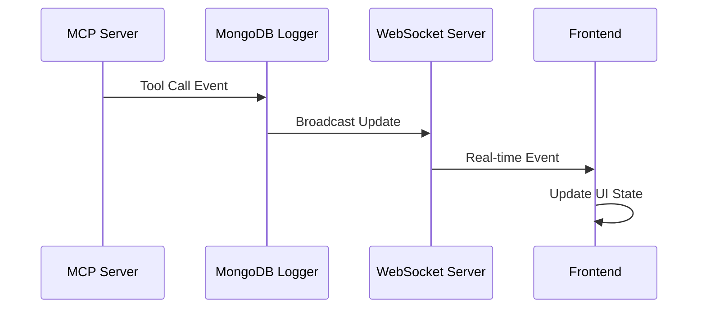
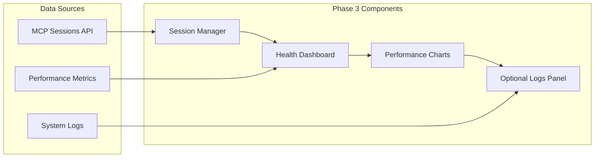
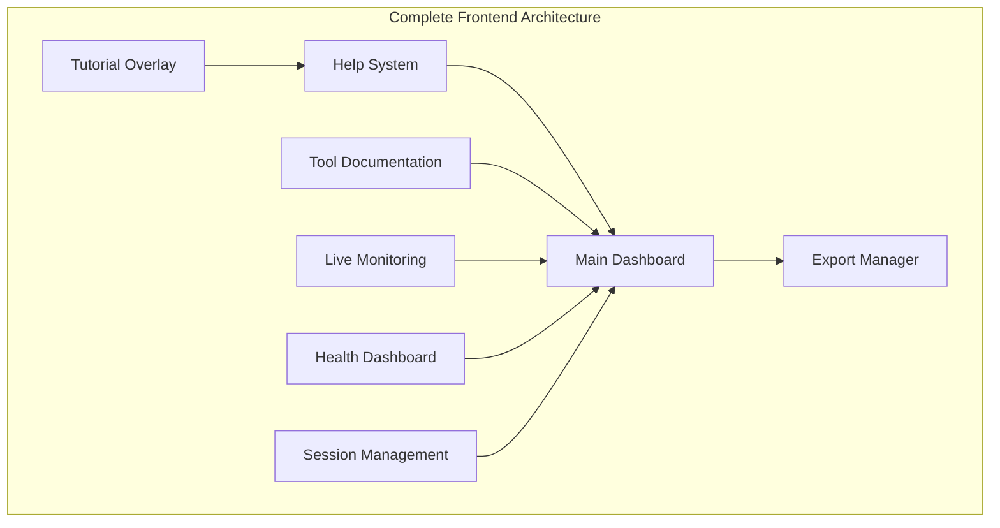
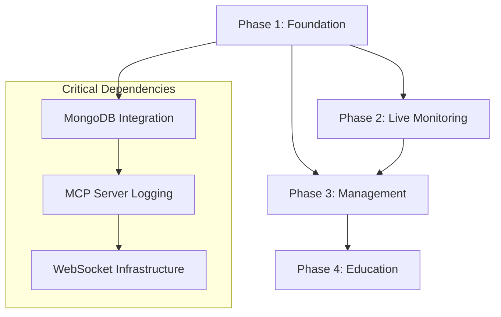

# MQTT MCP Frontend - Phasenplanung

## 📋 Phase Planning Übersicht

Basierend auf der Analyse der Frontend-Requirements erstelle ich eine **4-Phasen Entwicklungsplan** für das MQTT MCP Web Frontend, der einen schrittweisen Aufbau ermöglicht und jede Phase als funktionale Erweiterung deployed werden kann.

## 🎯 Strategische Ziele

### Development Philosophy
- **MCP Tool Education First**: Fokus auf Tool Understanding, nicht MQTT Debugging
- **Optional System Logs**: Default hidden, nur für Power Users
- **Copy-Paste Optimized**: Code Snippets ready für AI Assistants
- **Real-time ohne Overhead**: Live Updates ohne MCP Server Performance Impact

### Success Metrics
- **Page Load**: <3s initial load
- **Real-time Updates**: <2s Tool Call appearance
- **Memory Usage**: <50MB Frontend
- **User Adoption**: >70% Tutorial completion rate

## 🚀 4-Phasen Development Plan

### Phase 1: Foundation & MCP Tool Documentation (Woche 1)
**Ziel**: Grundlegende Architektur und Tool Documentation Dashboard
**User Value**: Entwickler können MCP Tools verstehen und nutzen



#### Deliverables Phase 1:
- ✅ **Frontend Infrastructure**: Vanilla HTML/CSS/JS (Port 8091)
- ✅ **F-001**: MCP Tool Documentation Dashboard (Must-Have)
  - Tool Overview mit allen 10 MCP Tools
  - Interactive Code Examples
  - Copy-Paste ready Snippets
  - Search Functionality
- ✅ **MongoDB Integration**: Tool Call Logging Setup
- ✅ **Basic UI Framework**: Navigation, Cards, Buttons
- ✅ **WebSocket Foundation**: Connection setup (ohne Live Updates)

#### Success Criteria Phase 1:
- [ ] Alle 10 MCP Tools sind dokumentiert und sichtbar
- [ ] Code Snippets sind copy-paste ready für Cursor/Claude
- [ ] Tool-Suche findet Tools in <0.5s
- [ ] Page Load <3s
- [ ] Mobile responsive Design

#### Epic Coverage:
- **Epic 1**: MCP Server Understanding & Usage (US-001 bis US-005) ✅ Complete

---

### Phase 2: Live Tool Call Monitoring (Woche 2)
**Ziel**: Real-time Tool Call Überwachung und Visualisierung
**User Value**: Live Debugging und Performance Monitoring von MCP Tool Calls



#### Deliverables Phase 2:
- ✅ **MCP Server Extension**: Tool Call Logging zu MongoDB
- ✅ **F-002**: Live Tool Call Monitoring (Must-Have)
  - Real-time Tool Call Stream
  - Success/Error Status Visualization
  - Call Details mit Parameters und Response
  - Performance Metrics (Duration, Success Rate)
  - Filter nach Tool Type, Status, Session
- ✅ **BL-001**: Tool Call Logging Implementation
- ✅ **BL-003**: WebSocket Real-time Updates

#### Success Criteria Phase 2:
- [ ] Tool Calls erscheinen in <2s nach Execution
- [ ] Filter funktionieren ohne Page Reload
- [ ] Success/Error Status sofort erkennbar
- [ ] Detail View lädt in <0.5s
- [ ] Memory Usage bleibt <50MB

#### Epic Coverage:
- **Epic 2**: Tool Call Monitoring & Visualization (US-006 bis US-012) ✅ Complete

---

### Phase 3: Session Management & Health Monitoring (Woche 3)
**Ziel**: Session Verwaltung und Performance Dashboard
**User Value**: Überblick über MCP Server Health und Session Status



#### Deliverables Phase 3:
- ✅ **F-004**: MCP Session Management (Should-Have)
  - Active Sessions Übersicht
  - MQTT Connection Details
  - Manual Session Close
  - Connection Statistics
- ✅ **F-005**: Performance & Health Dashboard (Should-Have)
  - Live Performance Metrics (CPU, Memory)
  - Health Score (0-100)
  - Error Rate Tracking
  - Resource Usage History
- ✅ **F-003**: Optional System Logs Viewer (Should-Have)
  - Default Hidden Toggle
  - Log Level Filtering
  - Dezente Bottom Panel (max 25vh)
- ✅ **BL-002**: System Logs Integration

#### Success Criteria Phase 3:
- [ ] Alle Sessions mit aktuellem Status sichtbar
- [ ] Health Indicators reflektieren realen Status
- [ ] Performance Metrics accurate und aktuell
- [ ] System Logs standardmäßig NICHT sichtbar
- [ ] Log Toggle funktioniert ohne Page Reload

#### Epic Coverage:
- **Epic 3**: System Logs & Server Health (US-013 bis US-018) ✅ Complete
- **Epic 5**: Session & Connection Management (US-024 bis US-028) ✅ Complete

---

### Phase 4: Education & Analytics (Woche 4)
**Ziel**: Tutorial System und Export Funktionalität
**User Value**: Onboarding für neue User und Analytics für Power Users



#### Deliverables Phase 4:
- ✅ **F-006**: Interactive Tutorial & Help System (Could-Have)
  - Step-by-Step Tutorial (5-7 Steps)
  - Common Use Cases Library
  - Contextual Help Tooltips
  - Tool Combination Patterns
- ✅ **F-007**: Data Export & Analytics (Could-Have)
  - Tool Call History Export (JSON/CSV)
  - Performance Reports (PDF)
  - Custom Date Range Selection
  - Analytics Dashboard
- ✅ **Advanced State Management**: Complete Frontend optimization
- ✅ **Performance Optimization**: Virtual scrolling, memory management

#### Success Criteria Phase 4:
- [ ] Tutorial completion >70% für neue User
- [ ] Export generiert <10s für 1000 calls
- [ ] Help System kontextuell relevant
- [ ] PDF Reports professional formatiert

#### Epic Coverage:
- **Epic 4**: MCP Server Education & Onboarding (US-019 bis US-023) ✅ Complete
- **Epic 6**: Deployment & Infrastructure Monitoring (US-029 bis US-033) ✅ Complete

## 🏗️ Technical Architecture pro Phase

### Phase 1: Foundation Architecture


### Phase 2: Real-time Integration


### Phase 3: Complete Monitoring


### Phase 4: Complete Frontend


## 📊 Dependencies & Risks

### Inter-Phase Dependencies


### Risk Mitigation pro Phase

#### Phase 1 Risks:
- **R-001**: MongoDB Connection Issues → Fallback zu localStorage
- **R-002**: MCP Tool Schema Changes → Flexible JSON parsing
- **Mitigation**: Extensive testing mit real MCP Server

#### Phase 2 Risks:
- **R-003**: WebSocket Performance → Connection pooling, retry logic
- **R-004**: MCP Server Overhead → Asynchronous logging, minimal impact
- **Mitigation**: Performance monitoring von Anfang an

#### Phase 3 Risks:
- **R-005**: System Logs Performance → Optional mit user toggle
- **R-006**: Session Management Complexity → Simple state management
- **Mitigation**: Optional features können deaktiviert werden

#### Phase 4 Risks:
- **R-007**: Tutorial UX Complexity → Simple, skippable design
- **R-008**: Export Performance → Client-side processing
- **Mitigation**: Progressive enhancement, graceful degradation

## 🎯 Business Logic Implementation Plan

### BL-001: Tool Call Logging (Phase 2)
```javascript
// MongoDB Schema Implementation
const toolCallSchema = {
  call_id: "uuid",
  timestamp_start: "ISODate",
  tool_name: "string",
  parameters: "object",
  session_id: "string", 
  duration_ms: "number",
  status: "success|error",
  response: "object"
}

// TTL Index: 24 hours
db.mcp_tool_calls.createIndex(
  { "timestamp_start": 1 }, 
  { expireAfterSeconds: 86400 }
)
```

### BL-002: System Logs (Phase 3)
```javascript
// Optional Logs Design
const systemLogSchema = {
  timestamp: "ISODate",
  level: "DEBUG|INFO|WARN|ERROR",
  component: "string",
  message: "string", 
  context: "object"
}

// Default Hidden State
const logsState = {
  enabled: false,  // User must toggle
  maxHeight: "25vh",
  autoCollapse: true
}
```

### BL-003: Real-time Updates (Phase 2)
```javascript
// WebSocket Event Types
const eventTypes = {
  TOOL_CALL_STARTED: "tool_call_started",
  TOOL_CALL_COMPLETED: "tool_call_completed", 
  SYSTEM_LOG: "system_log",
  HEALTH_UPDATE: "health_update"
}
```

## 📈 Performance Targets pro Phase

### Phase 1 Targets:
- Page Load: <3s
- Tool Search: <0.5s
- Memory Usage: <20MB

### Phase 2 Targets:
- Real-time Latency: <2s
- Filter Application: <500ms
- Memory Usage: <35MB

### Phase 3 Targets:
- Health Dashboard: <3s load
- Session Updates: <10s refresh
- Memory Usage: <45MB

### Phase 4 Targets:
- Tutorial Load: <2s
- Export Generation: <10s for 1000 records
- Total Memory: <50MB

## 🚀 Deployment Strategy

### Umbrel Integration Plan
```yaml
# docker-compose.yml Extension
services:
  frontend:
    build: ./web
    container_name: bitsperity-mqtt-mcp-frontend
    ports:
      - "8091:8091"
    environment:
      - NODE_ENV=production
      - MONGODB_URL=mongodb://192.168.178.57:27017/bitsperity_mqtt_mcp
    volumes:
      - ${APP_DATA_DIR}/frontend-logs:/app/logs
    healthcheck:
      test: ["CMD", "curl", "-f", "http://localhost:8091/health"]
      interval: 30s
      timeout: 5s
      retries: 3
```

### Phase Rollout Strategy:
- **Phase 1**: Deploy foundation, validate MongoDB integration
- **Phase 2**: Add WebSocket, test real-time updates
- **Phase 3**: Enable session management, optional logs
- **Phase 4**: Complete feature set, user testing

## 📋 Acceptance Criteria Matrix

| Feature | Phase | Must-Have | Should-Have | Could-Have |
|---------|--------|-----------|-------------|------------|
| F-001: Tool Documentation | 1 | ✅ | | |
| F-002: Live Monitoring | 2 | ✅ | | |
| F-003: System Logs | 3 | | ✅ | |
| F-004: Session Management | 3 | | ✅ | |
| F-005: Health Dashboard | 3 | | ✅ | |
| F-006: Tutorial System | 4 | | | ✅ |
| F-007: Data Export | 4 | | | ✅ |

## 🎉 Phase Completion Criteria

### Phase 1 Complete ✅ When:
- [ ] Tool Documentation vollständig (10 Tools)
- [ ] Code Snippets copy-paste ready
- [ ] MongoDB Connection established
- [ ] Basic UI responsive design
- [ ] Page Load <3s achieved

### Phase 2 Complete ✅ When:
- [ ] Tool Calls erscheinen live <2s
- [ ] WebSocket connection stable
- [ ] Filter/Search funktional
- [ ] Performance metrics accurate
- [ ] Memory usage <35MB

### Phase 3 Complete ✅ When:
- [ ] Session Management functional
- [ ] Health Dashboard live updates
- [ ] System Logs optional (default hidden)
- [ ] All Should-Have features working
- [ ] Memory usage <45MB

### Phase 4 Complete ✅ When:
- [ ] Tutorial completion >70%
- [ ] Export functions working
- [ ] All Could-Have features implemented
- [ ] Complete user acceptance testing
- [ ] Production ready deployment

---

**Frontend Phase Planning Status**: ✅ **COMPLETE**

**Next Step**: Implementation Guide für Phase 1 starten

**Timeline**: 4 Wochen (1 Woche pro Phase)

**Team**: 1 Frontend Developer (kann parallel zum MCP Server laufen) 