# MQTT MCP Frontend - System Architecture

## Übersicht der Frontend-Erweiterung

Die Frontend-Erweiterung für den MQTT MCP Server bietet eine webbasierte Benutzeroberfläche zur Überwachung, Dokumentation und Verwaltung des MCP Servers. Die Architektur folgt dem Prinzip einer einfachen, aber leistungsfähigen Single-Page-Application ohne schwere Frameworks.

### Architekturziele
- **MCP Tool Education**: Primärer Fokus auf Tool-Verständnis und -Nutzung
- **Live Monitoring**: Echtzeit-Überwachung von Tool Calls und System Health
- **Minimaler Overhead**: Keine negativen Auswirkungen auf MCP Server Performance
- **Umbrel Integration**: Seamlose Integration in Umbrel Ecosystem

## Systemkomponenten Übersicht

```mermaid
graph TB
    subgraph "Frontend Architecture (Port 8091)"
        subgraph "Client-Side Components"
            A[HTML/CSS/JS Frontend]
            B[WebSocket Client]
            C[Chart.js Visualization]
            D[Local State Management]
        end
        
        subgraph "Backend Integration"
            E[Express.js Web Server]
            F[WebSocket Server]
            G[MongoDB Integration]
            H[MCP Server Logger]
        end
    end
    
    subgraph "Existing MQTT MCP Server"
        I[MCP Server :stdio]
        J[MQTT Tools (10 Tools)]
        K[Session Management]
    end
    
    subgraph "Data Persistence"
        L[(MongoDB)]
        M[mcp_tool_calls]
        N[mcp_system_logs]
        O[mcp_performance_metrics]
    end
    
    subgraph "AI Assistant Integration"
        P[Cursor/Claude]
        Q[SSH Connection]
        R[docker exec]
    end
    
    A --> E
    B --> F
    F --> G
    G --> L
    H --> I
    I --> J
    P --> Q
    Q --> R
    R --> I
    
    L --> M
    L --> N  
    L --> O
```

## Frontend Komponenten-Architektur

### 1. Client-Side Architecture

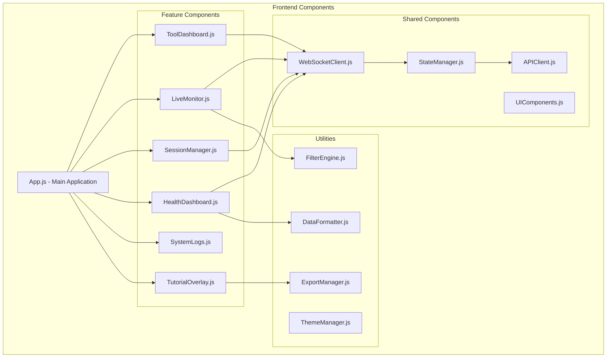

### 2. State Management Architecture

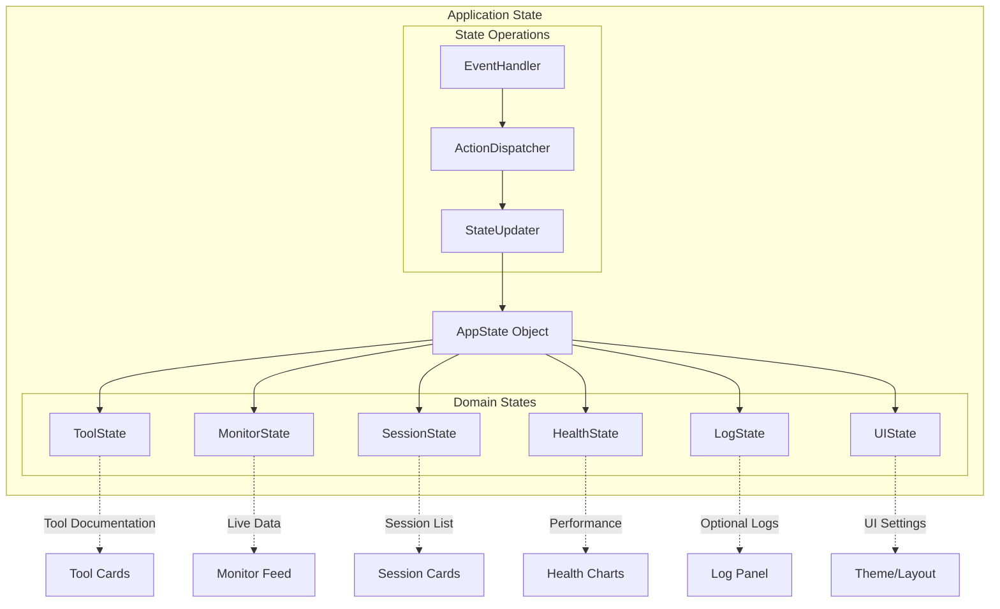

## Data Flow Architecture

### 1. Tool Call Monitoring Flow

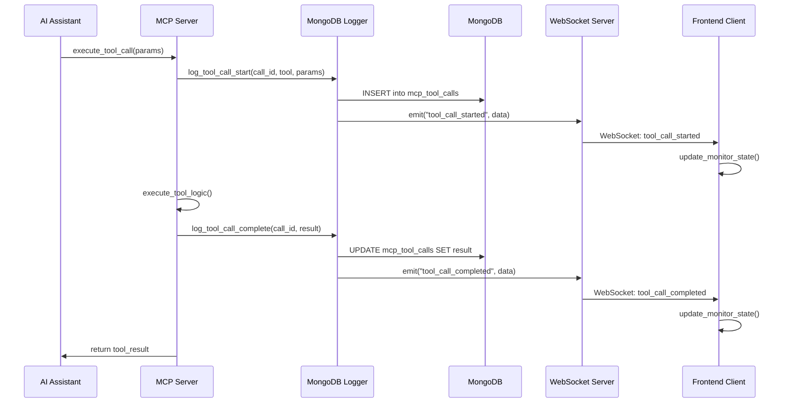

### 2. Real-time Data Synchronization

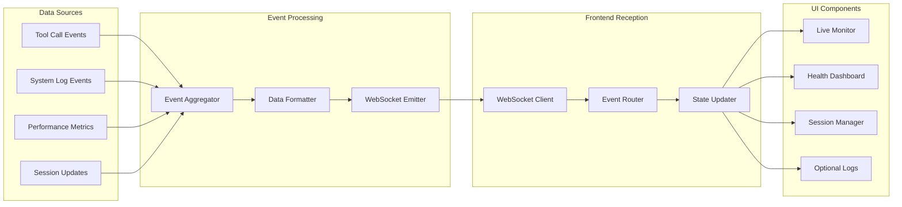

## Backend Integration Architecture

### 1. Web Server Components

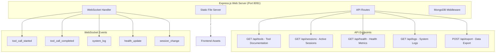

### 2. MongoDB Integration Schema

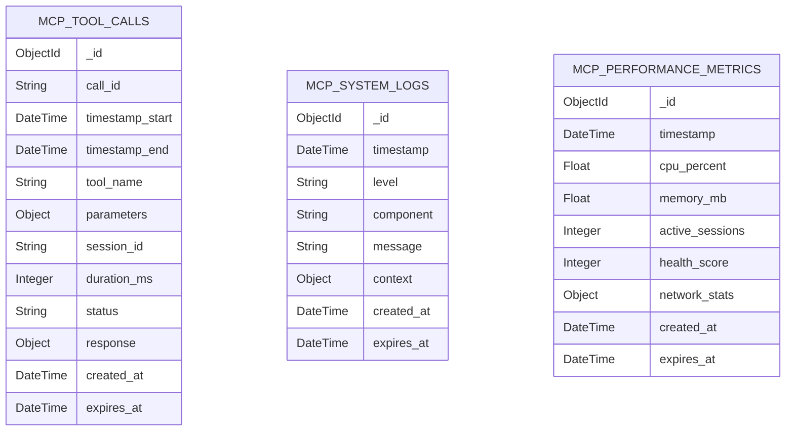

## Deployment Architecture

### 1. Docker Integration

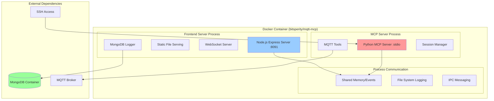

### 2. Umbrel App Configuration

```yaml
# umbrel-app.yml
manifestVersion: 1
id: bitsperity-mqtt-mcp
category: automation
name: MQTT MCP Server
version: "1.0.0"
tagline: "MQTT Model Context Protocol Server for AI"
description: >
  AI-powered MQTT device analysis with Model Context Protocol.
  Includes web interface for tool monitoring and documentation.
  
developer: Bitsperity
website: https://github.com/bitsperity/mqtt-mcp
dependencies:
  - bitsperity-mongodb-mcp  # Shared MongoDB instance

repo: https://github.com/bitsperity/bitsperity-mqtt-mcp
support: https://github.com/bitsperity/bitsperity-mqtt-mcp/issues
port: 8091
gallery:
  - 1.jpg
  - 2.jpg
  - 3.jpg
path: ""

defaultUsername: ""
defaultPassword: ""

submitter: Bitsperity
submission: https://github.com/getumbrel/umbrel-apps/pull/xxx
```

### 3. Network Architecture

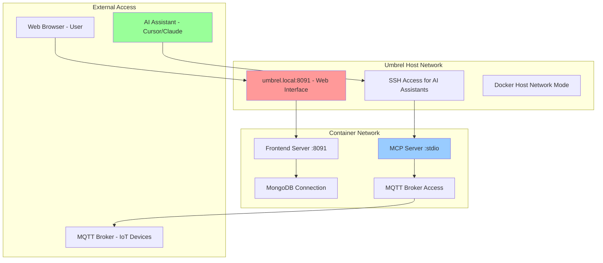

## Security Architecture

### 1. Access Control

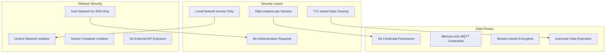

### 2. Data Security Flow

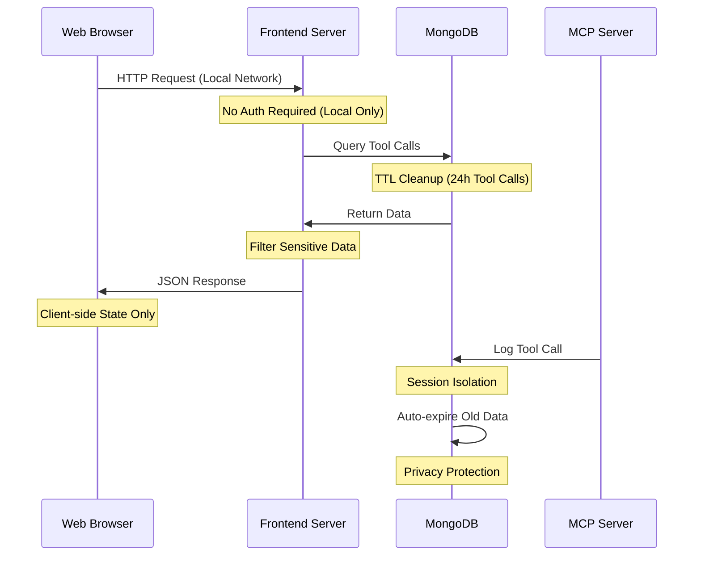

## Performance Architecture

### 1. Frontend Performance Optimization

```mermaid
graph TD
    subgraph "Client Performance"
        A[Virtual Scrolling for Large Lists]
        B[Lazy Loading of Components]
        C[Debounced Filter Updates]
        D[Memory-efficient State Management]
    end
    
    subgraph "Data Optimization"
        E[Rolling Window (500 Tool Calls)]
        F[Response Truncation (1KB limit)]
        G[Intelligent Caching]
        H[Background Data Cleanup]
    end
    
    subgraph "Network Optimization"
        I[WebSocket for Real-time]
        J[Compressed JSON Responses]
        K[Delta Updates Only]
        L[Connection Pooling]
    end
    
    A --> E
    B --> G
    C --> I
    D --> H
```

### 2. Resource Management

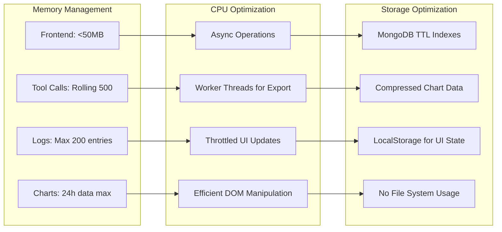

## Integration Points

### 1. MCP Server Integration

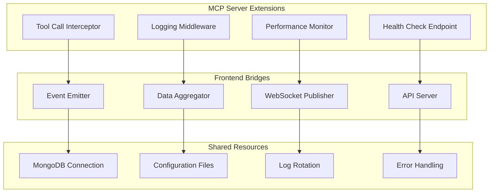

### 2. AI Assistant Integration

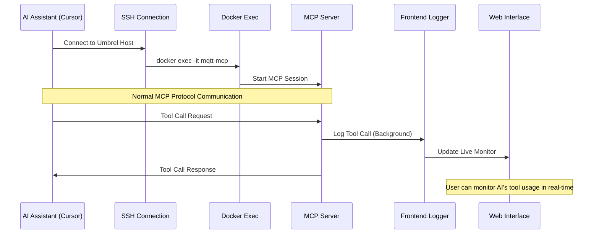

## Development Workflow

### 1. Build Pipeline

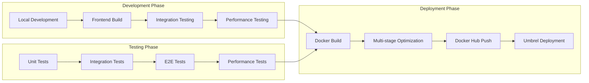

### 2. Deployment Strategy

```bash
# Dockerfile Multi-stage Build
FROM node:18-alpine AS frontend-builder
WORKDIR /app/frontend
COPY frontend/ .
RUN npm install && npm run build

FROM python:3.11-slim AS final
# MCP Server installation
COPY --from=frontend-builder /app/frontend/dist /app/frontend/dist
# Combined deployment
```

## Monitoring und Logging

### 1. System Monitoring

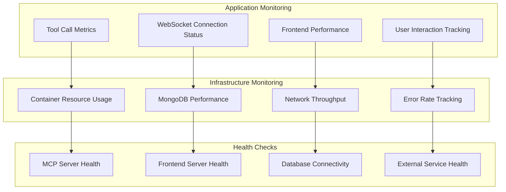

### 2. Error Handling Strategy

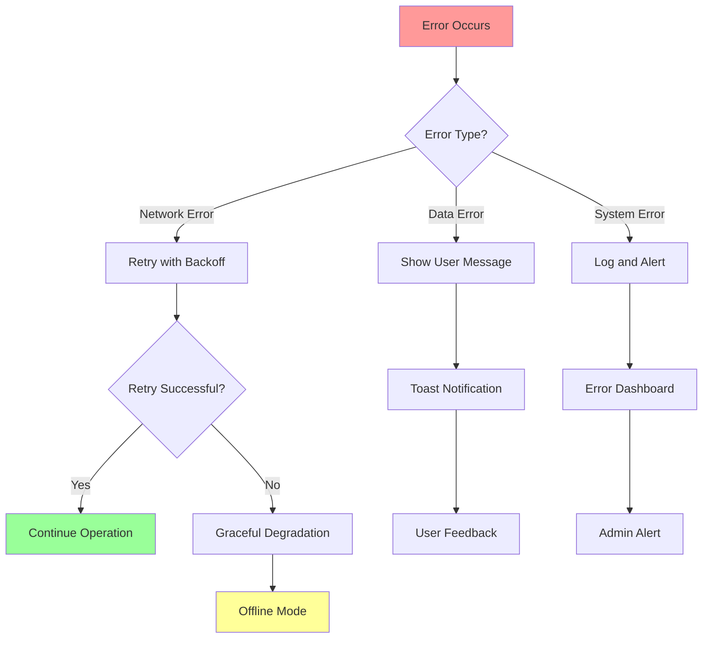

## Fazit der Architektur

Die Frontend-Architektur für den MQTT MCP Server ist als leichtgewichtige, aber funktionsreiche Erweiterung konzipiert, die:

### Hauptvorteile:
1. **Minimaler Impact**: Keine Performance-Beeinträchtigung des MCP Servers
2. **Echtzeit-Fähigkeiten**: Live-Monitoring über WebSocket
3. **Benutzerfreundlichkeit**: Intuitive Bedienung ohne komplexe Setup
4. **Skalierbarkeit**: Modularer Aufbau für zukünftige Erweiterungen
5. **Umbrel-Integration**: Nahtlose Integration in Umbrel Ecosystem

### Technische Highlights:
- **Vanilla JavaScript**: Keine schweren Framework-Dependencies
- **MongoDB Integration**: Shared Instance mit MCP Server
- **Docker-optimiert**: Multi-stage Build für minimale Image-Größe
- **Security-first**: Local-only Access, automatische Data Cleanup
- **Performance-optimiert**: Virtual Scrolling, Memory Management

Die Architektur ist bereit für die Implementierung und folgt allen Requirements aus der umfassenden Frontend-Dokumentation. 