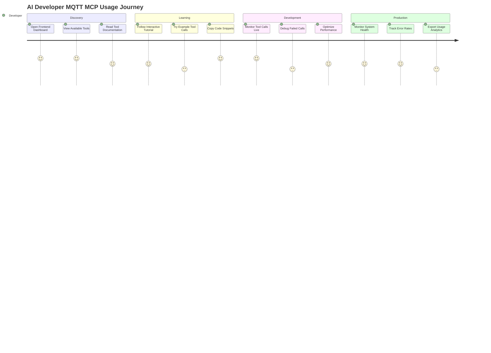
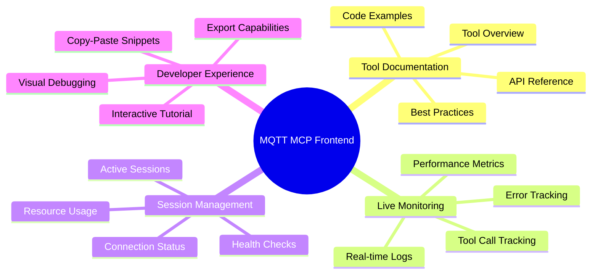
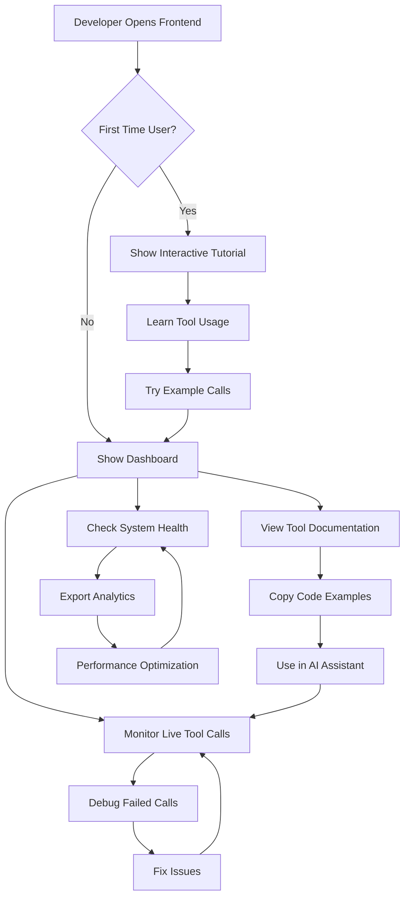
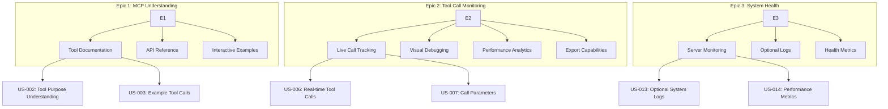
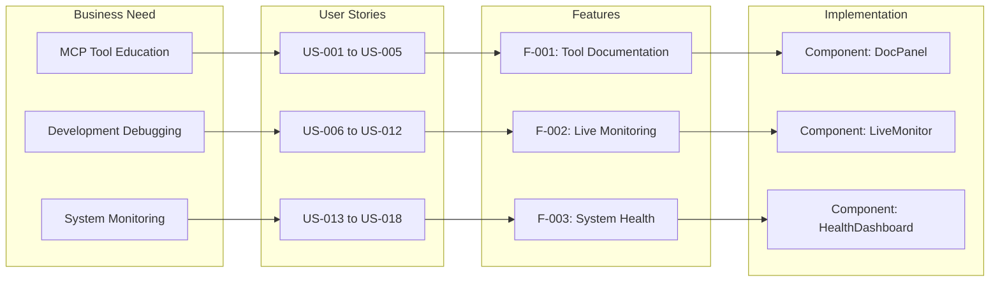

# MQTT MCP Frontend - User Stories

## Primary User: AI Assistant Developer (Cursor/Claude User)

### Epic 1: MCP Server Understanding & Usage
**Als** AI Assistant Developer  
**möchte ich** verstehen wie der MQTT MCP Server funktioniert  
**damit** ich ihn effektiv in meinen AI-gestützten Workflows nutzen kann

#### User Stories:
- **US-001**: Als Entwickler möchte ich eine übersichtliche Dashboard sehen mit Status des MCP Servers
- **US-002**: Als Entwickler möchte ich alle verfügbaren Tools und deren Zweck verstehen
- **US-003**: Als Entwickler möchte ich Beispiel-Aufrufe für jedes Tool sehen
- **US-004**: Als Entwickler möchte ich die Parameter und Rückgabewerte jedes Tools verstehen
- **US-005**: Als Entwickler möchte ich eine API-Dokumentation direkt im Interface haben

### Epic 2: Tool Call Monitoring & Visualization
**Als** AI Assistant Developer  
**möchte ich** alle MCP Tool Calls visuell nachvollziehen können  
**damit** ich debugging und optimization betreiben kann

#### User Stories:
- **US-006**: Als Entwickler möchte ich alle Tool Calls in Echtzeit sehen
- **US-007**: Als Entwickler möchte ich Tool Call Parameter und Responses sehen
- **US-008**: Als Entwickler möchte ich Tool Calls nach Zeit, Tool-Type und Session filtern
- **US-009**: Als Entwickler möchte ich erfolgreiche vs. fehlgeschlagene Calls unterscheiden
- **US-010**: Als Entwickler möchte ich detaillierte Error Messages und Stack Traces sehen
- **US-011**: Als Entwickler möchte ich Tool Call Performance (Duration) monitoren
- **US-012**: Als Entwickler möchte ich Tool Call History exportieren können

### Epic 3: System Logs & Server Health
**Als** AI Assistant Developer  
**möchte ich** die Gesundheit des MCP Servers überwachen  
**damit** ich Probleme frühzeitig erkennen und beheben kann

#### User Stories:
- **US-013**: Als Entwickler möchte ich System Logs des MCP Servers optional einsehen
- **US-014**: Als Entwickler möchte ich Server Performance Metrics sehen (Memory, CPU, etc.)
- **US-015**: Als Entwickler möchte ich MQTT Connection Status überwachen
- **US-016**: Als Entwickler möchte ich Error Rates und Success Rates tracking haben
- **US-017**: Als Entwickler möchte ich Logs nach Level filtern (DEBUG, INFO, WARN, ERROR)
- **US-018**: Als Entwickler möchte ich Logs dezent und unauffällig haben (optional toggle)

### Epic 4: MCP Server Education & Onboarding
**Als** AI Assistant Developer  
**möchte ich** schnell lernen wie ich den MCP Server nutze  
**damit** ich produktiv mit dem Tool arbeiten kann

#### User Stories:
- **US-019**: Als Entwickler möchte ich eine interaktive Tutorial für MCP Usage
- **US-020**: Als Entwickler möchte ich Best Practices für jeden Tool Call sehen
- **US-021**: Als Entwickler möchte ich häufige Use Cases und Patterns verstehen
- **US-022**: Als Entwickler möchte ich Copy-Paste ready Code Snippets haben
- **US-023**: Als Entwickler möchte ich verstehen welche Tools zusammen verwendet werden

### Epic 5: Session & Connection Management
**Als** AI Assistant Developer  
**möchte ich** MCP Sessions und MQTT Connections verwalten  
**damit** ich effizient mit verschiedenen MQTT Brokern arbeiten kann

#### User Stories:
- **US-024**: Als Entwickler möchte ich alle aktiven MCP Sessions sehen
- **US-025**: Als Entwickler möchte ich MQTT Connection Details pro Session sehen
- **US-026**: Als Entwickler möchte ich Connection Health Status überwachen
- **US-027**: Als Entwickler möchte ich Sessions manuell schließen können (für debugging)
- **US-028**: Als Entwickler möchte ich Connection Statistics sehen (Messages sent/received)

## Secondary User: DevOps/System Administrator

### Epic 6: Deployment & Infrastructure Monitoring
**Als** System Administrator  
**möchte ich** den MQTT MCP Server in production überwachen  
**damit** ich stabile Services für AI Assistants bereitstellen kann

#### User Stories:
- **US-029**: Als Admin möchte ich Server Uptime und Availability überwachen
- **US-030**: Als Admin möchte ich Resource Usage (Memory, CPU, Network) sehen
- **US-031**: Als Admin möchte ich Critical Errors und Alerts erhalten
- **US-032**: Als Admin möchte ich Performance Trends über Zeit sehen
- **US-033**: Als Admin möchte ich System Health Reports exportieren können

## User Journey Mermaid Diagram

## Feature Relationship Map

## Business Process Flow

## Epic to Feature Breakdown

## User Story Dependencies

```mermaid
graph LR
    subgraph "Foundation Stories"
        A[US-001: Dashboard Overview] --> B[US-002: Tool Understanding]
        B --> C[US-006: Tool Call Monitoring]
    end
    
    subgraph "Advanced Features"
        D[US-008: Call Filtering] --> E[US-011: Performance Monitoring]
        E --> F[US-012: Export Capabilities]
    end
    
    subgraph "System Features"
        G[US-013: Optional Logs] --> H[US-017: Log Filtering]
        H --> I[US-014: Performance Metrics]
    end
    
    C --> D
    F --> G
    
    style A fill:#ff9999
    style C fill:#ff9999
    style D fill:#99ccff
    style F fill:#99ccff
    style G fill:#99ff99
    style I fill:#99ff99
```

## Requirements Traceability

