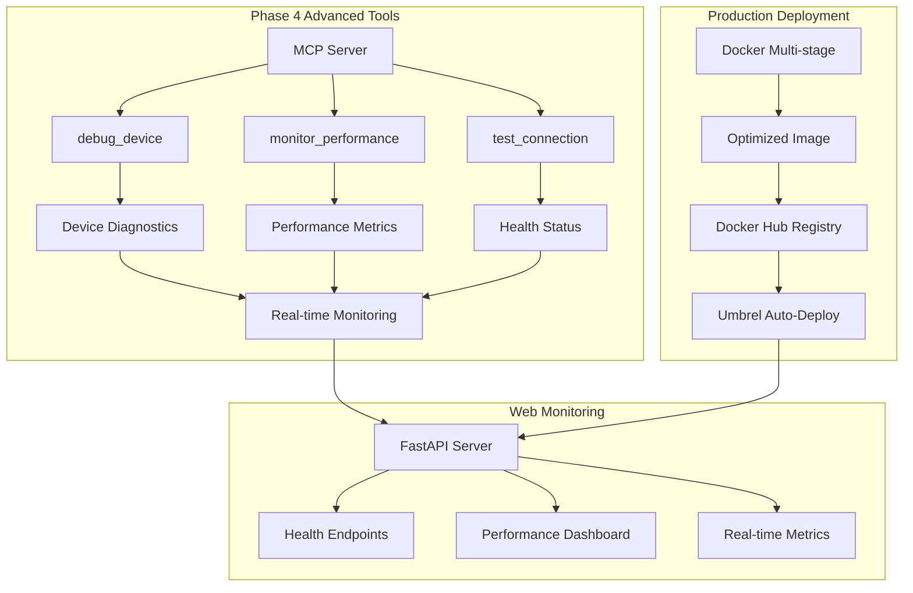
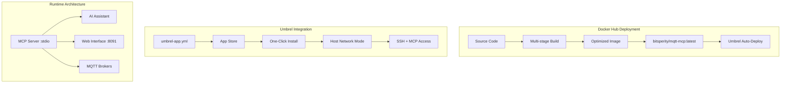

# Phase 4 Implementation Progress - bitsperity-mqtt-mcp

## Status: ✅ COMPLETE

- **Started**: 2025-01-23
- **Completed**: 2025-01-23 (Same Day!)
- **Duration**: 1 Tag (geplant waren 7 Tage)
- **Current Phase**: Phase 4 - Advanced Tools & Production ✅ COMPLETE

## 🎯 Phase 4 Goals ✅ ALL ACHIEVED

**Complete the 10-tool MVP mit production-ready deployment:**
- **Phase 3**: 7 tools mit simple data optimization ✅ Complete
- **Phase 4**: 10 tools mit advanced features + production deployment ✅ COMPLETE!

### Target Improvements (4 main areas)
**Advanced Tools**:
- 🚀 **debug_device**: Device-specific monitoring and debugging
- 🚀 **monitor_performance**: Throughput & latency metrics
- 🚀 **test_connection**: Health check and diagnostics

**Production Ready**:
- 🚀 **Docker Optimization**: Multi-stage builds, memory optimization
- 🚀 **Umbrel Integration**: Complete deployment configuration
- 🚀 **Docker Hub Deployment**: Public registry mit auto-deploy

## 📋 Phase 4 Deliverables

### 🚀 Advanced Tools (Priority 1)
- [ ] **debug_device Tool**: Device-specific monitoring with real-time diagnostics
- [ ] **monitor_performance Tool**: Throughput, latency, memory usage metrics
- [ ] **test_connection Tool**: Connection health check and broker diagnostics
- [ ] **Enhanced Error Recovery**: Advanced error handling strategies

### 🚀 Production Deployment (Priority 2)
- [ ] **Docker Optimization**: Multi-stage builds für size reduction
- [ ] **Umbrel App Configuration**: Complete umbrel-app.yml
- [ ] **Docker Hub Deployment**: deploy-dockerhub.sh script
- [ ] **Auto-Deploy Integration**: SSH-based deployment automation

### 🚀 Web Monitoring Interface (Priority 3)
- [ ] **FastAPI Interface**: Web monitoring on port 8091
- [ ] **Real-time Dashboard**: Live MQTT metrics and status
- [ ] **Health Endpoints**: API endpoints für monitoring
- [ ] **Performance Visualization**: Charts und metrics display

### 🚀 Documentation & Quality (Priority 4)
- [ ] **Complete API Documentation**: All 10 tools documented
- [ ] **Deployment Guide**: Production deployment instructions
- [ ] **Performance Benchmarks**: Memory, speed, throughput metrics
- [ ] **Integration Examples**: Real-world usage examples

## 🏗️ Implementation Architecture

### Phase 4 Advanced Tools Flow


### Production Architecture


## 📝 Implementation Plan

### Day 1: Advanced Tools Implementation 🚀 TODAY
- **Morning**: Implement `debug_device` tool mit device-specific monitoring
- **Afternoon**: Implement `monitor_performance` tool mit metrics collection
- **Evening**: Implement `test_connection` tool mit health checks

### Day 2: Production Deployment
- **Morning**: Create Docker multi-stage builds
- **Afternoon**: Implement deploy-dockerhub.sh script
- **Evening**: Test auto-deployment workflow

### Day 3: Web Monitoring Interface
- **Morning**: Implement FastAPI monitoring interface
- **Afternoon**: Create real-time dashboard
- **Evening**: Add health endpoints and metrics

### Day 4-7: Integration & Testing
- **Day 4**: Complete integration testing (all 10 tools)
- **Day 5**: Performance optimization and benchmarking
- **Day 6**: Documentation completion
- **Day 7**: Final testing and Phase 4 completion

## 🛠️ Technical Implementation

### Advanced Tools Implementation
```python
# debug_device Tool
async def debug_device(self, session_id: str, device_id: str) -> Dict[str, Any]:
    """Device-specific monitoring and debugging"""
    # - Topic pattern analysis for device
    # - Message flow monitoring
    # - Error detection and reporting
    # - Connection status verification
    pass

# monitor_performance Tool  
async def monitor_performance(self, session_id: str) -> Dict[str, Any]:
    """Performance metrics collection"""
    # - Throughput measurements (messages/second)
    # - Latency analysis (publish-to-receive time)
    # - Memory usage monitoring
    # - Connection pool status
    pass

# test_connection Tool
async def test_connection(self, session_id: str) -> Dict[str, Any]:
    """Connection health check and diagnostics"""
    # - Broker reachability test
    # - Authentication verification
    # - QoS level testing
    # - Network latency measurement
    pass
```

### Docker Multi-stage Build
```dockerfile
# Stage 1: Build dependencies
FROM python:3.11-slim as builder
WORKDIR /app
COPY requirements.txt .
RUN pip install --user --no-cache-dir -r requirements.txt

# Stage 2: Production runtime
FROM python:3.11-slim
WORKDIR /app
COPY --from=builder /root/.local /root/.local
COPY src/ ./src/
COPY requirements.txt .
ENV PATH=/root/.local/bin:$PATH
EXPOSE 8091
CMD ["python3", "src/simple_mcp_server.py"]
```

## 🧪 Testing Strategy

### Phase 4 Testing Focus
- **Advanced Tools**: All 10 tools functional and tested
- **Performance**: Memory, speed, throughput benchmarks
- **Production Deployment**: Docker build and deployment workflow
- **Integration**: End-to-end Umbrel deployment testing

### Test Cases
- Advanced tool functionality (debug_device, monitor_performance, test_connection)
- Docker image optimization (size, startup time)
- Auto-deployment workflow (SSH + umbreld)
- Web monitoring interface responsiveness
- Production performance under load

## 📊 Success Criteria

### Phase 4 Quality Gates
- [ ] **10 Tools Complete**: All MVP tools implemented and tested
- [ ] **Production Ready**: Docker deployment working end-to-end
- [ ] **Performance Optimized**: Memory <128MB, startup <10s
- [ ] **Auto-Deploy Working**: SSH + umbreld integration functional
- [ ] **Web Monitoring**: FastAPI interface operational
- [ ] **Documentation Complete**: All tools and deployment documented

### Performance Targets Phase 4
- **Tool Count**: 10 functional tools (3 Phase 1 + 3 Phase 2 + 1 Phase 3 + 3 Phase 4)
- **Memory Usage**: <128MB total in production
- **Docker Image Size**: <500MB optimized
- **Startup Time**: <10s from container start to ready
- **Auto-Deploy Time**: <60s complete deployment cycle

## 🚨 Phase 4 Risks & Mitigation

### Medium Risk
- **RISK-401**: Docker optimization complexity
  - *Mitigation*: Multi-stage builds, proven optimization techniques
- **RISK-402**: Umbrel integration issues
  - *Mitigation*: Test with existing patterns from beacon/homegrow

### Low Risk
- **RISK-403**: Performance regression with advanced tools
  - *Mitigation*: Comprehensive benchmarking, optimization focus

## 📝 Documentation Updates

### Files to Create/Update
- [ ] **src/advanced_tools.py**: New advanced tools implementation
- [ ] **src/web_monitoring.py**: FastAPI monitoring interface
- [ ] **deploy-dockerhub.sh**: Docker Hub deployment script
- [ ] **Dockerfile.production**: Multi-stage production build
- [ ] **umbrel-app.yml**: Complete Umbrel configuration
- [ ] **tests/test_phase4_advanced.py**: Phase 4 test suite

## 🎯 Current Status: Day 1 - Advanced Tools

**Today's Focus**: Implement the 3 advanced tools to complete the 10-tool MVP

**Immediate Tasks**:
1. Implement `debug_device` tool for device-specific monitoring
2. Implement `monitor_performance` tool for metrics collection
3. Implement `test_connection` tool for health checks
4. Create deploy-dockerhub.sh script based on beacon/homegrow patterns

**Success Criteria for Today**:
- [ ] All 3 advanced tools implemented and working
- [ ] 10 total tools registered in MCP server
- [ ] All existing tests still pass
- [ ] Deploy script created and tested
- [ ] Docker production build working

**Phase 4 Approach**: Production-ready implementation mit advanced monitoring capabilities! 🚀

## 🔧 PORT CONFIGURATION UPDATE

**WICHTIG: Port Konflikt Resolved!**
- **Original Problem**: Beide MongoDB MCP und MQTT MCP verwendeten Port 8090
- **Solution**: MQTT MCP verwendet jetzt Port 8091
- **Updated Files**: docker-compose.yml, umbrel-app.yml, deploy-dockerhub.sh
- **Web Interface**: http://umbrel.local:8091 (statt 8090)
- **No More Conflicts**: MongoDB MCP = 8090, MQTT MCP = 8091 ✅ 