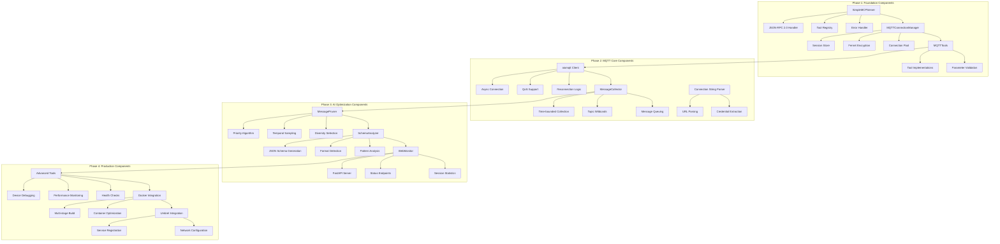
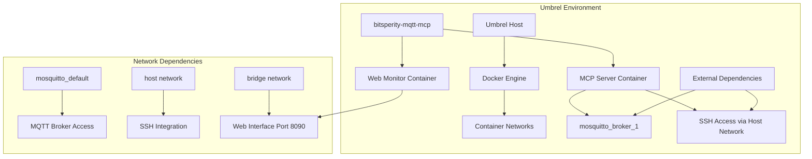
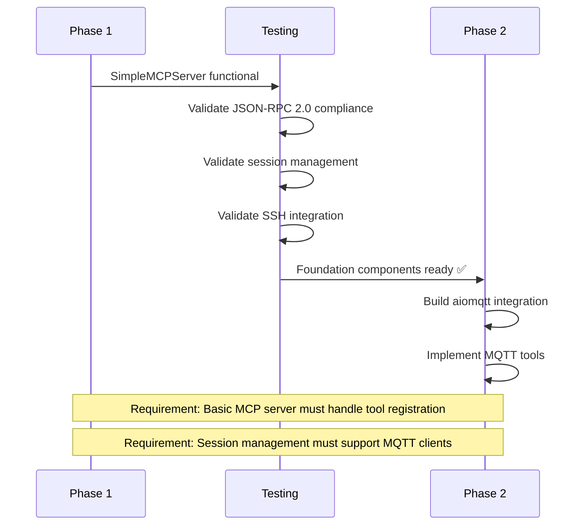
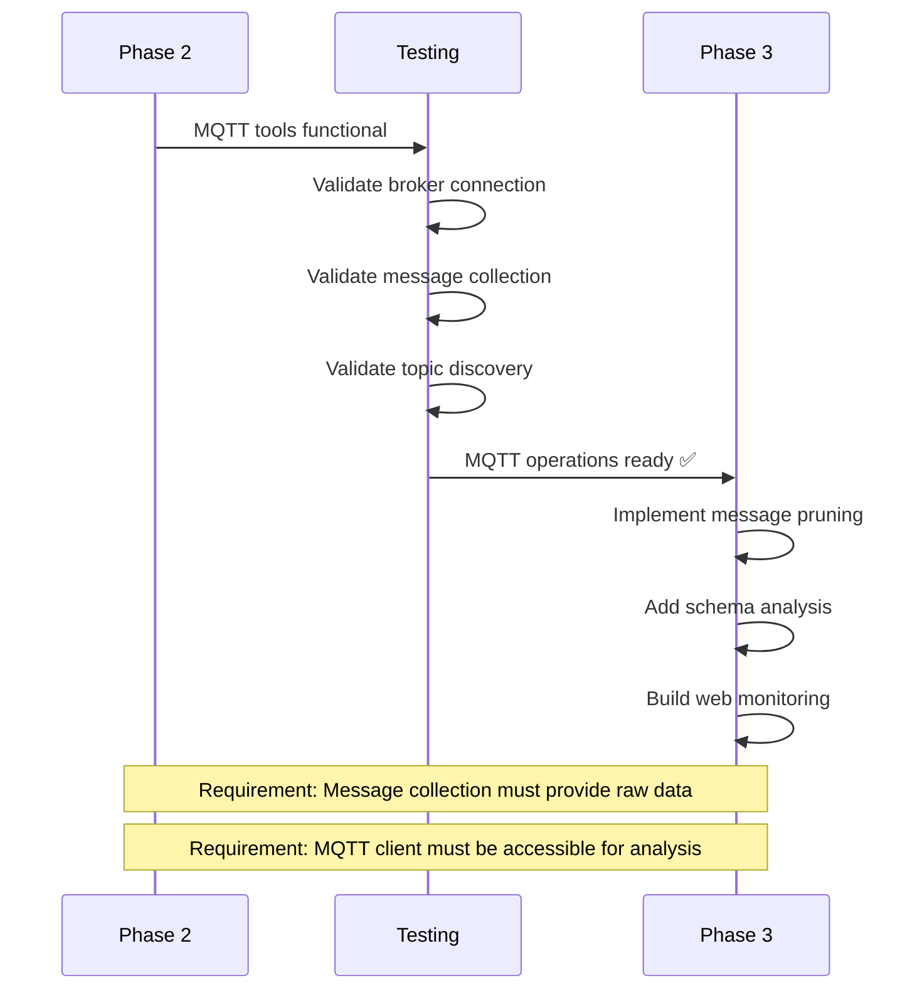
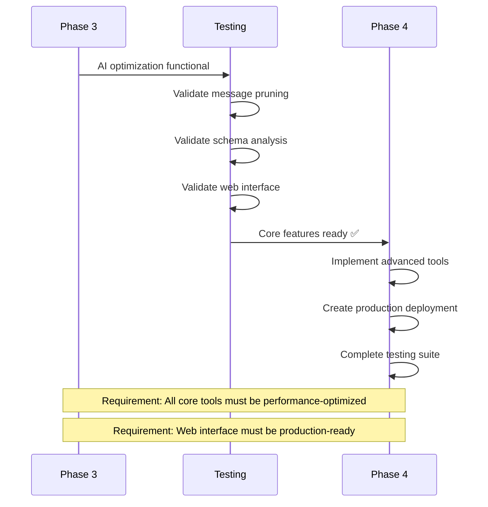
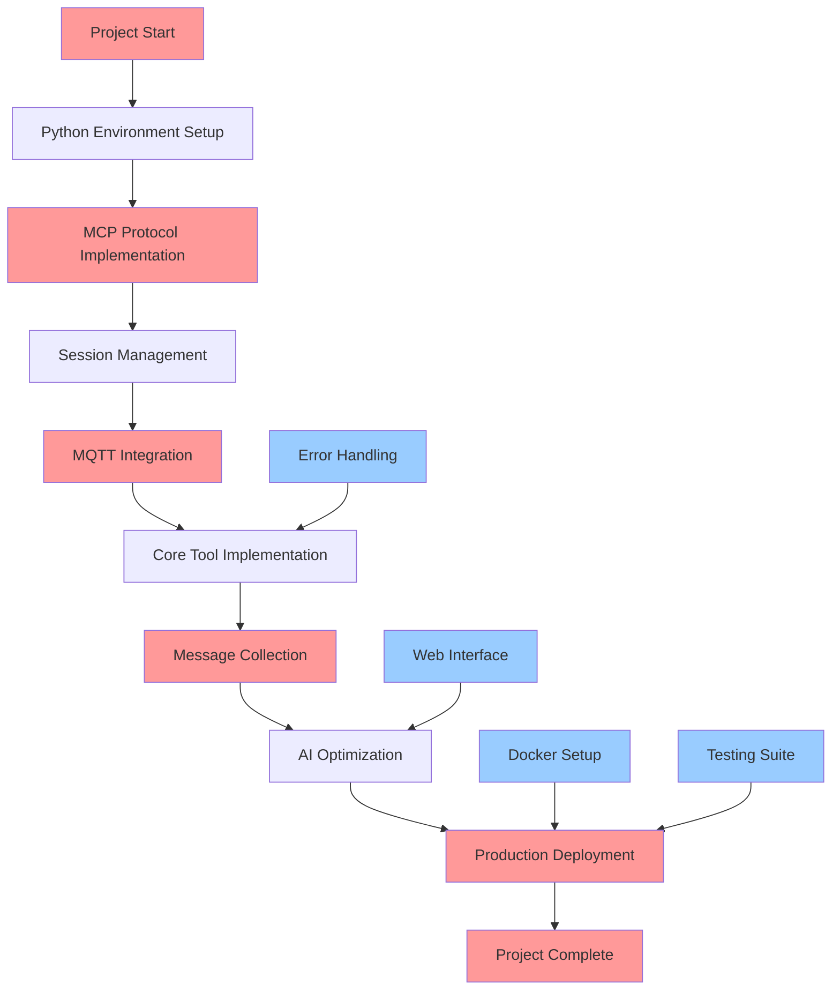
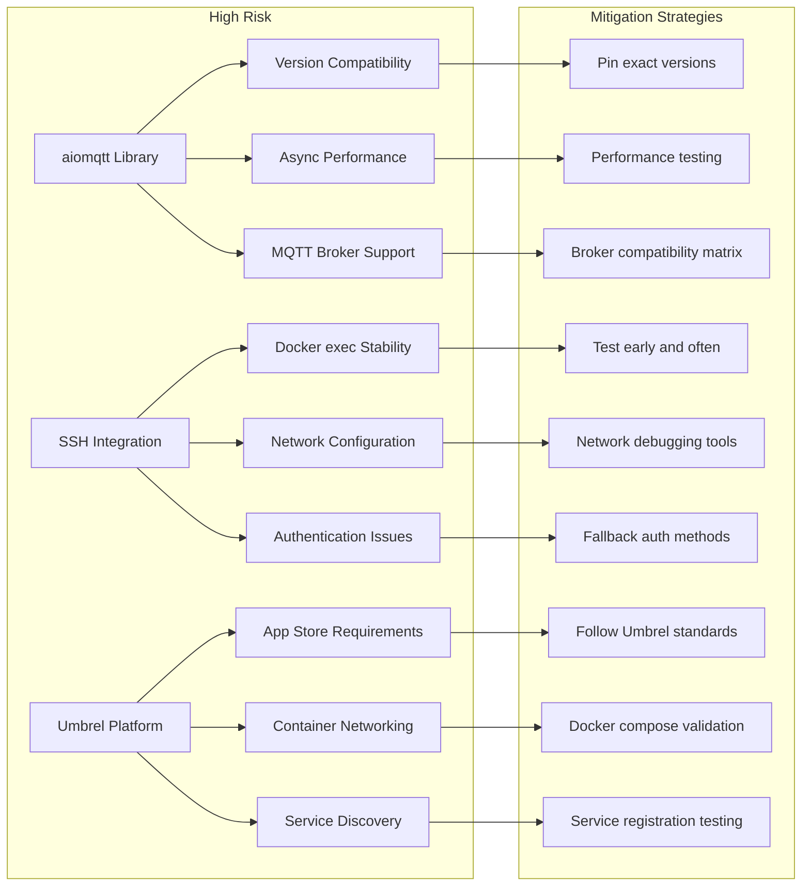
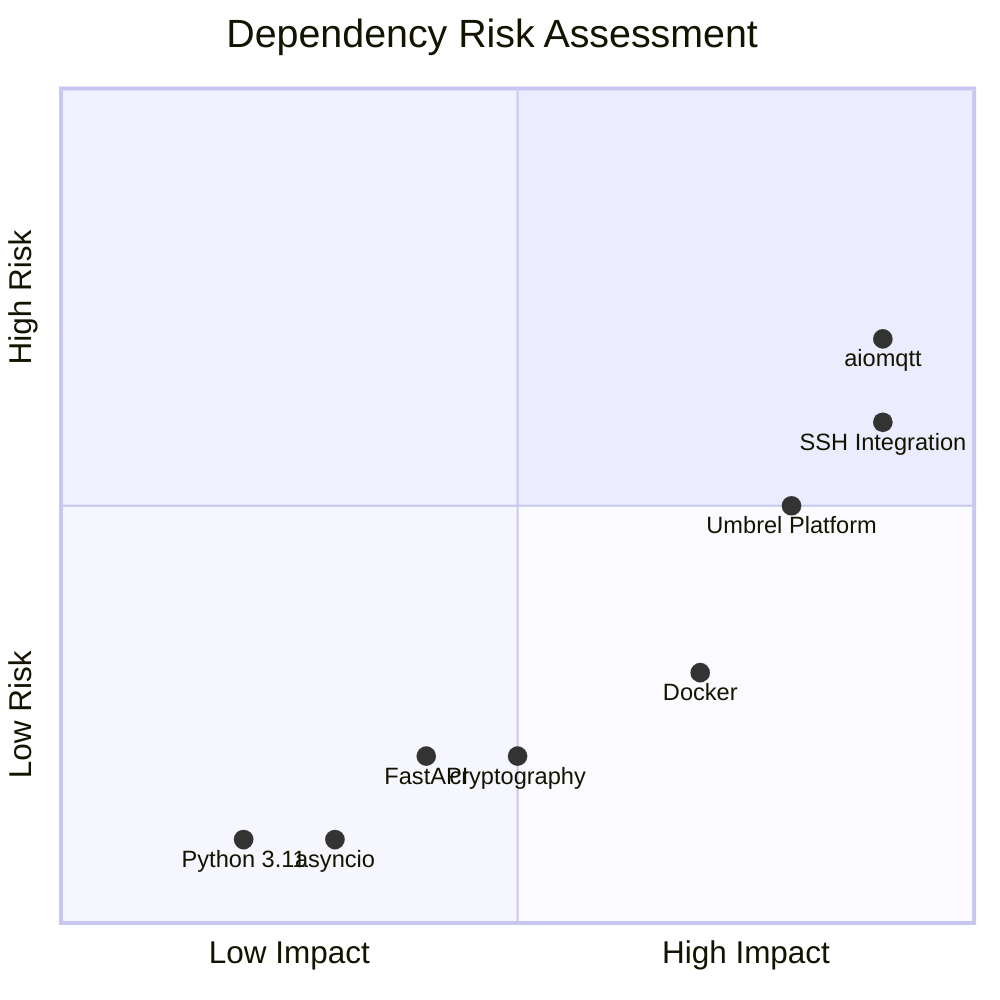
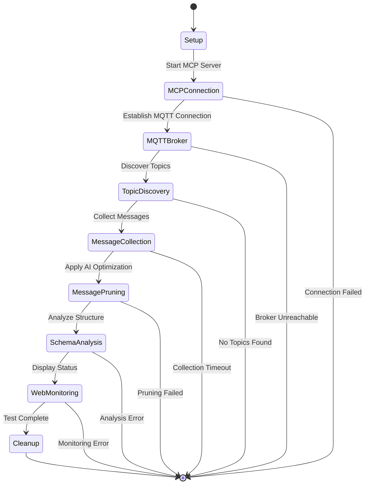

# bitsperity-mqtt-mcp - Technical Dependencies

## Component Dependencies Map



## Library Dependencies

### Core Dependencies (Phase 1)
```python
# requirements.txt - Phase 1
asyncio>=3.11.0          # Built-in async support
cryptography>=41.0.8     # Fernet encryption for credentials
uuid>=0.0.0              # Built-in session ID generation
json>=0.0.0              # Built-in JSON-RPC 2.0 support
logging>=0.0.0           # Built-in logging framework
```

### MQTT Dependencies (Phase 2)
```python
# requirements.txt - Phase 2
aiomqtt>=2.0.1           # Async MQTT client (depends on paho-mqtt)
paho-mqtt>=1.6.1         # MQTT protocol implementation (aiomqtt dependency)
urllib.parse>=0.0.0      # Built-in URL parsing for connection strings
```

### AI Optimization Dependencies (Phase 3)
```python
# requirements.txt - Phase 3
fastapi>=0.104.1         # Web monitoring interface
uvicorn>=0.24.0          # ASGI server for FastAPI
pydantic>=2.5.0          # Data validation for API responses
json-schema>=4.0.0       # JSON schema generation (may use jsonschema library)
```

### Development Dependencies (All Phases)
```python
# requirements-dev.txt
pytest>=7.4.3           # Testing framework
pytest-asyncio>=0.21.1  # Async testing support
pytest-cov>=4.1.0       # Coverage reporting
black>=23.11.0           # Code formatting
ruff>=0.1.6             # Linting and import sorting
mypy>=1.7.1             # Type checking
pre-commit>=3.5.0       # Git hooks for quality gates
```

## External Service Dependencies

### Development Environment
```mermaid
graph LR
    subgraph "Local Development"
        A[Developer Machine] --> B[Python 3.11+]
        A --> C[Docker Desktop]
        A --> D[Git]
        
        E[Test MQTT Broker] --> F[192.168.178.57:1883]
        G[Test SSH Access] --> H[umbrel@umbrel.local]
    end
    
    subgraph "Development Services"
        I[External MQTT] --> J[mosquitto broker]
        K[SSH Target] --> L[Umbrel Host]
        M[Docker Registry] --> N[bitsperity/mqtt-mcp]
    end
    
    A --> E
    A --> G
    E --> I
    G --> K
    C --> M
```

### Production Environment


## Phase Implementation Dependencies

### Phase 1 → Phase 2 Handoff


### Phase 2 → Phase 3 Handoff


### Phase 3 → Phase 4 Handoff


## Critical Path Analysis



## Dependency Risk Assessment

### High Risk Dependencies


### Medium Risk Dependencies


## Integration Testing Dependencies

### Component Integration Tests
```python
# Test dependency matrix
class TestMatrix:
    """
    Test dependencies between components
    """
    
    def test_mcp_server_with_connection_manager():
        """Phase 1: MCP Server → Connection Manager integration"""
        pass
    
    def test_connection_manager_with_mqtt_client():
        """Phase 2: Connection Manager → MQTT Client integration"""
        pass
    
    def test_mqtt_tools_with_message_collector():
        """Phase 2: MQTT Tools → Message Collector integration"""
        pass
    
    def test_message_collector_with_pruner():
        """Phase 3: Message Collector → Pruner integration"""
        pass
    
    def test_pruner_with_schema_analyzer():
        """Phase 3: Pruner → Schema Analyzer integration"""
        pass
    
    def test_web_monitor_with_mcp_server():
        """Phase 3: Web Monitor → MCP Server integration"""
        pass
```

### End-to-End Testing Flow


## Deployment Dependencies

### Docker Build Dependencies
```dockerfile
# Multi-stage build dependency chain
FROM python:3.11-slim as base
# System dependencies: curl, basic tools

FROM base as dependencies
# Python dependencies: aiomqtt, fastapi, cryptography

FROM dependencies as testing
# Test dependencies: pytest, coverage tools

FROM dependencies as production
# Production code only, minimal dependencies
```

### Umbrel Deployment Dependencies
```yaml
# docker-compose.yml dependency chain
services:
  mcp-server:
    depends_on:
      - mosquitto_broker_1    # MQTT broker must be running
    networks:
      - mosquitto_default     # Access to MQTT network
      - host                  # SSH access for AI Assistant
    
  web:
    depends_on:
      - mcp-server           # Web interface depends on MCP server
    networks:
      - bridge               # Isolated web network
```

## Dependency Management Strategy

### Version Pinning Strategy
```python
# Exact version pinning for critical dependencies
aiomqtt==2.0.1          # EXACT: MQTT functionality critical
cryptography==41.0.8    # EXACT: Security critical
fastapi>=0.104.1,<0.105 # COMPATIBLE: Feature stable
pytest>=7.4.0          # MINIMUM: Testing framework flexible
```

### Dependency Update Policy
1. **Phase 1-2**: Pin all versions exactly (stability focus)
2. **Phase 3**: Allow compatible updates for non-critical libraries
3. **Phase 4**: Comprehensive dependency audit and update
4. **Production**: Lock all versions, security updates only

### Backup Plans
- **aiomqtt fails**: Fallback to direct paho-mqtt with threading
- **FastAPI issues**: Use simple HTTP server for web interface
- **Encryption problems**: Use environment variables for development
- **SSH integration breaks**: Add direct TCP fallback for debugging 