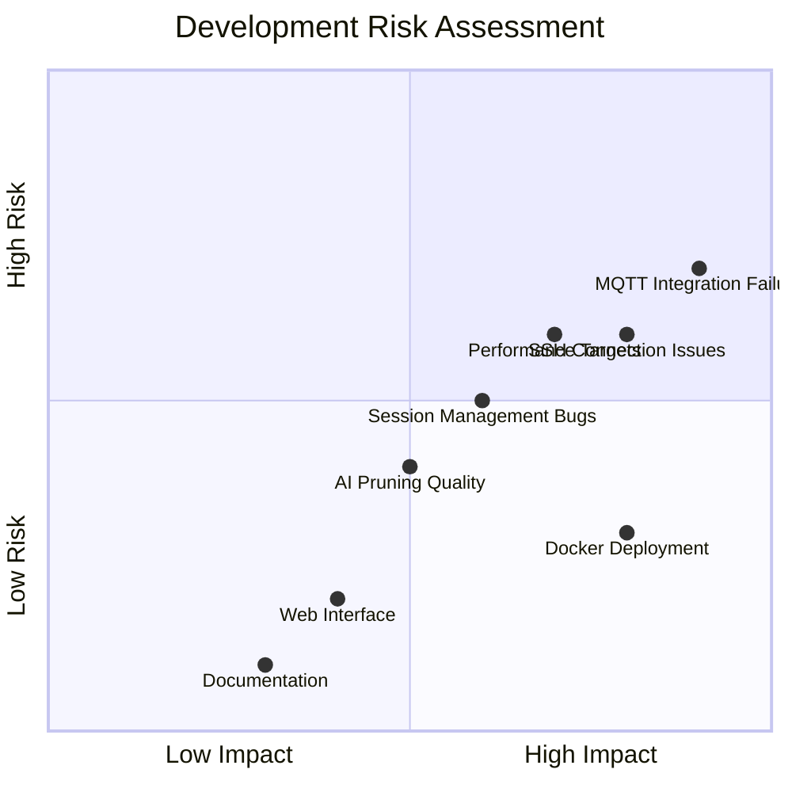
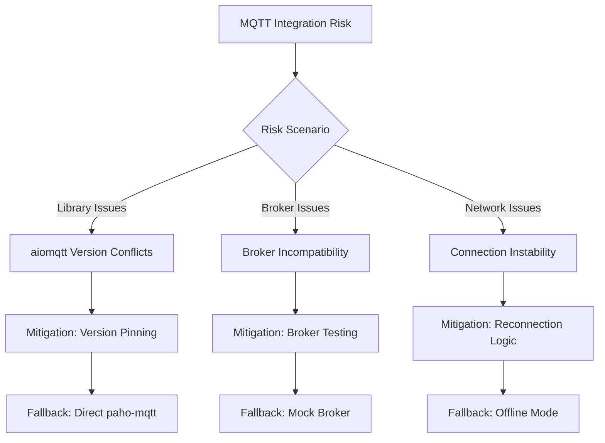
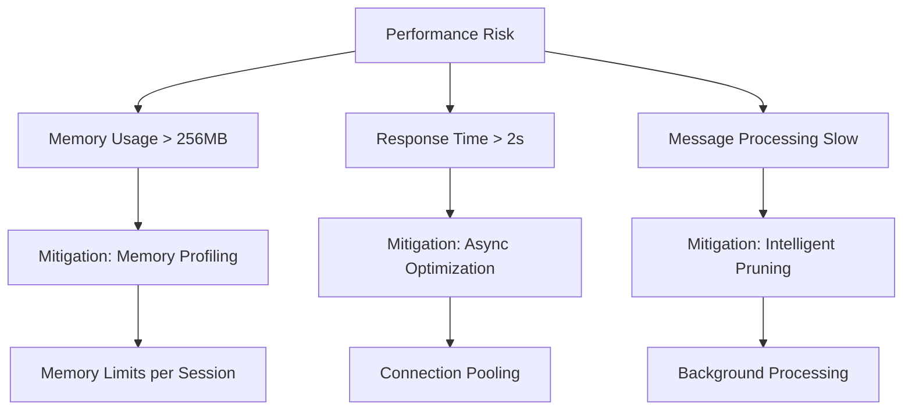
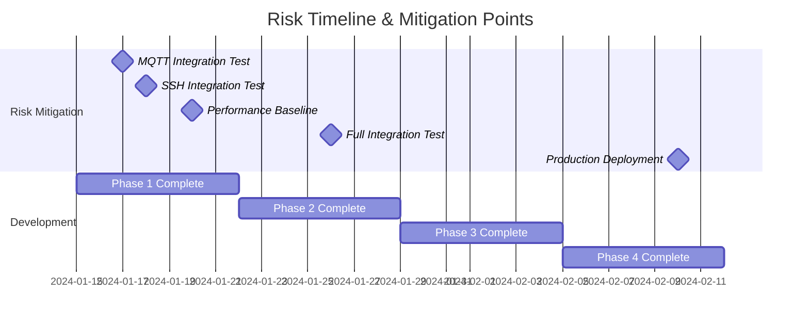
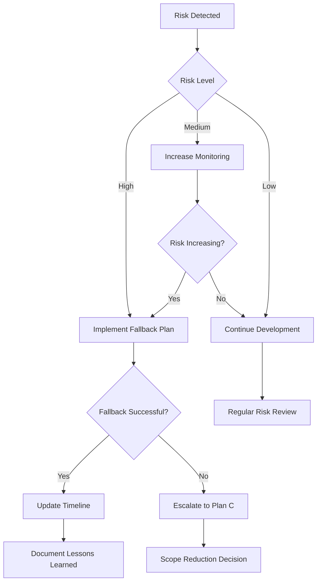

# bitsperity-mqtt-mcp - Risk Assessment & Mitigation

## Risk Overview Matrix



## High Risk Items (Priority 1)

### RISK-001: MQTT Integration Failure
**Risk Level**: 🔴 High (Impact: 9/10, Probability: 7/10)
**Description**: aiomqtt library incompatibility or MQTT broker connection issues



**Impact**: 
- Core functionality completely broken
- AI Assistant cannot perform MQTT operations
- Project delivery at risk

**Mitigation Strategies**:
1. **Early Integration Testing** (Day 7)
   - Test with development broker immediately
   - Validate aiomqtt with real MQTT traffic
   - Document broker compatibility matrix

2. **Version Pinning** (Day 1)
   ```python
   # requirements.txt - exact versions
   aiomqtt==2.0.1
   paho-mqtt==1.6.1
   ```

3. **Fallback Implementation** (Day 8)
   ```python
   # Fallback to direct paho-mqtt if aiomqtt fails
   try:
       import aiomqtt
       MQTT_CLIENT = 'aiomqtt'
   except ImportError:
       import paho.mqtt.client as mqtt
       MQTT_CLIENT = 'paho'
   ```

**Contingency Plans**:
- **Plan A**: Use direct paho-mqtt with threading (adds complexity)
- **Plan B**: Mock MQTT broker for development and testing
- **Plan C**: Reduced feature set without real-time MQTT

**Early Warning Indicators**:
- Connection failures during initial testing
- Library import errors
- Performance issues with message handling
- Broker compatibility problems

### RISK-002: SSH Integration Complexity
**Risk Level**: 🔴 High (Impact: 8/10, Probability: 6/10)
**Description**: SSH + docker exec integration doesn't work like MongoDB MCP

**Impact**:
- AI Assistant cannot reach MCP server
- Deployment model broken
- Manual workarounds required

**Mitigation Strategies**:
1. **Copy MongoDB MCP Pattern** (Day 1)
   - Use identical SSH integration approach
   - Same docker exec command structure
   - Replicate network configuration

2. **Early SSH Testing** (Day 3)
   ```bash
   # Test SSH integration immediately
   ssh umbrel@umbrel.local "docker exec -i test-container python -c 'print(\"Hello\")"
   ```

3. **Network Debugging Tools** (Day 2)
   ```bash
   # Debug tools setup
   apt-get install -y netcat-openbsd curl tcpdump
   ```

**Contingency Plans**:
- **Plan A**: Direct TCP connection for development
- **Plan B**: HTTP API fallback for debugging  
- **Plan C**: Local development only, Umbrel later

**Early Warning Indicators**:
- SSH key authentication failures
- Docker exec permission issues
- Network connectivity problems
- STDIO communication errors

## Medium Risk Items (Priority 2)

### RISK-003: Performance Targets Not Met
**Risk Level**: 🟡 Medium (Impact: 7/10, Probability: 6/10)
**Description**: Memory usage, response times, or message processing performance inadequate



**Impact**:
- Poor user experience
- AI Assistant timeouts
- Resource exhaustion on Umbrel

**Mitigation Strategies**:
1. **Continuous Performance Monitoring** (All Phases)
   ```python
   # Performance tracking
   import psutil
   import asyncio
   
   async def monitor_performance():
       memory = psutil.Process().memory_info().rss / 1024 / 1024
       if memory > 256:
           logger.warning(f"Memory usage: {memory}MB")
   ```

2. **Memory Limits Enforcement** (Phase 1)
   - Session-based memory limits (50MB each)
   - Automatic session cleanup
   - Message collection caps

3. **Async Optimization** (Phase 2)
   - Non-blocking MQTT operations
   - Connection pooling
   - Background processing

**Contingency Plans**:
- **Plan A**: Reduce message collection limits
- **Plan B**: Implement streaming instead of batch processing
- **Plan C**: Offload processing to background tasks

### RISK-004: Message Pruning Quality Issues
**Risk Level**: 🟡 Medium (Impact: 5/10, Probability: 4/10)
**Description**: Intelligent pruning doesn't preserve important information for AI

**Impact**:
- Poor AI analysis quality
- Important error messages lost
- Reduced user value

**Mitigation Strategies**:
1. **Pruning Algorithm Testing** (Day 13-15)
   ```python
   # Test cases for pruning quality
   def test_error_preservation():
       # Ensure error messages always preserved
       
   def test_temporal_distribution():
       # Verify even time sampling
       
   def test_diversity_preservation():
       # Check payload structure variety
   ```

2. **User Feedback Mechanism** (Phase 3)
   - Pruning summary in response
   - AI feedback on pruning quality
   - Adjustable pruning parameters

**Contingency Plans**:
- **Plan A**: Configurable pruning strategies
- **Plan B**: User-selectable pruning levels
- **Plan C**: Optional pruning (return all messages)

### RISK-005: Docker & Umbrel Deployment Issues
**Risk Level**: 🟡 Medium (Impact: 8/10, Probability: 3/10)
**Description**: Docker containerization or Umbrel integration problems

**Impact**:
- Cannot deploy to production
- Manual installation required
- App store submission blocked

**Mitigation Strategies**:
1. **Early Docker Testing** (Day 2)
   ```dockerfile
   # Test multi-stage build early
   FROM python:3.11-slim as test
   COPY requirements.txt .
   RUN pip install -r requirements.txt
   ```

2. **Umbrel Standards Compliance** (Day 24)
   - Follow umbrel-app.yml specification exactly
   - Test with Umbrel development environment
   - Validate docker-compose.yml syntax

**Contingency Plans**:
- **Plan A**: Manual Docker deployment instructions
- **Plan B**: Single-stage Docker build (larger image)
- **Plan C**: Local development deployment only

## Low Risk Items (Priority 3)

### RISK-006: Web Interface Development
**Risk Level**: 🟢 Low (Impact: 4/10, Probability: 2/10)
**Description**: FastAPI web monitoring interface issues

**Impact**:
- Reduced monitoring capabilities
- No web-based status view
- Debugging more difficult

**Mitigation**: Simple HTML + JSON API fallback

### RISK-007: Documentation Quality
**Risk Level**: 🟢 Low (Impact: 3/10, Probability: 1/10)
**Description**: Incomplete or unclear documentation

**Impact**:
- User adoption challenges
- Support burden increase
- Community contribution barriers

**Mitigation**: Iterative documentation with examples

## Timeline Risk Analysis



### Critical Risk Windows

**Week 1 (Phase 1)**: 🔴 High Risk
- SSH integration must work
- Basic MCP server functionality critical
- Session management foundation essential

**Week 2 (Phase 2)**: 🔴 High Risk  
- MQTT integration make-or-break point
- aiomqtt compatibility validation
- Performance baseline establishment

**Week 3 (Phase 3)**: 🟡 Medium Risk
- AI optimization quality validation
- Performance under load testing
- Web interface integration

**Week 4 (Phase 4)**: 🟢 Low Risk
- Deployment automation
- Final testing and polish
- Documentation completion

## Risk Monitoring & Escalation

### Daily Risk Checkpoints
```python
# Daily risk assessment checklist
DAILY_RISK_CHECKS = {
    'memory_usage': lambda: psutil.Process().memory_info().rss / 1024 / 1024 < 256,
    'mqtt_connection': lambda: test_mqtt_broker_connection(),
    'ssh_integration': lambda: test_ssh_docker_exec(),
    'test_coverage': lambda: get_test_coverage() > 80,
    'build_status': lambda: test_docker_build()
}

async def daily_risk_assessment():
    for check_name, check_func in DAILY_RISK_CHECKS.items():
        if not check_func():
            logger.warning(f"Risk indicator: {check_name} failed")
```

### Escalation Procedures

**Level 1 - Green**: Continue development
- All risks under control
- Performance targets met
- Quality gates passed

**Level 2 - Yellow**: Monitor closely
- One medium risk triggered
- Performance degradation detected
- Quality concerns identified

**Level 3 - Red**: Immediate action required
- High risk triggered
- Critical functionality broken
- Timeline impact likely

### Contingency Decision Tree



## Risk Mitigation Budget

### Time Buffer Allocation
- **Phase 1**: +2 days for SSH integration issues
- **Phase 2**: +3 days for MQTT compatibility problems  
- **Phase 3**: +1 day for performance optimization
- **Phase 4**: +1 day for deployment issues

### Scope Reduction Options (Last Resort)
1. **Reduce tool count**: 6 MVP tools only (drop advanced tools)
2. **Simplify pruning**: Basic count-based pruning only
3. **Remove web interface**: Command-line monitoring only
4. **Local development**: Skip Umbrel deployment

### Success Probability Assessment
- **All features delivered**: 70%
- **MVP features delivered**: 90%  
- **Core functionality only**: 95%
- **Development environment only**: 99%

## Lessons Learned Framework

### Post-Risk Analysis
After each risk event, document:
1. **Root Cause**: What actually caused the issue?
2. **Detection**: How quickly was it identified?
3. **Response**: Was mitigation effective?
4. **Prevention**: How to avoid in future projects?

### Knowledge Base
Maintain risk database for future projects:
- MQTT integration best practices
- SSH + Docker debugging procedures
- Performance optimization techniques
- Umbrel deployment troubleshooting 